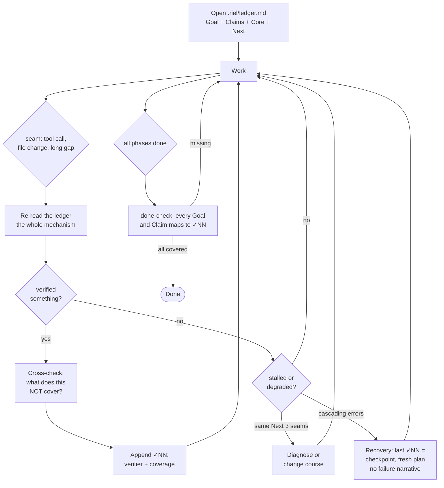
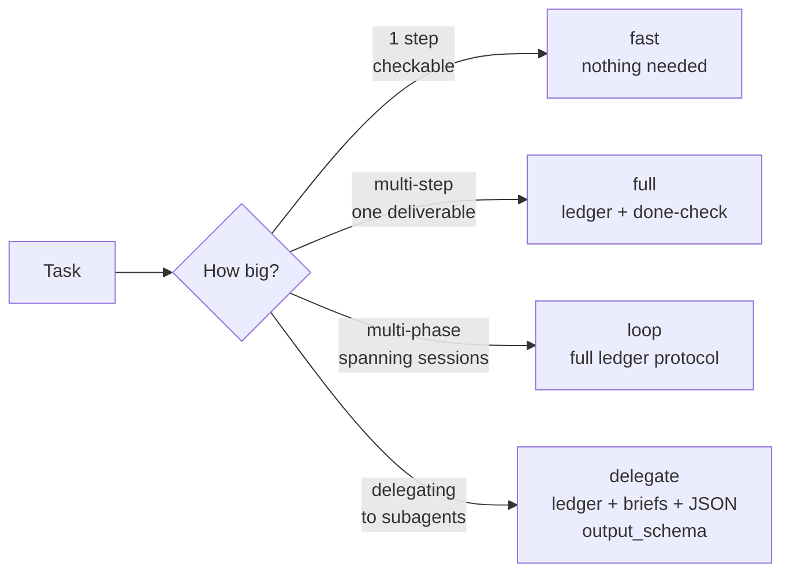

<div align="center">

# 🛤️ Riel

### Steering Layer for Harness/LLM

**Riel does not create capability in the model: it prevents capability from being lost.**

[](LICENSE)


</div>

A model can have a capability and still fail to deliver it: unstable
trajectory, drifting state, missing verification. That gap — having it vs.
delivering it — is what Riel steers. It operates on the surfaces a harness
exposes (first turn, task structure, between-turn state), never on weights.

The center of the framework is the **ledger**: externalized task state —
Goal, pre-registered Claims, Core (1-2 live items), Verified checkpoints,
Open questions, Next action — re-read at every seam, closed against named
verifiers. Everything else feeds it.

## What it replaces

Riel is the opposite of brute-force prompting: no plan, no state between
turns, no definition of done — sampling the model instead of steering it.
Riel inverts each: planned (`riel-contract`), held (`riel-ledger`),
delegated (`riel-briefs`, `riel-delegate`), and accepted only when every
Goal line maps to a verified checkpoint.

## The ledger cycle — the heart of the framework



Three rules carry the whole mechanism:

1. **Re-read at every seam.** The file is not the mechanism — the re-read is.
2. **A ✓NN without verifier + coverage is a mood, not a checkpoint.** The
   verifier is a command with binary output, external to the executor's
   judgment.
3. **No done from memory.** The done-check re-reads the Goal line by line
   against the ✓NN list, always.

Four load-bearing defenses against execution error:

- **Pre-registered claims** — what will be true when done is declared
  BEFORE the first action, with its verification method. Never editable
  post-execution: a failed claim is refuted, not reinterpreted.
- **Adversarial cross-check** — before any ✓NN, ask the opposite
  question: *what does this test NOT cover?* A passed gate without a
  cross-check is incomplete.
- **Contaminated-context invariant** — a ✓NN that took 3+ failed
  attempts leaves the context carrying the failed attempts. Models
  self-condition on their own error history; consider restarting from
  the last clean checkpoint instead of pushing forward.
- **Structured JSON returns on delegation** — children report via
  `output_schema`, not prose. `passed: true` with `exit_code: 1` is
  caught mechanically, not caught by reading.

## Components

| Component | What it steers | Status |
|---|---|---|
| `riel-ledger` | **State** — Goal/Claims/Core/Verified/Open/Next, re-read at every seam, recovery via checkpoints, mirrors to the session todo | ✅ skill v1.9 |
| `riel-contract` | **Structure** — mermaid as contract: closed verb vocabulary, verification funnel, ASK escalation, machine-checkable | ✅ skill v3.4 |
| `riel-protocol` | **Trajectory** — functional grammar, persona, minimal surface on the first turn | ✅ skill v1.5 |
| `riel-briefs` | **Delegation briefs** — self-contained packets: curated context, verb-graph, pre-registered claims, executable gates, templates | ✅ skill v3.4 |
| `riel-delegate` | **Delegation router** — plan, dispatch waves, JSON-schema'd returns, parent verifies | ✅ skill v1.3 |
| `riel-cli` | **Tooling** — `rielctl` writes the ledger mechanically, instantiates packet templates, validates packets, derives the session-todo mirror | ✅ skill v1.1 |

Each component is independent and optional: a short task uses zero; a long
loop may use all six. Use only the machinery the task earns.

Skills reference each other by name, not version — the installed set is
expected to come from the same commit. Install all six together; mixing
versions across skills is unsupported.

## Two paths, one framework



The solo path (fast/full/loop) keeps markdown + mermaid + gates + ledger.
Delegation adds JSON contracts and `output_schema` — only where a second
agent's report needs to be parsed, not read.

## System prompt initialization

Paste this block into `soul.md` or an injected system prompt:

```
## Frameworks — líneas activadoras

- **Riel (steering)** — al operar cualquier conversación o tarea LLM, carga el
  skill `riel-protocol` y los que apliquen: `riel-ledger` (tareas multi-fase),
  `riel-contract` (DAGs), `riel-briefs`/`riel-delegate` (delegación),
  `riel-cli` (cuando necesites manipular el ledger o instanciar packets
  desde templates: `rielctl`). Riel no crea capacidad — evita que se pierda.
```

Keep it this short: the soul references the skills, it never embeds them
(embedding desyncs and costs tokens every turn).

## Installation

From the repo checkout:

```bash
make install   # symlink rielctl into ~/.local/bin (PATH)
make skills    # sync the 6 skills to the skills dir
```

Both destinations are make variables and can be overridden per call —
the deployed-skills directory is machine- and user-specific, so pass
yours explicitly if you don't use the default:

```bash
make skills SKILLS_DIR=~/.hermes/skills        # per-user Hermes skills dir
make skills SKILLS_DIR=/srv/shared/skills      # any shared location
make install BIN_DIR=/some/other/bin           # non-default bin dir (must be on PATH)
```

Defaults: `SKILLS_DIR=$HOME/Workspace/Skills`, `BIN_DIR=$HOME/.local/bin`.
Environment variables work too (`SKILLS_DIR=... make skills`); the
command-line form wins.

Verify: the skill must appear in the session's skill index (`skills_list`).
Note the deployed copies are **copies**, not symlinks — re-run
`make skills` after pulling new commits.

### Dependencies

| Piece | Needed at | Requires |
|---|---|---|
| The 6 skills (markdown only) | runtime | nothing — they are read by the agent |
| `rielctl` (`skills/riel-cli/scripts/rielctl`) | runtime (loop/delegate tasks) | **Python 3, stdlib only** |
| Task templates (`skills/riel-briefs/templates/`) | runtime | nothing — `rielctl` reads them directly |
| `scripts/validate-mermaid.sh` | development (validate graph files) | Node + `mmdc`: `npm install -g @mermaid-js/mermaid-cli` |
| `tests/test_rielctl.py` | development (run the suite) | Python 3, stdlib only |

Optional. `rielctl brief validate` will *also* run `mmdc` on each graph if
it finds it on PATH; without it, structural checks still run, just without
the parser-level mmdc check. Nothing in the runtime path requires mmdc.

### Using `rielctl` after install

`make install` (from the repo checkout) symlinks `rielctl` into
`~/.local/bin`, so any shell — human or agent, in any worktree — calls
it without resolving the skill path:

```bash
rielctl note --goal "..." --next "..."
```

Run from the task's worktree root — `rielctl` reads/writes `.riel/` under
the current directory. If the command is not found, re-run `make install`
or invoke the skill copy directly:
`python3 <skills-root>/riel-cli/scripts/rielctl ...`.

## Validate mermaid blocks

```bash
scripts/validate-mermaid.sh            # README + specs + skills
scripts/validate-mermaid.sh README.md  # a single file
```

Requires mermaid-cli (`npm install -g @mermaid-js/mermaid-cli`).

## Structure

```
riel/
├── README.md          ← this file
├── assets/            ← header image
├── skills/            ← installable skills (cp to ~/.hermes/skills/)
│   ├── riel-ledger/     ← state: the heart of the framework
│   ├── riel-contract/   ← structure: mermaid contract + verification funnel
│   ├── riel-protocol/   ← trajectory: grammar, persona, minimal surface
│   ├── riel-briefs/     ← delegation briefs + pre-registered claims + templates/
│   ├── riel-delegate/   ← delegation router + JSON output_schema
│   └── riel-cli/        ← rielctl: mechanical ledger writer + packet tooling
├── specs/             ← design contracts
│   ├── spec-ledger-format.md    ← .riel/ledger.md format + rules
│   ├── spec-todo-contract.md    ← what the todo body must carry
│   ├── spec-todo-hermes.md      ← session-todo mirror (Hermes todo tool)
│   ├── spec-pull-push.md        ← local↔remote protocol
│   ├── spec-phase-advance.md    ← per-phase ledger
│   └── spec-adapters.md         ← contract for remote task systems
├── scripts/           ← repo tooling
│   ├── validate-mermaid.sh   ← validates every mermaid block with mmdc
│   └── extract-mermaid.py    ← extracts mermaid blocks (regex, re.DOTALL)
├── tests/             ← stdlib unittest regression suite (test_rielctl.py)
└── references/        ← local-only notes
```

## Tests

```bash
python3 -m unittest discover -s tests -v
```

Stdlib-only, subprocess-driven. 29 tests cover `rielctl note/seam/resume/todo/ship`
and `brief new/validate` end-to-end.


