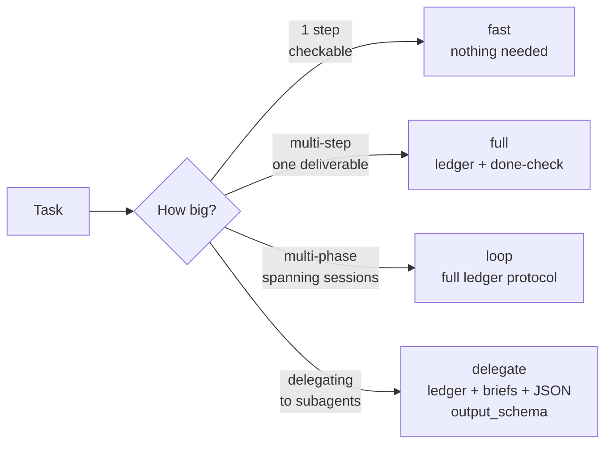

<div align="center">

# 🛤️ Riel

### Steering Layer for Harness/LLM

**Riel does not create capability in the model: it prevents capability from being lost.**

[](LICENSE)


</div>

A model can have a capability and still fail to deliver it: unstable
trajectory, drifting state, missing verification. That gap — having it vs.
delivering it — is what Riel steers. It operates on the surfaces a harness
exposes (first turn, task structure, between-turn state), never on weights.

The center of the framework is the **ledger**: externalized task state —
Goal, pre-registered Claims, Core (1-2 live items), Verified checkpoints,
Open questions, Next action — re-read at every seam, closed against named
verifiers. Everything else feeds it.

## Quick start

```bash
make install   # symlink rielctl into ~/.local/bin (on PATH)
make skills    # deploy the 6 skills to SKILLS_DIR (~/Workspace/Skills)
```

Then, from any task worktree:

```bash
rielctl note --goal "what done means" --next "first action"
```

`make help` lists every target. Only the mermaid checks need Node; nothing
in the runtime path does.

## What it replaces

Riel is the opposite of brute-force prompting: no plan, no state between
turns, no definition of done — sampling the model instead of steering it.
Riel inverts each: planned (`riel-contract`), held (`riel-ledger`),
delegated (`riel-briefs`, `riel-delegate`), and accepted only when every
Goal line maps to a verified checkpoint.

## The ledger cycle — the heart of the framework


Three rules carry the whole mechanism:

1. **Re-read at every seam.** The file is not the mechanism — the re-read is.
2. **A ✓NN without verifier + coverage is a mood, not a checkpoint.** The
   verifier is a command with binary output, external to the executor's
   judgment.
3. **No done from memory.** The done-check re-reads the Goal line by line
   against the ✓NN list, always.

Four load-bearing defenses against execution error:

- **Pre-registered claims** — what will be true when done is declared
  BEFORE the first action, with its verification method. Never editable
  post-execution: a failed claim is refuted, not reinterpreted.
- **Adversarial cross-check** — before any ✓NN, ask the opposite
  question: *what does this test NOT cover?* A passed gate without a
  cross-check is incomplete.
- **Contaminated-context invariant** — a ✓NN that took 3+ failed
  attempts leaves the context carrying the failed attempts. Models
  self-condition on their own error history; consider restarting from
  the last clean checkpoint instead of pushing forward.
- **Structured JSON returns on delegation** — children report via
  `output_schema`, not prose. `passed: true` with `exit_code: 1` is
  caught mechanically, not caught by reading.

## Components

| Component | What it steers | Status |
|---|---|---|
| `riel-ledger` | **State** — Goal/Claims/Core/Verified/Open/Next, re-read at every seam, recovery via checkpoints, mirrors to the session todo | ✅ skill v1.10 |
| `riel-contract` | **Structure** — mermaid as contract: closed verb vocabulary, verification funnel, graph digest, machine-checkable | ✅ skill v3.6 |
| `riel-protocol` | **Trajectory** — functional grammar, persona, minimal surface on the first turn | ✅ skill v1.7 |
| `riel-briefs` | **Delegation briefs** — self-contained packets: curated context, verb-graph, pre-registered claims, executable gates, templates | ✅ skill v3.5 |
| `riel-delegate` | **Delegation router** — plan, dispatch waves, JSON-schema'd returns, parent verifies | ✅ skill v1.3 |
| `riel-cli` | **Tooling** — `rielctl` writes the ledger mechanically, instantiates/validates packets, expands the graph digest, derives the session-todo mirror | ✅ skill v1.3 |

Each component is independent and optional: a short task uses zero; a long
loop may use all six. Use only the machinery the task earns.

Skills reference each other by name, not version — the installed set is
expected to come from the same commit. Install all six together; mixing
versions across skills is unsupported.

## Two paths, one framework



The solo path (fast/full/loop) keeps markdown + mermaid + gates + ledger.
Delegation adds JSON contracts and `output_schema` — only where a second
agent's report needs to be parsed, not read.

## System prompt initialization

Paste this block into `soul.md` or an injected system prompt:

```
## Frameworks — activation lines

- **Riel (steering)** — when operating any LLM conversation or task, load the
  `riel-protocol` skill and whichever apply: `riel-ledger` (multi-phase tasks),
  `riel-contract` (DAGs), `riel-briefs`/`riel-delegate` (delegation),
  `riel-cli` (ledger, packets and digest via `rielctl`). Riel does not create
  capability — it prevents it from being lost.
```

Keep it this short: the soul references the skills, it never embeds them
(embedding desyncs and costs tokens every turn). The same block lives at
`system-prompt.md`.

## Installation

From the repo checkout:

```bash
make install   # symlink rielctl into ~/.local/bin (PATH)
make skills    # sync the 6 skills to the skills dir
```

Both destinations are make variables and can be overridden per call —
the deployed-skills directory is machine- and user-specific, so pass
yours explicitly if you don't use the default:

```bash
make skills SKILLS_DIR=~/.hermes/skills        # per-user Hermes skills dir
make skills SKILLS_DIR=/srv/shared/skills      # any shared location
make install BIN_DIR=/some/other/bin           # non-default bin dir (must be on PATH)
```

Defaults: `SKILLS_DIR=$HOME/Workspace/Skills`, `BIN_DIR=$HOME/.local/bin`.
Environment variables work too (`SKILLS_DIR=... make skills`); the
command-line form wins.

Verify: the skill must appear in the session's skill index (`skills_list`).
Note the deployed copies are **copies**, not symlinks — re-run
`make skills` after pulling new commits.

### Hermes plugin (optional)

The repo also ships a Hermes plugin package at `hermes_plugin/riel`: the
ledger/contract machinery as four tools (`riel_note`, `riel_seam`,
`riel_resume`, `riel_todo`) wrapping a **vendored** `rielctl`. The package is
self-contained, so it never needs this checkout at runtime.

| Piece | Command |
|---|---|
| The 6 skills as an indexed Hermes skill source | `hermes skills tap add alvarolizama/riel` |
| The tools (pair them with the tap: the protocol prose is the skills) | `hermes plugins install alvarolizama/riel/hermes_plugin/riel` then `hermes plugins enable riel` |
| Development: link this checkout instead of installing | `make plugin-vendor` + `make plugin-link` (`PLUGINS_DIR` overridable) |

`vendor/` is a build artifact generated from `skills/` by `make plugin-vendor`
and compared byte for byte in the test suite, so the repo stays the single
source of truth. Note plugins are **per profile** (`$HERMES_HOME/plugins/`),
unlike skills, which are shared through `skills.external_dirs`.
`hermes_plugin/riel/README.md` documents how the plugin resolves the worktree's
`.riel/` state (session cwd, never the Hermes process cwd).

With the plugin active, its desktop half also puts an activity chip in the
statusbar: the ledger of the worktree in focus (`riel 4✓ 2? · next: <acción>`,
read through the plugin's own backend at `GET /api/plugins/riel/ledger`) plus the
live activity while a turn runs (`riel ● <tool> · …`, from the gateway's
`tool.start` / `tool.complete` events). The desktop half is opt-in and
app-level; see the plugin README for the three switches.

The plugin also carries the `pre_verify` gate: a turn that edited code inside a
Riel worktree does not close while its ledger has claims and no ✓ carrying
evidence — the rule `riel-ledger` states, enforced by the runtime. Bounded
(one nudge per turn by default) and opt-out per worktree (no ledger, no gate).

### Dependencies

| Piece | Needed at | Requires |
|---|---|---|
| The 6 skills (markdown only) | runtime | nothing — they are read by the agent |
| `rielctl` (`skills/riel-cli/scripts/rielctl`) | runtime (loop/delegate tasks) | **Python 3, stdlib only** |
| Task templates (`skills/riel-briefs/templates/`) | runtime | nothing — `rielctl` reads them directly |
| `scripts/validate-mermaid.sh` | development (validate graph files) | Node + `mmdc`: `npm install -g @mermaid-js/mermaid-cli` |
| `tests/test_rielctl.py`, `tests/test_plugin_vendor.py` | development (run the suite) | Python 3, stdlib only |
| Hermes plugin package (`hermes_plugin/riel/`) | Hermes users (optional) | Hermes ≥ 0.21 + Python 3; `vendor/` carries its own `rielctl` |

Optional. `rielctl brief validate` will *also* run `mmdc` on each graph if
it finds it on PATH; without it, structural checks still run, just without
the parser-level mmdc check. Nothing in the runtime path requires mmdc.

### Using `rielctl`

`make install` (from the repo checkout) symlinks `rielctl` into
`~/.local/bin`, so any shell — human or agent, in any worktree — calls
it without resolving the skill path. Run from the task's worktree root
(`rielctl` reads/writes `.riel/` under the current directory):

| Command | Does |
|---|---|
| `rielctl note …` | write/update `.riel/ledger.md` — goal, claims, core, checks, open, next; `--from-contract` seeds Goal/Phase/Claims/Next from `.riel/contract.md` |
| `rielctl seam` | re-print the ledger + which invariants are due |
| `rielctl resume` | post-gap bootstrap (ledger → invariants → mode → next) |
| `rielctl todo` | session-todo mirror (JSON) derived from the ledger |
| `rielctl ship FILE` | dense-register check before delivery |
| `rielctl brief new` / `validate` / `slice` | instantiate / structurally check / slice a phase into a mini packet |
| `rielctl brief digest` · `rielctl digest` | explicit text digest of a graph |
| `rielctl --version` · `--help` | version / usage |

If the command is not found, re-run `make install` or invoke the skill copy
directly: `python3 <skills-root>/riel-cli/scripts/rielctl ...`.

## Make targets

| Target | Does |
|---|---|
| `help` | list targets (default when you run bare `make`) |
| `install` | symlink `rielctl` into `$(BIN_DIR)` (`~/.local/bin`) |
| `skills` | sync the 6 skills to `$(SKILLS_DIR)` (deploy copies, not symlinks) |
| `plugin-vendor` | rebuild `hermes_plugin/riel/vendor/` from `skills/` (build artifact) |
| `plugin-link` | symlink the plugin package into `$(PLUGINS_DIR)` (`~/.hermes/plugins`) |
| `test` | regression suite (unittest discovery) |
| `validate` | parse every mermaid block with `mmdc` |
| `digest` | print the explicit graph digest for README + specs + skills |
| `lint` | byte-compile the Python tooling; `shellcheck` if present |
| `uninstall` | remove the `rielctl` symlink (deployed skills stay) |

## Validate & digest

```bash
make validate                          # every mermaid block, via mmdc
scripts/validate-mermaid.sh README.md  # a single file
make digest                            # explicit text digest of every graph
```

`validate` requires mermaid-cli (`npm install -g @mermaid-js/mermaid-cli`).
`digest` is stdlib-only.

## Structure

```
riel/
├── README.md          ← this file
├── assets/            ← header image
├── skills/            ← installable skills (deploy copies to $SKILLS_DIR)
│   ├── riel-ledger/     ← state: the heart of the framework
│   ├── riel-contract/   ← structure: mermaid contract + funnel + digest
│   ├── riel-protocol/   ← trajectory: grammar, persona, minimal surface
│   ├── riel-briefs/     ← delegation briefs + pre-registered claims + templates/
│   ├── riel-delegate/   ← delegation router + JSON output_schema
│   └── riel-cli/        ← rielctl: ledger writer, packet + digest tooling
├── hermes_plugin/     ← Hermes plugin package (machinery only, optional)
│   ├── riel/            ← tools + gate + vendored rielctl/templates (self-contained)
│   │   ├── dashboard/     ← backend del chip (GET /api/plugins/riel/ledger)
│   │   └── desktop/       ← chip de actividad en el statusbar (opt-in)
│   └── probe-session-cwd.py ← live probe of the Hermes load path (needs Hermes)
├── specs/             ← design contracts
│   ├── spec-ledger-format.md    ← .riel/ledger.md format + rules
│   ├── spec-contract-format.md  ← .riel/contract.md format (the plan)
│   ├── spec-todo-hermes.md      ← session-todo mirror (Hermes todo tool)
│   └── spec-phase-advance.md    ← per-phase ledger
├── scripts/           ← repo tooling
│   ├── validate-mermaid.sh   ← validates every mermaid block with mmdc
│   └── extract-mermaid.py    ← extracts mermaid blocks (regex, re.DOTALL)
├── tests/             ← stdlib unittest suite (test_rielctl.py, test_plugin_vendor.py)
└── references/        ← evidence & design notes (public)
```

## Tests

```bash
make test     # or: python3 -m unittest discover -s tests -v
```

Stdlib-only, subprocess-driven. 119 tests cover `rielctl note/seam/resume/todo/ship`,
`brief new/validate/digest`, the graph checks, and `extract-mermaid.py` end-to-end,
plus the Hermes plugin package: vendoring hashes, manifest/schema/handler
wiring, the handlers end-to-end through the vendored copy, the statusbar chip
rendered by node against a stubbed SDK (labels, tooltip, click, and the refetch
a finished tool triggers), the backend routes through a real FastAPI app, and
the `pre_verify` gate's decision table (worktree resolution, counters,
self-throttling, and its opt-out rules).

The Hermes-side load path (discovery, registration, session-cwd resolution,
per-session isolation) needs a real Hermes install, so it is probed separately —
run from a directory that is not a worktree:

```bash
# the same interpreter the `hermes` launcher execs
hermes_dir="$(dirname "$(sed -n 's/^exec "\(.*\)\/hermes".*/\1/p' "$(command -v hermes)")")"
"$hermes_dir/bin/python" hermes_plugin/probe-session-cwd.py
```

Any Python that can `import hermes_cli` works as well.
