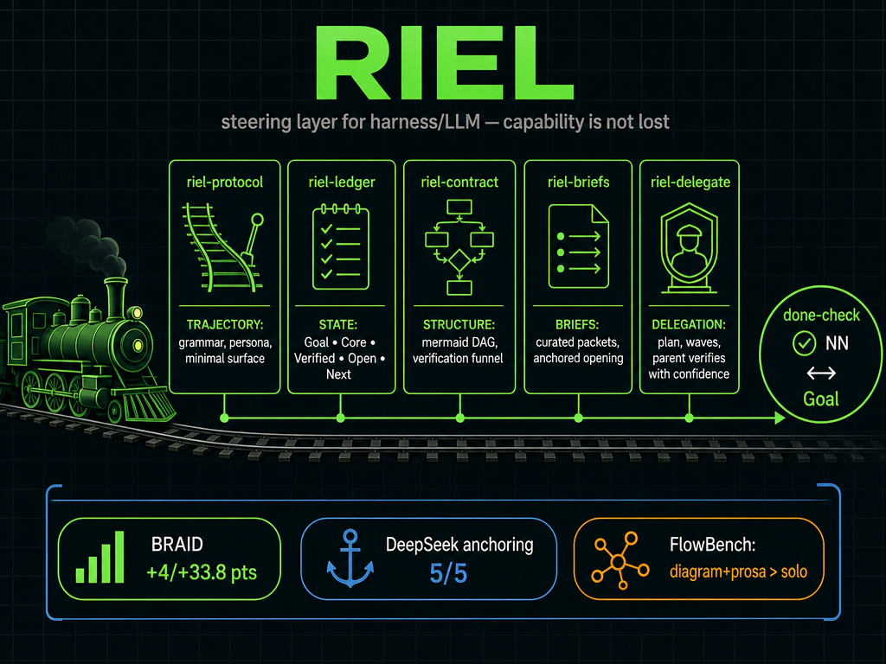
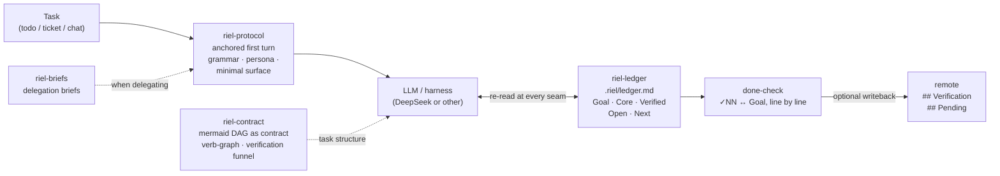
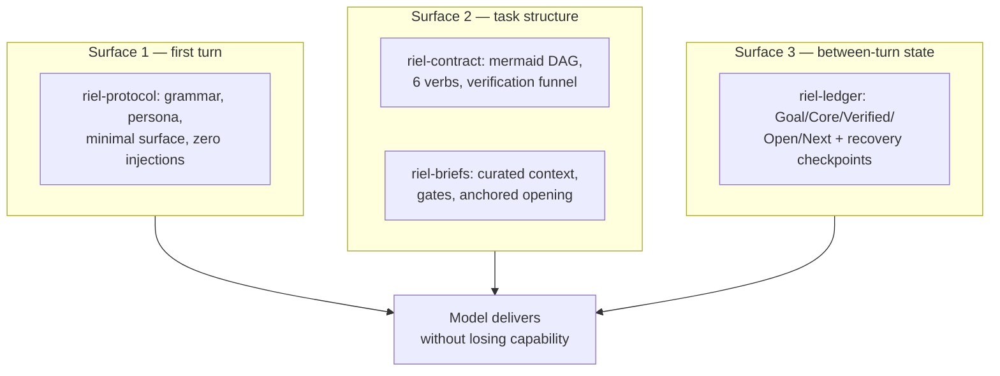

# Riel — steering layer for harness/LLM



A homegrown agent-steering framework. **Riel does not create capability in the
model: it prevents capability from being lost.** The thesis comes from
*capability-realization loss* research: the gap between a model having a
capability and delivering it reliably (unstable trajectory, drifting state,
missing verification).

The name: the train already moves on its own; the rail just keeps it from
derailing.

Applies to any harness/LLM (DeepSeek or other) by operating on the surfaces
the harness exposes — system prompt / first turn, between-turn context, task
structure — without touching weights or internals.

## How it works



Every component operates on a different control surface:



## Components

| Component | What it steers | Metaphor | Status |
|---|---|---|---|
| `riel-protocol` | **Trajectory** — functional grammar, persona, minimal surface | the switch: the first turn picks the track | ✅ skill v1.2 |
| `riel-ledger` | **State** — Goal/Core/Verified/Open/Next, re-read at every seam; recovery via checkpoints; local-first, no remote dependency | the track level | ✅ skill v1.2 + specs |
| `riel-contract` | **Structure** — mermaid as contract, verification funnel, BRAID/FlowBench evidence | the rails themselves | ✅ skill v3.0 |
| `riel-briefs` | **Delegation briefs** — curated context, verb-graph, gates, anchored opening | the signage | ✅ skill v3.0 |

Each component is **independent and optional**: a short task uses zero;
a long loop may use all four. Inherited philosophy: "use only the machinery
the task earns".

## The ledger cycle (heart of the framework)


## System prompt initialization

To make the framework mandatory, paste this block into `soul.md` or an
injected system prompt (full version with rationale: `system-prompt.md`):

```
## Riel — steering framework

When operating on any LLM conversation or task, follow the Riel framework
(load the matching skill when it applies):

1. riel-protocol — open every conversation and subagent brief with a shared
   objective ("We need…"), a short stable persona, and minimal surface.
   Never rewrite the user's request.
2. riel-ledger — for multi-phase or long tasks, keep
   Goal/Core/Verified/Open/Next in .riel/ledger.md and re-read it at every
   seam. No done until every Goal line maps to a ✓NN with verifier and
   coverage; recover from the last ✓NN with a fresh plan.
3. riel-contract — express instructions and phases as mermaid DAGs with the
   closed verb vocabulary (READ/EDIT/CREATE/RUN/VERIFY/ASK); every flow ends
   in VERIFY nodes before End.
4. riel-briefs — when delegating, briefs are self-contained: curated
   context, executable gates, explicit DO NOT.

Riel never rewrites capability in — it only prevents it from being lost.
```

Keep it this short: the soul references the skills, it never embeds them
(embedding desyncs and costs tokens every turn).

## How skills get loaded (Hermes mechanics)

Skills are NOT injected whole into every conversation — only their
name+description lives in each turn's system-prompt index. There are three
activation levels:

**Level 1 — available (automatic).** Skill installed in `~/.hermes/skills/`
→ its description appears in each turn's index → the agent loads it
(`skill_view`) when the task matches the description trigger. That is why
the first ~57 characters of the description are the actual trigger.

**Level 2 — mandatory (soul).** One line in the soul (identity system
prompt): *"In every conversation or brief for an LLM, apply the protocol of
skill `riel-protocol`."* The soul references the skill, never embeds its
content (it would desync and cost tokens every turn).

**Level 3 — subagents (brief).** `delegate_task` subagents have access to
the same skills; the parent's brief includes *"load and follow skill
riel-protocol"* and the subagent loads it itself.

General rule: the skill body enters context **only when needed**; the index
is what lives always.

## Installation

```bash
# from the repo
cp -R ~/Workspace/Repos/alvarolizama/riel/skills/riel-protocol ~/.hermes/skills/

# update after repo changes
cp -R ~/Workspace/Repos/alvarolizama/riel/skills/* ~/.hermes/skills/
```

Verify: the skill must appear in the session's skill index (`skills_list` or
the system listing).

## Validate mermaid blocks

```bash
scripts/validate-mermaid.sh            # README + specs + skills + system-prompt
scripts/validate-mermaid.sh README.md  # a single file
```

Requires mermaid-cli (`npm install -g @mermaid-js/mermaid-cli`). Extracts the
` ```mermaid ` blocks with `scripts/extract-mermaid.py` (regex + `re.DOTALL`,
not awk — awk works line-by-line, not whole blocks) and pipes each through
`mmdc`. Practicing what riel-contract preaches: the repo's own diagrams must
parse.

## Structure

```
riel/
├── README.md          ← this file
├── assets/            ← framework infographic
├── skills/            ← installable skills (cp to ~/.hermes/skills/)
│   ├── riel-protocol/   ← trajectory: grammar, persona, minimal surface
│   ├── riel-ledger/     ← state: local Goal/Core/Verified/Open/Next + recovery
│   ├── riel-contract/   ← structure: mermaid contract + verification funnel
│   └── riel-briefs/     ← delegation briefs with anchored opening
├── specs/             ← design contracts (source of the patches)
│   ├── spec-ledger-format.md    ← .riel/ledger.md format + rules + git hygiene
│   ├── spec-todo-contract.md    ← what the todo body must carry → todo-flow patch
│   ├── spec-pull-push.md        ← local↔remote protocol → coder-flow patch
│   ├── spec-phase-advance.md    ← per-phase ledger: ledger+contract fusion
│   └── spec-adapters.md         ← system-agnostic contract for remote task systems
├── scripts/           ← repo tooling
│   ├── validate-mermaid.sh   ← validates every mermaid block with mmdc
│   └── extract-mermaid.py    ← extracts mermaid blocks (regex, re.DOTALL)
└── references/        ← local-only notes (gitignored; public contract in specs/)
```

## Papers & sources actually used

| Source | What it contributed | Component(s) |
|---|---|---|
| Gurnee et al., *Verbalizable Representations Form a Global Workspace in Language Models* (Anthropic, 2026) | Workspace concept: capacity of 1-2 active ideas, broadcast hub, written externalization survives workspace ablation | `riel-protocol`, `riel-ledger` |
| DeepSeek community research: [dsh-anchored-standard](https://github.com/xiaobright/dsh-anchored-standard) + [DeepseekCotexplorations](https://github.com/0liveiraaa/DeepseekCotexplorations) | The 3 anchoring levers: Minimal tool schema 5/5, output budget 26/32, skill-catalog injections 0/9; "We need…" trajectory | `riel-protocol` |
| DeepSeek-V4 official paper ([arXiv:2606.19348](https://arxiv.org/abs/2606.19348)) | Model facts (1.6T/49B, 1M context); confirmation that anchoring is NOT officially documented — it is black-box evidence | `riel-protocol` |
| DeepSeek Harness source ([deepseek-ai/deepseek-harness](https://github.com/deepseek-ai/deepseek-harness)) | First-hand confirmation of the Minimal preset (complete persona, zero runtime context, two-tool pair); `ctx.invariants` registry; capability seams | `riel-protocol`, `riel-ledger` |
| BRAID ([arXiv:2512.15959](https://arxiv.org/abs/2512.15959)) | Mermaid graphs as executable plans: +4 to +33.8 accuracy points, up to 74x performance-per-dollar; atomic nodes; verification funnel; generator/solver split | `riel-contract`, `riel-briefs` |
| FlowBench (EMNLP 2024 Findings) | Flowcharts > prose for agent planning; text + code + flowchart together > any single format | `riel-contract` |
| Lost in the Middle ([arXiv:2307.03172](https://arxiv.org/abs/2307.03172)) | Branch logic in paragraphs gets lost in long context; graphs are position-proof | `riel-contract` |
| Metacognitive control harness ([arXiv:2605.14186](https://arxiv.org/abs/2605.14186)) + Nelson & Narens 1990 | Every monitoring signal must select an action (48.3 → 56.9 without weight changes) | `riel-ledger` |
| Long-horizon agent failures ([arXiv:2607.05775](https://arxiv.org/abs/2607.05775), [arXiv:2607.00692](https://arxiv.org/abs/2607.00692), [arXiv:2607.08964](https://arxiv.org/abs/2607.08964)) | Context-handling gap, no-recovery bottleneck, completion overestimation → ledger fields, recovery protocol, done-check | `riel-ledger` |
| Re-reading the input ([arXiv:2309.06275](https://arxiv.org/abs/2309.06275)) | Re-reading improves reasoning across 14 datasets → the seam re-read | `riel-ledger` |
| METR GPT-5 evaluation report | The recovery template: "Stop. Focus. Return to step by step" — fresh plan, re-enter at step 1 | `riel-ledger` |

Full distillation of the 24 verified sources lives in the local
`references/` directory.

## Honesty about evidence

- **Measured:** first-turn conditions anchor the trajectory on DeepSeek
  (Minimal schema 5/5; with injections 0/9).
- **Hypothesis:** that the anchored trajectory improves scores — independent
  replication with 95% CI [−2.6, +9.3]; one A/B found no gain. Riel does not
  promise better results; task verification lives in the done-check of
  `riel-ledger`.
