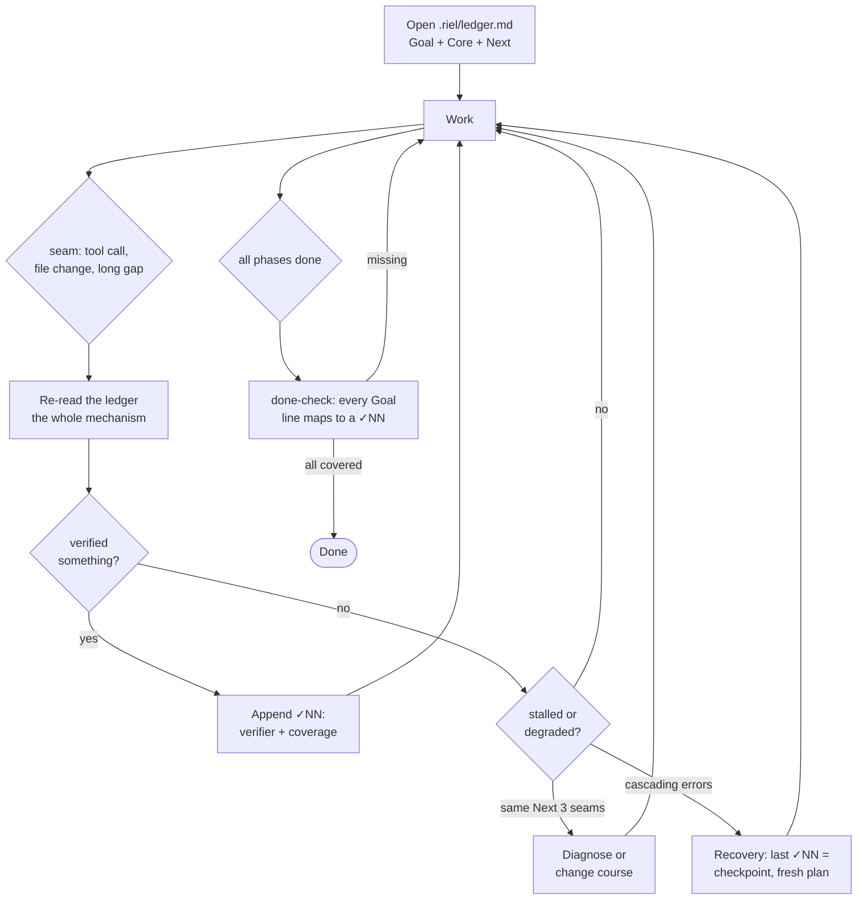

<div align="center">

# 🛤️ Riel

### Steering Layer for Harness/LLM

**Riel does not create capability in the model: it prevents capability from being lost.**

[](LICENSE)


</div>

A model can have a capability and still fail to deliver it: unstable
trajectory, drifting state, missing verification. That gap — having it vs.
delivering it — is what Riel steers. It operates on the surfaces a harness
exposes (first turn, task structure, between-turn state), never on weights.

The center of the framework is the **ledger**: externalized task state,
re-read at every seam, closed against named verifiers. Everything else feeds
it.

## What it replaces

Riel is the opposite of brute-force prompting: no plan, no state between
turns, no definition of done — sampling the model instead of steering it.
Riel inverts each: planned (`riel-contract`), held (`riel-ledger`),
delegated (`riel-briefs`, `riel-delegate`), and accepted only when every
Goal line maps to a verified checkpoint.

## The ledger cycle — the heart of the framework



Three rules carry the whole mechanism:

1. **Re-read at every seam.** The file is not the mechanism — the re-read is.
2. **A ✓NN without verifier + coverage is a mood, not a checkpoint.** The
   verifier is a command with binary output, external to the executor's
   judgment.
3. **No done from memory.** The done-check re-reads the Goal line by line
   against the ✓NN list, always.

## Components

| Component | What it steers | Status |
|---|---|---|
| `riel-ledger` | **State** — Goal/Core/Verified/Open/Next, re-read at every seam, recovery via checkpoints | ✅ skill v1.6 |
| `riel-contract` | **Structure** — mermaid as contract: closed verb vocabulary, verification funnel, machine-checkable | ✅ skill v3.3 |
| `riel-protocol` | **Trajectory** — functional grammar, persona, minimal surface on the first turn | ✅ skill v1.5 |
| `riel-briefs` | **Delegation briefs** — self-contained packets: curated context, verb-graph, executable gates | ✅ skill v3.2 |
| `riel-delegate` | **Delegation router** — plan, dispatch waves, parent verifies returns | ✅ skill v1.2 |

Each component is independent and optional: a short task uses zero; a long
loop may use all five. Use only the machinery the task earns.

Skills reference each other by name, not version — the installed set is
expected to come from the same commit. Install all five together; mixing
versions across skills is unsupported.

## System prompt initialization

Paste this block into `soul.md` or an injected system prompt:

```
## Frameworks — líneas activadoras

- **Riel (steering)** — al operar cualquier conversación o tarea LLM, carga el
  skill `riel-protocol` y los que apliquen: `riel-ledger` (tareas multi-fase),
  `riel-contract` (DAGs), `riel-briefs`/`riel-delegate` (delegación). Riel no
  crea capacidad — evita que se pierda.
```

Keep it this short: the soul references the skills, it never embeds them
(embedding desyncs and costs tokens every turn).

## Installation

```bash
cp -R ~/Workspace/Repos/alvarolizama/riel/skills/* ~/.hermes/skills/
```

Verify: the skill must appear in the session's skill index (`skills_list`).

## Validate mermaid blocks

```bash
scripts/validate-mermaid.sh            # README + specs + skills
scripts/validate-mermaid.sh README.md  # a single file
```

Requires mermaid-cli (`npm install -g @mermaid-js/mermaid-cli`).

## Structure

```
riel/
├── README.md          ← this file
├── assets/            ← framework header
├── skills/            ← installable skills (cp to ~/.hermes/skills/)
│   ├── riel-ledger/     ← state: the heart of the framework
│   ├── riel-contract/   ← structure: mermaid contract + verification funnel
│   ├── riel-protocol/   ← trajectory: grammar, persona, minimal surface
│   ├── riel-briefs/     ← delegation briefs
│   └── riel-delegate/   ← delegation router
├── specs/             ← design contracts
│   ├── spec-ledger-format.md    ← .riel/ledger.md format + rules
│   ├── spec-todo-contract.md    ← what the todo body must carry
│   ├── spec-pull-push.md        ← local↔remote protocol
│   ├── spec-phase-advance.md    ← per-phase ledger
│   └── spec-adapters.md         ← contract for remote task systems
├── scripts/           ← repo tooling
│   ├── validate-mermaid.sh   ← validates every mermaid block with mmdc
│   └── extract-mermaid.py    ← extracts mermaid blocks (regex, re.DOTALL)
└── references/        ← local-only notes
```

The name: the train already moves on its own; the rail just keeps it from
derailing.
