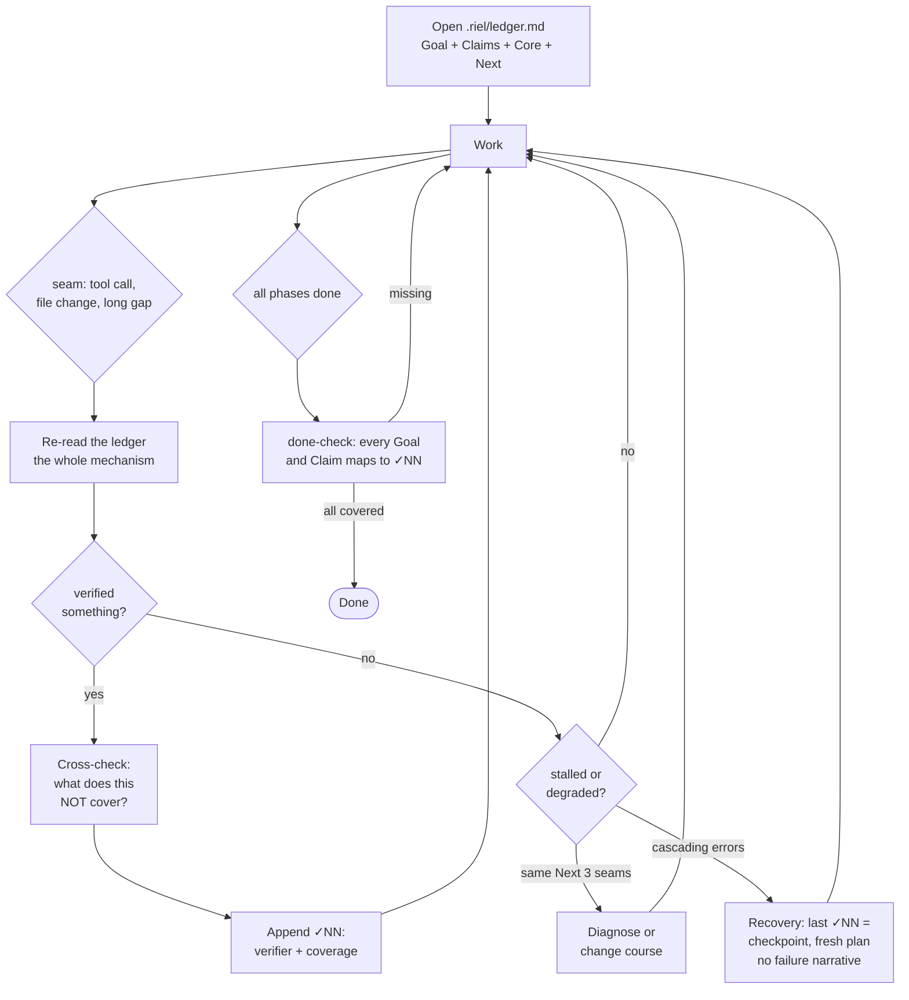
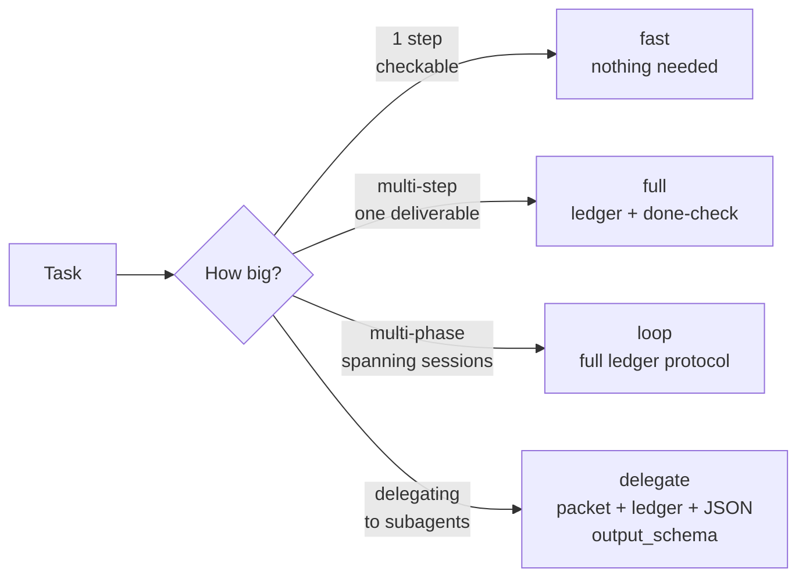

<div align="center">


# Riel

### *Riel* — the rail a runaway train needs. Steering, not horsepower.

### Steering layer for harness/LLM

[](LICENSE)
[](./hermes_plugin/riel/plugin.yaml)
[](https://www.python.org)
[](https://www.nousresearch.com)

</div>

## What is Riel

**Riel does not create capability in the model: it prevents capability from
being lost.** A model can have a capability and still fail to deliver it:
unstable trajectory, drifting state, missing verification. That gap — having
it vs. delivering it — is what Riel steers. It operates on the surfaces a
harness exposes (first turn, task structure, between-turn state), never on
weights.

The center of the framework is the **ledger**: externalized task state —
Goal, pre-registered Claims, Core (1-2 live items), Verified checkpoints,
Open questions, Next action — re-read at every seam, closed against named
verifiers. Everything else feeds it.

Riel ships as two faces over one core:

| Face | What it is | Where |
|---|---|---|
| **The prose** | six guides the agent reads on demand — protocol, ledger, contract, shaping, delegate, tools | `hermes_plugin/riel/guide/*.md` |
| **The engine** (one stdlib file) | not a user surface: the sole writer of the ledger format; instantiates, validates and slices packets; derives the todo/state mirrors; fetches remote contracts — reached only through the twelve tools | `engine/run.py` |
| **The Hermes plugin** | the whole product: the prose (read through `riel_guide`), the engine, twelve typed tools (`riel_guide`, `riel_note` … `riel_check`), the `pre_verify` gate and a statusbar chip — installed as a copy of a commit, updated the same way | `hermes_plugin/riel/` |
| **Specs** | the long form of each format (ledger, contract, shaping, todo, the package itself) | `specs/` |

The prose lives **inside the package** (`hermes_plugin/riel/guide/`) — one tree, no copy: what you edit is what ships.
The repo is the single source of truth and the suite covers the package in place.

### Components

| Component | What it steers | Status |
|---|---|---|
| riel_guide(topic="ledger") | **State** — Goal/Claims/Core/Verified/Open/Next, re-read at every seam, recovery via checkpoints, opening rules over an existing `.riel/`, auto-backup before every engine write, mirrors to the session todo | ✅ guide v1.16.0 |
| riel_guide(topic="contract") | **Structure** — mermaid as contract: closed verb vocabulary, verification funnel, graph digest, machine-checkable | ✅ guide v3.7.6 |
| riel_guide(topic="protocol") | **Trajectory** — functional grammar, persona, minimal surface on the first turn | ✅ guide v1.8.0 |
| riel_guide(topic="delegate") | **Delegation end-to-end** — the packet (curated context + `### Why` + keywords, verb-graph, anchored claims, gates) and the cycle: plan, dispatch waves, JSON-schema'd returns, parent verifies | ✅ guide v2.0.1 |
| riel_guide(topic="shaping") | **Evidence before the plan** — findings with sources, alternatives with verdicts, the verdict that seeds the contract; claim anchors point back here | ✅ guide v1.0.0 |
| riel_guide(topic="tools") | **Tooling** — the tool surface: `riel_note` writes the ledger mechanically, `riel_clean` archives the worktree state with flat in-`.riel/` backups, `riel_contract` instantiates/validates packets, slices a phase into a child packet (inheriting the Objective, the `### Why` rationale and the keywords) and expands the graph digest, `riel_todo` derives the session-todo mirror (the plan: the contract's goal, phases and steps), `riel_state` the ledger mirror the chip and the gate fold, `riel_context` emits the context keywords, `riel_fetch` fetches a remote contract to disk (HTTPS, atomic, sha256-verified), `riel_shaping` validates a shaping (Spec 7) and `riel_seam(anchors=true)` re-reads each claim beside the anchored region that supports it | ✅ guide v1.17.0 |

Each component is independent and optional: a short task uses zero; a long
loop may use all six. Use only the machinery the task earns.

The guides reference each other by topic, not version — the installed set is
expected to come from the same commit. Install all six together; mixing
versions across guides is unsupported.

## What it is for

- **Multi-phase work that spans sessions.** The ledger holds the state
  between turns and restarts: any fresh session re-reads
  `.riel/ledger.md` and continues from the last verified checkpoint
  instead of re-deriving the task from a conversation transcript.
- **A "done" backed by evidence.** Every Goal line and pre-registered
  claim must map to a ✓NN checkpoint with a named verifier (a command with
  binary output) and an explicit coverage. No done from memory.
- **Delegation with machine-checkable reports.** Children receive a slice
  of the contract (subgraph, gates, intent) and return JSON against an
  `output_schema` — `passed: true` with `exit_code: 1` is caught
  mechanically, not by reading prose. The parent is the ledger's only
  writer.
- **Plans as artifacts, not intentions.** The contract
  (`.riel/contract.md`) is written first: objective, `### Why` rationale,
  constraints, pre-registered claims, a mermaid execution graph with a
  verification funnel, executable gates, deliverable, DO NOT. A parser
  accepts or rejects it (`riel_contract(verb="validate")`).
- **The evidence before the plan.** A task that researches first writes
  `.riel/shaping.md` — findings with their sources and a confidence,
  alternatives with their verdicts, the questions still open — and each claim
  can point back at its support (`— anchor: §Constraints#2`, a node of the
  graph, or `shaping:F1`). `riel_seam(anchors=true)` re-reads a claim beside the
  region that holds it up, at every seam, so a support that moved is noticed
  while the claim is still refutable.
- **Recovery from degraded runs.** A ✓NN that took 3+ failed attempts
  leaves the context contaminated with its own error history; the ledger's
  checkpoints let you restart clean from the last verified state instead
  of pushing forward.

## Why

Riel is the opposite of brute-force prompting: no plan, no state between
turns, no definition of done — sampling the model instead of steering it.
Riel inverts each: planned (riel_guide(topic="contract")), held (riel_guide(topic="ledger")),
delegated (riel_guide(topic="delegate")), and accepted only when every
Goal line maps to a verified checkpoint.

### The ledger cycle — the heart of the framework


```mermaid
flowchart TD
  OPEN["Open .riel/ledger.md\nGoal + Claims + Core + Next"] --> W[Work]
  W --> S{"seam: tool call,\nfile change, long gap"}
  S --> R["Re-read the ledger\nthe whole mechanism"]
  R --> V{"verified\nsomething?"}
  V -->|yes| XC["Cross-check:\nwhat does this\nNOT cover?"]
  XC --> APP["Append ✓NN:\nverifier + coverage"]
  APP --> W
  V -->|no| ST{"stalled or\ndegraded?"}
  ST -->|"same Next 3 seams"| FIX["Diagnose or\nchange course"]
  ST -->|"cascading errors"| REC["Recovery: last ✓NN =\ncheckpoint, fresh plan\nno failure narrative"]
  FIX --> W
  REC --> W
  ST -->|no| W
  W --> END{"all phases done"}
  END --> DC["done-check: every Goal\nand Claim maps to ✓NN"]
  DC -->|missing| W
  DC -->|all covered| DONE([Done])
```

Three rules carry the whole mechanism:

1. **Re-read at every seam.** The file is not the mechanism — the re-read is.
2. **A ✓NN without verifier + coverage is a mood, not a checkpoint.** The
   verifier is a command with binary output, external to the executor's
   judgment.
3. **No done from memory.** The done-check re-reads the Goal line by line
   against the ✓NN list, always.

Four load-bearing defenses against execution error:

- **Pre-registered claims** — what will be true when done is declared
  BEFORE the first action, with its verification method. Never editable
  post-execution: a failed claim is refuted, not reinterpreted.
- **Adversarial cross-check** — before any ✓NN, ask the opposite
  question: *what does this test NOT cover?* A passed gate without a
  cross-check is incomplete.
- **Contaminated-context invariant** — a ✓NN that took 3+ failed
  attempts leaves the context carrying the failed attempts. Models
  self-condition on their own error history; consider restarting from
  the last clean checkpoint instead of pushing forward.
- **Structured JSON returns on delegation** — children report via
  `output_schema`, not prose. `passed: true` with `exit_code: 1` is
  caught mechanically, not caught by reading.

### Intent travels with the plan

The contract captures *what* (`## Objective`, one sentence opening with
"We need…"), *what will be true* (`## Pre-registered claims`) and *why*
(`### Why`, under `## Context`): the rationale — what triggers the
objective, which alternative was discarded. `riel_contract(verb="slice")`
inherits the Objective, the `### Why` and the context keywords into every
child packet, so a delegated agent never executes with the what but
without the why; on a conflict it escalates (`ASK[goal-changing]`) instead
of reinterpreting. `riel_contract(verb="validate")` WARNs when the Objective runs past one
sentence — rationale belongs in `### Why`.

## How to use

### Two paths, one framework


```mermaid
flowchart LR
  TASK[Task] --> MODE{"How big?"}
  MODE -->|"1 step\ncheckable"| FAST["fast\nnothing needed"]
  MODE -->|"multi-step\none deliverable"| FULL["full\nledger + done-check"]
  MODE -->|"multi-phase\nspanning sessions"| LOOP["loop\nfull ledger protocol"]
  MODE -->|"delegating\nto subagents"| DELEG["delegate\npacket + ledger + JSON\noutput_schema"]
```

The solo path (fast/full/loop) keeps markdown + mermaid + gates + ledger.
Delegation adds JSON contracts and `output_schema` — only where a second
agent's report needs to be parsed, not read.

### Anatomy of a loop task

From the task's worktree (everything lives under `.riel/`, gitignored
local state):

```
# 1. Write the plan first — the contract (skeleton from a template,
#    then you write the returned text to .riel/contract.md)
riel_contract(verb="new", template="feature",
           params=["name=reset flow", "one_sentence=add password reset via email"])
#    …fill Context (### Why, keywords), claims, graph, gates, DO NOT by hand…
riel_contract(verb="validate", file=".riel/contract.md")

# 2. Seed the ledger from the contract (Goal ← Objective, Claims ← P#,
#    Phase ← first F#/W# node, Next ← graph entry)
riel_note(from_contract=true)

# 3. Mirror the plan into the session todo (pass the returned JSON to todo_list)
riel_todo

# 4. Work the graph. At every seam, re-read — ledger and support:
riel_seam(anchors=true)

# 5. Close each verified checkpoint with real gate output — never prose:
riel_note(check="suite green", by="make test: 264 OK", covering="plugin, engine")

# 6. Delegate a phase: slice its subgraph into a child packet
riel_contract(verb="slice", file=".riel/contract.md", phase="F2")

# 7. Done-check: every Goal line and Claim maps to a ✓NN
riel_resume
```

### The tool surface

Riel has no command line to call: the engine ships inside the plugin and the
**tools are the interface**. Every tool runs it against the worktree of the
session you are in (session cwd, never the host process cwd), and every one
returns the same envelope — `{command, worktree, exit_code, passed, stdout,
stderr}` plus its own keys. `command` is provenance, never something to type.

| Tool | Does |
|---|---|
| `riel_note` | write/update `.riel/ledger.md` — goal, next, core, claim+verify_with, check+by+covering, open+settled_by, close; `from_contract=true` seeds Goal/Phase/Claims/Next from `.riel/contract.md` |
| `riel_seam` | re-print the ledger + which invariants are due; `anchors=true` also re-reads each claim beside the region that supports it |
| `riel_resume` | post-gap bootstrap (ledger → invariants → mode → next) |
| `riel_todo` | session-todo mirror (JSON) — the PLAN: the contract's goal (its Objective), its phases as rows and their steps as nested subtasks; the ledger sets the statuses (the current step is the only in_progress) |
| `riel_state` | ledger mirror (JSON) — the ledger's own facts for the desktop chip and the `pre_verify` gate: goal, phase, next, opens, claims, verified checkpoints |
| `riel_context` | context keywords of a contract (JSON) — the index the memory search reads |
| `riel_contract` | `new` renders a template (returns the text — you write it), `validate` runs the structural rules, `digest` expands a graph, `slice` extracts one phase as a child packet |
| `riel_shaping` | `new` drops the Spec 7 skeleton, `validate` checks a shaping |
| `riel_clean` | archive the worktree's `.riel/` state — flat timestamped backups inside `.riel/` (`ledger-<ts>.bak.md`, never a subdirectory); `all` includes the contract and the shaping, `purge` removes without backup; ask the user before cleaning (rule in riel_guide(topic="ledger")) |
| `riel_fetch` | download a contract into the worktree — run it at the **task opening** (`riel_resume`/`riel_seam`/`riel_note(from_contract=true)`), not only when delegating; atomic, sha256-pinned, HTTPS by default (`allow_http` for a trusted transport such as a VPN); the URL may carry a short-lived single-use token instead of the API key, and is never printed |
| `riel_check` | dense-register check on one file before delivery + the explicit text digest of its graph; `mermaid=true` also parses every block with mermaid-cli |

### The Hermes plugin

With the plugin enabled, the same mechanics run as native tools and the
protocol is enforced by the runtime:

- **Twelve tools**, and no command line: `riel_guide` (the prose), `riel_note`,
  `riel_seam`, `riel_resume`, `riel_todo`, `riel_state`, `riel_context`,
  `riel_contract`, `riel_shaping`, `riel_clean`, `riel_fetch`, `riel_check`. Each call resolves
  the session's worktree (session cwd, never the Hermes process cwd) and runs
  the bundled engine in a subprocess — concurrent sessions never touch each
  other's ledger. `riel_seam(anchors=true)` folds the anchor re-read into the
  seam; `riel_contract` and `riel_shaping` take a typed `verb`, never argv.
- **The prose ships inside the package, read on demand**: six guides served by `riel_guide` — the index with no argument, one
  guide by topic, one section of it by `section=`. The `riel` prompt section
  publishes what the tool catalog cannot: that the prose exists at all, its topic
  list, and the worktree's ledger state, so a fresh session knows what Riel is
  without anyone copying markdown anywhere. Nothing registers a Hermes skill.
- **Three switches, from the chip or `/riel`**: `gate`, `tools` and `context`,
  plus the operator's `harness_note` line for whatever the model of the day
  needs. A switch applies to the NEXT session (a session keeps the prompt and
  the tool list it started with) and the refusal a handler gives when its group
  is off is the only immediate half.
- **The `pre_verify` gate**: a turn that edited code inside a Riel worktree
  does not close while its ledger has claims and no ✓ carrying evidence —
  the rule riel_guide(topic="ledger") states, enforced by the runtime. Bounded (one nudge
  per turn by default, `gate_attempts`), opt-out per worktree (no ledger, no
  gate) and switchable (`gate: false`).
- **The desktop chip** (opt-in, app-level): ONE statusbar item for the focused
  worktree — it exists only when `.riel/contract.md` is there; idle it reads
  `Riel` (a click opens the contract rendered with its mermaid graph), and
  while the turn runs `Riel ● <tool>` names the live tool. The ledger's own
  state stays out of the bar: the model re-reads it with `riel_seam` and the
  `pre_verify` gate enforces it. Its backend serves
  `/api/plugins/riel/{health,ledger,contract,session_cwd,settings}`; ⌘K carries
  `Riel: encender/apagar el gate` and `… el bloque del prompt`.
- **`riel_context`** hands over the contract's context-keyword index and
  stops — memory backends live in the agent's memory manager, not in the
  tool registry, so the search is the agent's, with whatever backend it has
  configured.
- **The injected plan is visible app-wide**: `riel_todo`'s mirror lands in
  the desktop's composer status stack (goal → phases → steps as nested
  rows with live glyphs) and in the sidebar card's `X/Y` progress — the
  surfaces the mirror feeds are documented in `specs/spec-todo-hermes.md`.

`hermes_plugin/riel/README.md` documents the plugin in depth (worktree
resolution, chip wiring, gate limits).

## Installation

### From Hermes (user)

One artifact installs everything — the prose, the engine, the tools, the gate
and the chip — as a **copy of a commit, with provenance**. Never a symlink, and
nothing to put on `PATH`:

```bash
hermes plugins install "git@github.com:alvarolizama/riel.git#hermes_plugin/riel" --enable
hermes plugins update riel         # after new commits
```

Then enable the desktop half (opt-in) in the app: **Capabilities →
Plugins → riel**. Verify: `hermes plugins doctor riel`, and a fresh session's
prompt carries the `riel` section while `riel_guide(topic="ledger")` answers (12 tools, 0 skills).

### Manual (development)

From a checkout — the package's tree IS the source; there is no build step:

```bash
git clone https://github.com/alvarolizama/riel && cd riel

HERMES_HOME=~/.hermes/profiles/<p> hermes plugins install \\
  "file://$(pwd)#hermes_plugin/riel" --enable
make test && make lint && make validate

# the desktop half, app-level (loaded from the installed package; no extra copy)
```

Commit before installing: the installer clones a commit, so anything
uncommitted does not travel. A plugin enabled mid-session is not live until the
gateway restarts, and the desktop half re-scans on app start (⌘K → **Reload
desktop plugins** if the chip does not appear).

### Dependencies

| Piece | Needed at | Requires |
|---|---|---|
| The 6 guides (markdown only) | runtime | nothing — the agent reads them through `riel_guide` |
| The engine (`engine/run.py`) | runtime (loop/delegate tasks) | **Python 3, stdlib only** |
| Task templates (`templates/`) | runtime | nothing — the engine reads them directly |
| The engine's `mermaid` (via `riel_check(mermaid=true)` or `make validate`) | development (parse graph files) | Node + `mmdc`: `npm install -g @mermaid-js/mermaid-cli` — optional |
| `tests/` | development (run the suite) | Python 3, stdlib only (the desktop half's tests also use `node`; the FastAPI route tests need a Hermes interpreter) |
| Hermes plugin package (`hermes_plugin/riel/`) | Hermes users | Hermes + Python 3; it carries the prose (`guide/`), the engine (`engine/run.py`) and the templates (`templates/`) |

Optional. `riel_contract(verb="validate")` will *also* run `mmdc` on each graph if
it finds it on PATH; without it, structural checks still run, just without
the parser-level mmdc check. Nothing in the runtime path requires mmdc.

### Make targets

| Target | Does |
|---|---|
| `help` | list targets (default when you run bare `make`) |
| `test` | regression suite (unittest discovery) |
| `validate` | parse every mermaid block with `mmdc` (the engine's `mermaid`) |
| `digest` | print the explicit graph digest for the README, the specs and the guides |
| `lint` | byte-compile the Python tooling; `shellcheck` if present |

### Structure

```
riel/
├── README.md          ← this file
├── Makefile           ← test · validate · digest · lint (no build, no install)
├── LICENSE
├── assets/            ← header image
├── hermes_plugin/     ← THE PRODUCT: the package a user installs, tree and all
│   ├── riel/
│   │   ├── plugin.yaml __init__.py schemas.py tools.py guide.py section.py
│   │   ├── settings.py commands.py hooks.py
│   │   ├── guide/         ← the prose: one file per topic, served by riel_guide
│   │   ├── engine/run.py  ← the machine behind the tools (stdlib, no user surface)
│   │   ├── templates/     ← the packet and shaping templates
│   │   ├── dashboard/     ← backend routes (/api/plugins/riel/*)
│   │   └── desktop/       ← the one statusbar chip + the ⌘K switches (opt-in)
├── specs/             ← the long form of each format
│   ├── spec-plugin-package.md   ← what the package is, and what it refuses to be
│   ├── spec-ledger-format.md    ← .riel/ledger.md format + rules + phase advance
│   ├── spec-contract-format.md  ← .riel/contract.md format (the plan) + claim anchors
│   ├── spec-shaping-format.md   ← .riel/shaping.md format (the evidence before the plan)
│   └── spec-todo-hermes.md      ← session-todo mirror (the plan) + ledger mirror (state)
└── scripts/           ← repo tooling
    └── probe-session-cwd.py    ← the LIVE probe: real discovery, registry
                                dispatch, session cwd, the gate (needs Hermes)
└── tests/             ← stdlib unittest suite (engine, guide, plugin, chip)
```

### Tests

```bash
make test     # or: python3 -m unittest discover -s tests -v
```

Stdlib-only, subprocess-driven. 285 tests cover `riel_note`, `riel_seam` (with
anchors), `riel_resume`, `riel_todo`, `riel_state`, `riel_context`, `riel_contract`
(new/validate/digest/slice), `riel_shaping` (new/validate), `riel_clean`,
`riel_fetch`, `riel_check` (dense markers, digest and the `mermaid=true`
parser half), the graph
and claim-anchor checks, plus the Hermes
plugin package: manifest/schema/handler wiring, the handlers end-to-end through the bundled
copy, the prompt section and the three switch groups, the statusbar chip rendered by node against a stubbed SDK (the one
chip exists only with a contract, the live `● <tool>` mark, the refetch a
finished tool triggers, and the per-session worktree resolution), the backend
routes through a real FastAPI app, and the `pre_verify` gate's decision
table (worktree resolution, counters, self-throttling, and its opt-out
rules).

### The live probe

The Hermes-side load path — discovery, registration, dispatch through the real
registry, session-cwd resolution, per-session isolation, the `pre_verify` gate
and `riel_context` — needs a real Hermes install, so it is NOT part of
`make test`. `hermes plugins doctor riel` reads the manifest; this probe
*exercises* it. Run it from a directory that is not a worktree:

```bash
python3 scripts/probe-session-cwd.py     # bootstraps a managed install itself
```

It finds the agent tree at `$HERMES_AGENT_ROOT` (default
`~/.hermes/hermes-agent`) and runs `hermes_bootstrap` the way the launcher
does. Run it with the interpreter Hermes itself uses (the launcher's python,
e.g. `~/.hermes/tools/python-*/bin/python3`): the agent tree needs
Python ≥ 3.10 (`X | Y` annotations), so an older system `python3` cannot
import it.

Graph docs are validated with mermaid-cli — the engine's own `mermaid`
subcommand, the same one behind `riel_check(mermaid=true)`:

```bash
make validate                                        # every mermaid block
python3 hermes_plugin/riel/engine/run.py mermaid README.md   # one file
make digest                                          # explicit text digest
```

## License

Released under the [MIT License](LICENSE) — Copyright (c) 2026 Álvaro Lizama.
The license covers the whole repository: the package (the prose, the engine,
the tools, the chip), the repo tooling (`scripts/`, `tests/`,
`Makefile`) and the Hermes plugin package (`hermes_plugin/riel/`).
Third-party dependencies keep their own licenses.
