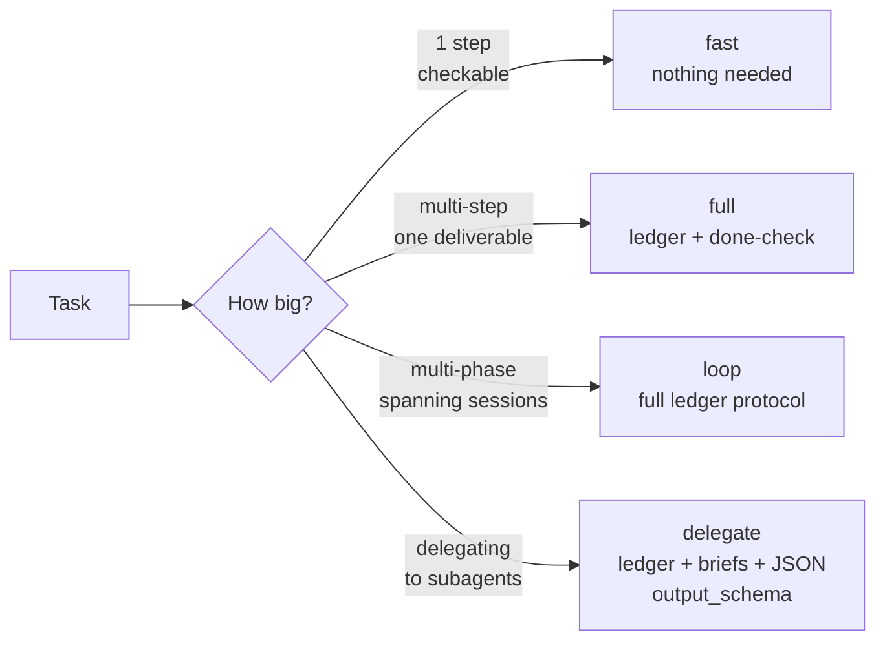

<div align="center">


# Riel

### *Riel* — the rail a runaway train needs. Steering, not horsepower.

### Steering layer for harness/LLM

[](LICENSE)
[](./skills/riel-cli/SKILL.md)
[](https://www.python.org)
[](https://www.nousresearch.com)

</div>

## What is Riel

**Riel does not create capability in the model: it prevents capability from
being lost.** A model can have a capability and still fail to deliver it:
unstable trajectory, drifting state, missing verification. That gap — having
it vs. delivering it — is what Riel steers. It operates on the surfaces a
harness exposes (first turn, task structure, between-turn state), never on
weights.

The center of the framework is the **ledger**: externalized task state —
Goal, pre-registered Claims, Core (1-2 live items), Verified checkpoints,
Open questions, Next action — re-read at every seam, closed against named
verifiers. Everything else feeds it.

Riel ships as two faces over one core:

| Face | What it is | Where |
|---|---|---|
| **Six skills** | the protocol prose the agent reads: ledger, contract, trajectory, briefs, delegation, CLI | `skills/riel-*` |
| **`rielctl`** | stdlib-only Python CLI: the sole writer of the ledger format; instantiates, validates and slices packets; derives the todo/status mirrors; fetches remote contracts | `skills/riel-cli/scripts/rielctl` |
| **Hermes plugin** (optional) | machinery only: five tools (`riel_note`, `riel_seam`, `riel_resume`, `riel_todo`, `riel_context`) over a vendored `rielctl`, the `pre_verify` gate, and a statusbar activity chip | `hermes_plugin/riel/` |
| **Specs** | the design contract of each artifact (ledger format, contract format, phase advance, todo mirror) | `specs/` |

The protocol prose lives ONLY in the skills — the plugin never copies it.
The repo is the single source of truth; the plugin's `vendor/` is a build
artifact regenerated from `skills/` and pinned by hash in the test suite.

### Components

| Component | What it steers | Status |
|---|---|---|
| `riel-ledger` | **State** — Goal/Claims/Core/Verified/Open/Next, re-read at every seam, recovery via checkpoints, opening rules over an existing `.riel/`, mirrors to the session todo | ✅ skill v1.14.1 |
| `riel-contract` | **Structure** — mermaid as contract: closed verb vocabulary, verification funnel, graph digest, machine-checkable | ✅ skill v3.6.1 |
| `riel-protocol` | **Trajectory** — functional grammar, persona, minimal surface on the first turn | ✅ skill v1.7 |
| `riel-briefs` | **Delegation briefs** — self-contained packets: curated context + the `### Why` rationale and context-keyword index, verb-graph, pre-registered claims, executable gates, templates | ✅ skill v3.7 |
| `riel-delegate` | **Delegation router** — plan, dispatch waves, JSON-schema'd returns, parent verifies | ✅ skill v1.3 |
| `riel-cli` | **Tooling** — `rielctl` writes the ledger mechanically, cleans the worktree state with flat in-`.riel/` backups, instantiates/validates packets, slices a phase into a child packet (inheriting the Objective, the `### Why` rationale and the keywords), expands the graph digest, derives the session-todo mirror (the plan: the contract's goal, phases and steps) and the ledger mirror the chip and the gate fold (`rielctl status`), emits the context keywords, and fetches a remote contract to disk (HTTPS, atomic, sha256-verified) | ✅ skill v1.10 |

Each component is independent and optional: a short task uses zero; a long
loop may use all six. Use only the machinery the task earns.

Skills reference each other by name, not version — the installed set is
expected to come from the same commit. Install all six together; mixing
versions across skills is unsupported.

## What it is for

- **Multi-phase work that spans sessions.** The ledger holds the state
  between turns and restarts: any fresh session re-reads
  `.riel/ledger.md` and continues from the last verified checkpoint
  instead of re-deriving the task from a conversation transcript.
- **A "done" backed by evidence.** Every Goal line and pre-registered
  claim must map to a ✓NN checkpoint with a named verifier (a command with
  binary output) and an explicit coverage. No done from memory.
- **Delegation with machine-checkable reports.** Children receive a slice
  of the contract (subgraph, gates, intent) and return JSON against an
  `output_schema` — `passed: true` with `exit_code: 1` is caught
  mechanically, not by reading prose. The parent is the ledger's only
  writer.
- **Plans as artifacts, not intentions.** The contract
  (`.riel/contract.md`) is written first: objective, `### Why` rationale,
  constraints, pre-registered claims, a mermaid execution graph with a
  verification funnel, executable gates, deliverable, DO NOT. A parser
  accepts or rejects it (`rielctl brief validate`).
- **Recovery from degraded runs.** A ✓NN that took 3+ failed attempts
  leaves the context contaminated with its own error history; the ledger's
  checkpoints let you restart clean from the last verified state instead
  of pushing forward.

## Why

Riel is the opposite of brute-force prompting: no plan, no state between
turns, no definition of done — sampling the model instead of steering it.
Riel inverts each: planned (`riel-contract`), held (`riel-ledger`),
delegated (`riel-briefs`, `riel-delegate`), and accepted only when every
Goal line maps to a verified checkpoint.

### The ledger cycle — the heart of the framework


```mermaid
flowchart TD
  OPEN["Open .riel/ledger.md\nGoal + Claims + Core + Next"] --> W[Work]
  W --> S{"seam: tool call,\nfile change, long gap"}
  S --> R["Re-read the ledger\nthe whole mechanism"]
  R --> V{"verified\nsomething?"}
  V -->|yes| XC["Cross-check:\nwhat does this\nNOT cover?"]
  XC --> APP["Append ✓NN:\nverifier + coverage"]
  APP --> W
  V -->|no| ST{"stalled or\ndegraded?"}
  ST -->|"same Next 3 seams"| FIX["Diagnose or\nchange course"]
  ST -->|"cascading errors"| REC["Recovery: last ✓NN =\ncheckpoint, fresh plan\nno failure narrative"]
  FIX --> W
  REC --> W
  ST -->|no| W
  W --> END{"all phases done"}
  END --> DC["done-check: every Goal\nand Claim maps to ✓NN"]
  DC -->|missing| W
  DC -->|all covered| DONE([Done])
```

Three rules carry the whole mechanism:

1. **Re-read at every seam.** The file is not the mechanism — the re-read is.
2. **A ✓NN without verifier + coverage is a mood, not a checkpoint.** The
   verifier is a command with binary output, external to the executor's
   judgment.
3. **No done from memory.** The done-check re-reads the Goal line by line
   against the ✓NN list, always.

Four load-bearing defenses against execution error:

- **Pre-registered claims** — what will be true when done is declared
  BEFORE the first action, with its verification method. Never editable
  post-execution: a failed claim is refuted, not reinterpreted.
- **Adversarial cross-check** — before any ✓NN, ask the opposite
  question: *what does this test NOT cover?* A passed gate without a
  cross-check is incomplete.
- **Contaminated-context invariant** — a ✓NN that took 3+ failed
  attempts leaves the context carrying the failed attempts. Models
  self-condition on their own error history; consider restarting from
  the last clean checkpoint instead of pushing forward.
- **Structured JSON returns on delegation** — children report via
  `output_schema`, not prose. `passed: true` with `exit_code: 1` is
  caught mechanically, not caught by reading.

### Intent travels with the plan

The contract captures *what* (`## Objective`, one sentence opening with
"We need…"), *what will be true* (`## Pre-registered claims`) and *why*
(`### Why`, under `## Context`): the rationale — what triggers the
objective, which alternative was discarded. `rielctl brief slice`
inherits the Objective, the `### Why` and the context keywords into every
child packet, so a delegated agent never executes with the what but
without the why; on a conflict it escalates (`ASK[goal-changing]`) instead
of reinterpreting. `brief validate` WARNs when the Objective runs past one
sentence — rationale belongs in `### Why`.

## How to use

### Two paths, one framework


```mermaid
flowchart LR
  TASK[Task] --> MODE{"How big?"}
  MODE -->|"1 step\ncheckable"| FAST["fast\nnothing needed"]
  MODE -->|"multi-step\none deliverable"| FULL["full\nledger + done-check"]
  MODE -->|"multi-phase\nspanning sessions"| LOOP["loop\nfull ledger protocol"]
  MODE -->|"delegating\nto subagents"| DELEG["delegate\nledger + briefs + JSON\noutput_schema"]
```

The solo path (fast/full/loop) keeps markdown + mermaid + gates + ledger.
Delegation adds JSON contracts and `output_schema` — only where a second
agent's report needs to be parsed, not read.

### Anatomy of a loop task

From the task's worktree (everything lives under `.riel/`, gitignored
local state):

```bash
# 1. Write the plan first — the contract (skeleton from a template)
rielctl brief new --type feature --param name="reset flow" \
                  --param one_sentence="add password reset via email" \
                  > .riel/contract.md
#    …fill Context (### Why, keywords), claims, graph, gates, DO NOT by hand…
rielctl brief validate .riel/contract.md

# 2. Seed the ledger from the contract (Goal ← Objective, Claims ← P#,
#    Phase ← first F#/W# node, Next ← graph entry)
rielctl note --from-contract

# 3. Mirror the plan into the session todo (Hermes: pass the JSON to todo_list)
rielctl todo

# 4. Work the graph. At every seam, re-read:
rielctl seam

# 5. Close each verified checkpoint with real gate output — never prose:
rielctl note --check "suite green" --by "make test: 169 OK" --covering "rielctl, tests"

# 6. Delegate a phase: slice its subgraph into a child packet
rielctl brief slice .riel/contract.md --phase F2 -o packet-f2.md

# 7. Done-check: every Goal line and Claim maps to a ✓NN
rielctl resume
```

### `rielctl` reference

`make install` symlinks `rielctl` into `~/.local/bin`, so any shell — human
or agent, in any worktree — calls it without resolving the skill path. It
reads/writes `.riel/` under the current directory.

| Command | Does |
|---|---|
| `rielctl note …` | write/update `.riel/ledger.md` — goal, claims, core, checks, open, next; `--from-contract` seeds Goal/Phase/Claims/Next from `.riel/contract.md` |
| `rielctl seam` | re-print the ledger + which invariants are due |
| `rielctl resume` | post-gap bootstrap (ledger → invariants → mode → next) |
| `rielctl todo` | session-todo mirror (JSON) — the PLAN: the contract's goal (its Objective), its phases as rows and their steps as nested subtasks; the ledger sets the statuses (the current step is the only in_progress) |
| `rielctl status` | ledger mirror (JSON) — the ledger's own facts for the desktop chip and the `pre_verify` gate: goal, phase, next, opens, claims, verified checkpoints |
| `rielctl context` | context keywords of a contract (JSON) — the index the memory search reads |
| `rielctl clean` | clear the worktree's `.riel/` state — flat timestamped backups inside `.riel/` (`ledger-<ts>.bak.md`, never a subdirectory); `--all` includes the contract, `--purge` removes without backup; ask the user before cleaning (rule in `riel-ledger`) |
| `rielctl ship FILE` | dense-register check before delivery |
| `rielctl brief new` / `validate` / `slice` | instantiate / structurally check / slice a phase into a mini packet |
| `rielctl brief digest` · `rielctl digest` | explicit text digest of a graph |
| `rielctl fetch URL -o FILE` | download a contract (or any file) over HTTP(S) into the worktree — run it at the **task opening** (`resume`/`seam`/`note --from-contract`), not only when delegating; atomic, sha256-verified (`--sha256`), HTTPS by default (`--allow-http` for a trusted transport such as a VPN); the URL may carry a short-lived single-use token instead of the API key, and is never printed |
| `rielctl --version` · `--help` | version / usage |

If the command is not found, re-run `make install` or invoke the skill copy
directly: `python3 <skills-root>/riel-cli/scripts/rielctl ...`.

### System prompt initialization

The paste-ready block (for `soul.md` or any injected system prompt) lives at
`system-prompt.md` — one source, so the README never carries a second copy of
it. Keep it that short: the soul references the skills, it never embeds them
(embedding desyncs and costs tokens every turn).

### The Hermes plugin (optional)

With the plugin enabled, the same mechanics run as native tools and the
protocol is enforced by the runtime:

- **Five tools** wrapping the vendored `rielctl`: `riel_note`, `riel_seam`,
  `riel_resume`, `riel_todo`, `riel_context`. Each call resolves the
  session's worktree (session cwd, never the Hermes process cwd) and runs
  `rielctl` in a subprocess — concurrent sessions never touch each other's
  ledger.
- **The `pre_verify` gate**: a turn that edited code inside a Riel worktree
  does not close while its ledger has claims and no ✓ carrying evidence —
  the rule `riel-ledger` states, enforced by the runtime. Bounded (one nudge
  per turn by default, `gate_attempts`), opt-out per worktree (no ledger, no
  gate) and switchable (`gate: false`).
- **The desktop chip** (opt-in, app-level): a statusbar item showing the
  focused worktree's ledger (`riel 4✓ 2? · next: <action>`) and live tool
  activity while a turn runs; a click opens the Ledger modal (goal, next,
  ✓ checkpoints with evidence) and the Contract modal (the plan, with its
  mermaid graph rendered). Its backend serves
  `/api/plugins/riel/{health,ledger,contract,session_cwd}`.
- **`riel_context`** hands over the contract's context-keyword index and
  stops — memory backends live in the agent's memory manager, not in the
  tool registry, so the search is the agent's, with whatever backend it has
  configured.
- **The injected plan is visible app-wide**: `riel_todo`'s mirror lands in
  the desktop's composer status stack (goal → phases → steps as nested
  rows with live glyphs) and in the sidebar card's `X/Y` progress — the
  surfaces the mirror feeds are documented in `specs/spec-todo-hermes.md`.

`hermes_plugin/riel/README.md` documents the plugin in depth (worktree
resolution, chip wiring, gate limits).

## Installation

### From Hermes (user)

The two install surfaces are independent: the skills carry the protocol,
the plugin carries the machinery. Install both for the full experience.

```bash
# the 6 skills as an indexed Hermes skill source
hermes skills tap add alvarolizama/riel

# the tools + gate + chip (self-contained package, vendored rielctl)
hermes plugins install alvarolizama/riel/hermes_plugin/riel
hermes plugins enable riel          # per profile; effective on the next gateway start
```

Then enable the desktop half (opt-in) in the app: **Capabilities →
Plugins → riel**. Verify: the skills appear in the session's skill index
(`skills_list`), and the plugin's registration passes
`hermes plugins doctor`.

### Manual (development)

From a checkout — the dev layout is symlink-everything-to-the-checkout,
one source of truth, no copies:

```bash
git clone https://github.com/alvarolizama/riel && cd riel

make install     # symlink rielctl into ~/.local/bin (must be on PATH)
make skills      # deploy the 6 skills to SKILLS_DIR (default ~/Workspace/Skills)

# the plugin, linked per profile instead of installed:
make plugin-vendor                                          # regenerate vendor/ from skills/
make plugin-link PLUGINS_DIR=~/.hermes/profiles/<p>/plugins # once per profile
hermes plugins enable riel

# the desktop half, app-level (ONE symlink for all profiles):
ln -sfn "$(pwd)/hermes_plugin/riel/desktop" ~/.hermes/desktop-plugins/riel

make test        # the regression suite (176 tests)
```

Both destinations are make variables, overridable per call:

```bash
make skills SKILLS_DIR=~/.hermes/skills        # per-user Hermes skills dir
make install BIN_DIR=/some/other/bin           # non-default bin dir (on PATH)
```

Notes for the dev layout: `make install` and `make plugin-link` are
symlinks into the checkout, so `git pull` keeps them current; `make skills`
deploys **copies** — re-run it after pulling. Plugins are per profile
(`$HERMES_HOME/plugins/`); skills are shared through `skills.external_dirs`.
A plugin enabled mid-session is not live until the gateway restarts, and
the desktop half re-scans on app start (⌘K → **Reload desktop plugins** if
the chip does not appear).

### Dependencies

| Piece | Needed at | Requires |
|---|---|---|
| The 6 skills (markdown only) | runtime | nothing — they are read by the agent |
| `rielctl` (`skills/riel-cli/scripts/rielctl`) | runtime (loop/delegate tasks) | **Python 3, stdlib only** |
| Task templates (`skills/riel-briefs/templates/`) | runtime | nothing — `rielctl` reads them directly |
| `scripts/validate-mermaid.sh` | development (validate graph files) | Node + `mmdc`: `npm install -g @mermaid-js/mermaid-cli` |
| `tests/` | development (run the suite) | Python 3, stdlib only (the desktop half's tests also use `node`; the FastAPI route tests need a Hermes interpreter) |
| Hermes plugin package (`hermes_plugin/riel/`) | Hermes users (optional) | Hermes + Python 3; `vendor/` carries its own `rielctl` |

Optional. `rielctl brief validate` will *also* run `mmdc` on each graph if
it finds it on PATH; without it, structural checks still run, just without
the parser-level mmdc check. Nothing in the runtime path requires mmdc.

### Make targets

| Target | Does |
|---|---|
| `help` | list targets (default when you run bare `make`) |
| `install` | symlink `rielctl` into `$(BIN_DIR)` (`~/.local/bin`) |
| `skills` | sync the 6 skills to `$(SKILLS_DIR)` (deploy copies, not symlinks) |
| `plugin-vendor` | rebuild `hermes_plugin/riel/vendor/` from `skills/` (build artifact) |
| `plugin-link` | symlink the plugin package into `$(PLUGINS_DIR)` (`~/.hermes/plugins`) |
| `test` | regression suite (unittest discovery) |
| `validate` | parse every mermaid block with `mmdc` |
| `digest` | print the explicit graph digest for README + specs + skills |
| `lint` | byte-compile the Python tooling; `shellcheck` if present |
| `uninstall` | remove the `rielctl` symlink (deployed skills stay) |

### Structure

```
riel/
├── README.md          ← this file
├── system-prompt.md   ← the soul/system-prompt initialization block
├── assets/            ← header image
├── skills/            ← installable skills (deploy copies to $SKILLS_DIR)
│   ├── riel-ledger/     ← state: the heart of the framework
│   ├── riel-contract/   ← structure: mermaid contract + funnel + digest
│   ├── riel-protocol/   ← trajectory: grammar, persona, minimal surface
│   ├── riel-briefs/     ← delegation briefs + pre-registered claims + templates/
│   ├── riel-delegate/   ← delegation router + JSON output_schema
│   └── riel-cli/        ← rielctl: ledger writer, packet + digest tooling
├── hermes_plugin/     ← Hermes plugin package (machinery only, optional)
│   ├── riel/            ← tools + gate + vendored rielctl/templates (self-contained)
│   │   ├── dashboard/     ← backend routes (/api/plugins/riel/*)
│   │   └── desktop/       ← statusbar activity chip (opt-in)
│   └── probe-session-cwd.py ← live probe of the Hermes load path (needs Hermes)
├── specs/             ← design contracts
│   ├── spec-ledger-format.md    ← .riel/ledger.md format + rules + phase advance
│   ├── spec-contract-format.md  ← .riel/contract.md format (the plan) + intent
│   └── spec-todo-hermes.md      ← session-todo mirror (the plan) + ledger mirror (status)
├── scripts/           ← repo tooling
│   ├── validate-mermaid.sh   ← validates every mermaid block with mmdc
│   └── extract-mermaid.py    ← extracts mermaid blocks (regex, re.DOTALL)
├── tests/             ← stdlib unittest suite (rielctl, vendor hashes, plugin hooks, desktop chip)
└── references/        ← papers-and-sources.md — evidence & design notes (public)
```

### Tests

```bash
make test     # or: python3 -m unittest discover -s tests -v
```

Stdlib-only, subprocess-driven. 176 tests cover `rielctl note/seam/resume/todo/clean/ship`,
`brief new/validate/digest/slice`, the graph checks, and `extract-mermaid.py`
end-to-end, plus the Hermes plugin package: vendoring hashes,
manifest/schema/handler wiring, the handlers end-to-end through the vendored
copy, the statusbar chip rendered by node against a stubbed SDK (labels,
tooltip, click, and the refetch a finished tool triggers), the backend
routes through a real FastAPI app, and the `pre_verify` gate's decision
table (worktree resolution, counters, self-throttling, and its opt-out
rules).

The Hermes-side load path (discovery, registration, session-cwd resolution,
per-session isolation) needs a real Hermes install, so it is probed
separately — run from a directory that is not a worktree:

```bash
# the same interpreter the `hermes` launcher execs
hermes_dir="$(dirname "$(sed -n 's/^exec "\(.*\)\/hermes".*/\1/p' "$(command -v hermes)")")"
"$hermes_dir/bin/python" hermes_plugin/probe-session-cwd.py
```

Any Python that can `import hermes_cli` works as well.

Graph docs are validated with mermaid-cli:

```bash
make validate                          # every mermaid block, via mmdc
scripts/validate-mermaid.sh README.md  # a single file
make digest                            # explicit text digest of every graph
```

## License

Released under the [MIT License](LICENSE) — Copyright (c) 2026 Álvaro Lizama.
The license covers the whole repository: the skills (`skills/`), `rielctl`
(`skills/riel-cli/scripts/`), the repo tooling (`scripts/`, `tests/`,
`Makefile`) and the Hermes plugin package (`hermes_plugin/riel/`).
Third-party dependencies keep their own licenses.
