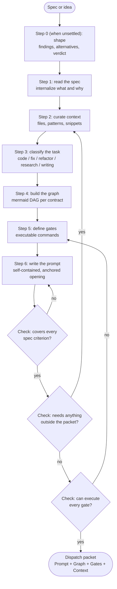
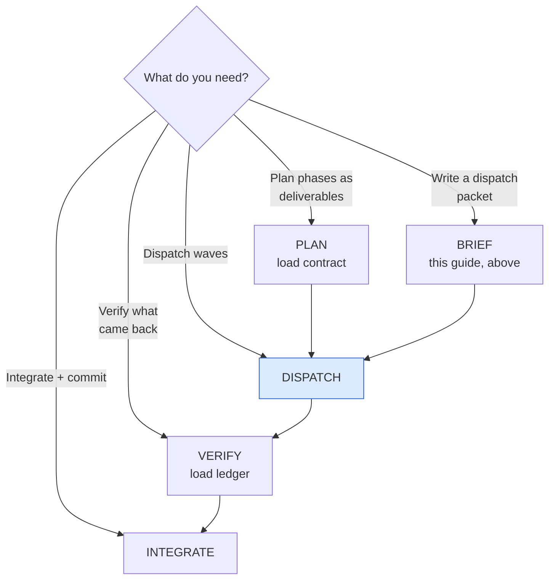

# delegate — Delegating to subagents (Riel)

One guide to route Riel delegation end-to-end: writing the **packet** the
child executes, dispatching it in waves, and verifying what comes back.
It does not recreate the framework — it routes to it. The parent is the
capability that must not be lost: it plans, dispatches, verifies and
integrates. Children are generators; the parent is the verifier.

This guide owns the **contract** (the plan, written first — solo or
delegated) and its **delegation form** (the packet). The full cycle is
PLAN → BRIEF → DISPATCH → VERIFY → INTEGRATE, in order — never skip VERIFY.


To **land a process on the fly** as a self-contained instruction for an
agent/subagent: dispatch packets for `delegate_task`, execution specs with
phases, prompts another agent runs without you.

This skill owns the **contract** (the plan) and its format. The contract is
written first, always — solo or delegated — at `.riel/contract.md`; a packet
is the contract's **delegation form** (see below).

If you need a **durable, reusable skill**, use `riel_guide(topic="contract")` — this
skill is for one-shot instructions.

## Core principle

**Agents have no memory of your conversation.** Every packet must be a
standalone document. If the agent needs to ask "what do you mean?" — the
packet is incomplete.

## The contract comes first — solo or delegated

Before any execution, and **before the ledger**, write the plan as a
**contract** at `.riel/contract.md`, in the packet format below. This happens
**always** — the contract is the plan, the ledger is the state, and the
ledger is written from the contract. (A `fast` task — one step, no plan —
needs neither.)

- **Solo:** work the contract phase by phase; the ledger tracks state.
- **Delegated:** the contract stays with the parent; each child receives a
  **mini contract** — the contract narrowed to that child's phase (its
  subgraph, gates, Deliverable, DO NOT, plus the inherited Objective,
  `### Why` and context keywords) — as its packet. The **parent** keeps
  and validates the ledger; the child never does. Slice it mechanically with
  `riel_contract(verb="slice", file=".riel/contract.md", phase="F#")` (subgraph + FILL sections),
  then complete the FILLs by hand.

Seed the ledger from the contract, then iterate normally (`note`, `seam`,
`todo`):

```bash
riel_note(from_contract=true)      # Goal <- Objective, Claims <- P#, Next <- entry, Phase <- first F#/W#
```

Before using the ledger, re-read the contract — never execute from the
ledger or from memory alone.
Full format + rules: `riel/specs/spec-contract-format.md`.

## Anchored opening

Apply the first-turn conditions of `riel_guide(topic="protocol")` in `goal` + `context`:
`goal` opens with the shared objective ("We need…"), one-line persona,
`context` carries only what the first action needs, zero irrelevant
injections. Do not restate them here — the canonical rules live in
`riel_guide(topic="protocol")`.

## When to use / not use

| Use | Do not use |
|-----|-----------|
| Delegating to subagents (`delegate_task`) | One-line trivial tasks |
| Execution specs with phases (dev todos) | Exploratory research with no known path |
| Processes that repeat and you want frozen | Something you will do yourself right now |

The overhead of writing a good packet pays off only when another agent
executes it.

## Flow overview



## Step 1: Read the spec

Read the full spec before writing anything. Note:

- Every acceptance criterion → becomes a gate or verification step
- Every constraint → appears as a rule in the prompt
- The deliverable → the agent's target output
- Dependencies → what may be referenced vs what must be created

## Step 2: Curate context

The agent needs context it cannot obtain alone. Package it.

| Context type | How to get it | Example |
|--------------|---------------|---------|
| **File structure** | `search_files(path="lib/")` | "Umbrella: `apps/myapp/`, `apps/myapp_web/`" |
| **Existing patterns** | `read_file` in adjacent code | "Follow the pattern in `kanban_live.ex:45-67`" |
| **Code snippets** | `read_file` exact lines | Paste the code to modify or imitate |
| **API signatures** | grep for the definition | "Public API is `Brain.update_page/2`" |
| **Test patterns** | `read_file` in existing tests | "Tests use `DataCase`, pattern in `test/...`" |
| **Config/conventions** | `read_file` in configs | "Elixir 1.20, OTP 27, `--warnings-as-errors`" |

**Context budget:** 3-5 snippets max, each < 30 lines. If you need more,
the task is too big — split it. Exclude full codebase dumps, files it will
not touch, tangential context.

## Step 3: Classify the task

The type changes the **shape of the graph**, not the rules. Every type
uses the same closed verb vocabulary, edge guards, and verification
funnel from riel_guide(topic="contract") — what varies is the pipeline topology:

| Type | Graph shape | Typical gates |
|------|-------------|---------------|
| **Code (new feature)** | Linear pipeline with TDD gates | compile, test, format |
| **Code (bug fix)** | Debug → Hypothesis → Fix → Verify | repro, test, no regressions |
| **Code (refactor)** | Read → Plan → Transform → Verify | compile, tests unchanged, diff review |
| **Research** | Search → Extract → Synthesize → Validate | cited sources, complete answer |
| **Writing** | Outline → Draft → Review → Polish | structure, tone, accuracy |

Each type has a ready-made skeleton at `templates/<type>.md` in this skill
— start from that instead of writing the contract from scratch. The
`packet.md` template is the empty base **of the format** (used for the
contract and for a child packet alike) when none of the types fit.

## Step 4: Build the instruction graph

The graph is the **agent's execution plan**. `flowchart TD` following
`riel_guide(topic="contract")` conventions — the closed verb vocabulary, predictable IDs,
edge guards, and the verification funnel are all defined there, not here.

- **Always include the graph in the prompt** — it IS the execution plan;
  the agent follows the textual flow even without rendering mermaid
- On complex tasks (3+ phases), the graph prevents skipped steps
- Use predictable IDs by node kind — `W1/W2` for waves, `S1/S2` for steps,
  `G1` for gates (per riel_guide(topic="contract")). The agent's parser keys on them.
- **Pair the graph with its digest** — a Mermaid-only graph is read less
  reliably than the same structure spelled out in text. Include the output
  of `riel_contract(verb="digest")` beside the diagram (elements, edges, branches,
  entry/terminals) so the child gets the structure in plain words too.

## Step 5: Define verification gates

Every gate is a **concrete command** the agent can run. Never "verify it
works" — exact command and expected output.

````markdown
### Gate: [Name]
**Command:** `exact command`
**Expected:** [what success looks like]
**On failure:** [what to do — fix, retry, or report]
````

A gate agnostic to any stack (example — adapt the command, keep the shape):

````markdown
### Gate: Service responds
**Command:** `curl -sf http://localhost:8000/health | grep -q '"ok":true'`
**Expected:** exit 0 (silent)
**On failure:** read the server log before retrying; do not re-run blindly
````

Every binary criterion of the spec becomes a gate:

| Spec criterion | Gate |
|----------------|------|
| "No new deps" | `git diff mix.exs` → no deps entries |
| "Backward compatible" | Existing suite runs without failures |
| "Docs updated" | Read the doc, confirm the section exists |

### Gate result format (when dispatched with output_schema)

When the parent dispatches with `output_schema` (below, DISPATCH), the child
must return its gate results as JSON matching the schema — not prose. The
child still runs the command; the schema constrains how it *reports*. A
child that claims `"passed": true` with `"exit_code": 1` is caught
mechanically, without the parent reading any prose.

## Step 6: Write the dispatch prompt

The **format skeleton** lives at `templates/packet.md` in this skill — copy
it and fill the `{{placeholders}}`. It is the skeleton of the **contract**
(the plan) and of a child **packet** alike. A complete worked example
(password-reset) lives at `templates/example-password-reset.md`.

The packet is a markdown document with these sections, in this order:

1. `# Task:` — the name.
2. `## Objective` — one sentence, opens with "We need…". `brief validate`
   WARNs when it runs past one sentence — move the rationale to `### Why`.
3. `## Context` — **starting with `### Why`**: one or two sentences of
   rationale (what triggers this objective, which alternative was
   discarded). `brief slice` inherits it into every child packet, so the
   delegated agent knows *why*, not only *what* — and escalates
   (`ASK[goal-changing]`) instead of reinterpreting on a conflict. Then
   Project (path, stack, conventions), existing code to
   read, code to modify/create, reference snippets, **and the
   `### Context keywords` subsection**: the contract's index into memory
   (one term per line, an optional `→ dran|memory|code` hint). It is not
   prose for the reader — it is what the context fetch searches, at open
   and at every phase advance, to fill `Core`.
4. `## Constraints` — hard rules only (style guidance stays in Context,
   exclusions stay in DO NOT).
5. `## Pre-registered claims` — P-ids with verification method, declared
   before executing anything. **Never editable after execution**: a
   failed claim is refuted, never reinterpreted. The ledger's done-check
   maps every Goal line to a P-id, not to a narrative.
6. `## Execution graph` — the mermaid DAG from Step 4 (funnel topology:
   RUN gates followed by VERIFY decision nodes before End).
7. `## Verification gates` — every gate from Step 5.
8. `## Deliverable` — exactly what is produced: files, behavior.
9. `## DO NOT` — explicit anti-patterns, scope enforcement.

### Why "DO NOT" matters

Agents are enthusiastic helpers. Without explicit anti-patterns they
refactor code you did not ask to touch, add out-of-scope features, change
patterns that already work, add dependencies without asking. The "DO NOT"
section is your scope enforcement.

## Real dispatch (delegate_task)

When dispatching, `goal` stays short and `context` carries the packet:

- **goal:** what to achieve, one or two sentences, opening with the shared
  objective ("We need…")
- **context:** the full packet (project, snippets, constraints, graph,
  gates, deliverable, DO NOT) — minimal surface first
- **Language:** if the answer must be in Spanish, say so in the context
- **Parallel subagents:** only if tasks touch disjoint files; if they
  share a file or commit to the same repo, serialize (git index race)

## Pitfalls

- **Context dump instead of curated snippets.** Agents drown on 2000-line
  dumps. 3-5 snippets of 10-30 lines.
- **Vague gates.** "Make sure it works" is not a gate. Exact command and
  expected output.
- **No "DO NOT" section.** Without explicit exclusions, agents refactor
  everything they touch.
- **Graph without edge guards.** A decision without labeled edges leaves
  the agent guessing the path.
- **Prompt without snippets.** An agent that does not see existing
  patterns invents its own — usually wrong.
- **Invented snippets.** Every `path:line` verified with `read_file`
  against the real repo before dispatching. If the repo changed, update
  the packet first.
- **Parallelizing tasks that collide.** Same file or same git index →
  serial.
- **Dumping the full tool/skill catalog in the first turn.** Minimal
  surface first.

## Packet validation checklist

A packet is *valid* when all of the following pass. `riel_contract(verb="validate")`
(read `riel_guide(topic="tools")`) runs them mechanically; review by hand before dispatching.

Structure:

- [ ] The nine sections are present, in the order of `templates/packet.md`
- [ ] `# Task:` names the deliverable, not the journey
- [ ] `## Objective` is one sentence opens with "We need…" (validate WARNs
      past one sentence)
- [ ] `## Context` opens with `### Why`: the rationale travels to every
      slice — a child without it knows what but not why
- [ ] `## Context` fits the budget: 3-5 snippets, each < 30 lines
- [ ] `## Pre-registered claims` has ≥1 claim, each with a verify-with that
      refers to a command or explicit check
- [ ] Each claim carries its anchor (`— anchor: §Section#n` | a node id |
      `shaping:F#`) — validate WARNs a claim with none and fails one that
      does not resolve
- [ ] `## DO NOT` is present and non-empty

Graph (validable con `mmdc` / `riel_check(file=…, mermaid=true)`):

- [ ] The execution graph parses (`mmdc`)
- [ ] Every execution node starts with a verb from the closed vocabulary
      (READ/EDIT/CREATE/RUN/VERIFY/ASK) — riel_guide(topic="contract")
- [ ] Predictable IDs: `W1/W2` waves, `S1/S2` steps, `G1/G2` gates
- [ ] Every decision has labeled edges (`|yes|`, `|no|`)
- [ ] The flow ends in a VERIFY/Check node before `END`
- [ ] Loops carry counters (`< 3 attempts`), never unbounded
- [ ] The graph is paired with its explicit digest (`riel_contract(verb="digest")`)

Content:

- [ ] Every `path:line` in snippets and graph was verified with `read_file`
      against the repo **at the current commit**
- [ ] Every acceptance criterion of the spec has a gate
- [ ] Every gate is a concrete command + Expected + On failure
- [ ] No tool name appears in graph node labels (verbs only)
- [ ] Claims cannot be satisfied by editing the packet (claims are
      pre-registered; if speculation appears, split)

## Cross-references

- Format skeleton (contract + packet): `templates/packet.md`
- Shaping skeleton (the evidence before the plan): `templates/shaping.md`
- Worked example: `templates/example-password-reset.md`
- Verb-graph syntax conventions (canonical): `riel_guide(topic="contract")`
- Opening conditions and functional grammar: `riel_guide(topic="protocol")`
- The contract (the plan) and its format: `riel/specs/spec-contract-format.md`

## Entry router



The full cycle is PLAN → BRIEF → DISPATCH → VERIFY → INTEGRATE, in order —
never skip VERIFY. Each step's rules live in its own skill; what follows is
only what dispatching itself adds.

## Parse contract

### What this skill CONSUMES
- A task to delegate (feature, fix, research, tests)

### What this skill PRODUCES
- A routed plan: phases (riel_guide(topic="contract")) → packets (BRIEF, above) → waves
- A parent-side verification verdict per criterion (riel_guide(topic="ledger"))
- Commits per logical concern

## The cycle at a glance

1. **PLAN** — load `riel_guide(topic="contract")`. Every phase is a complete deliverable
   with a literal definition of done; subagents get disjoint file scopes,
   grouped in waves (Wave 2 depends on Wave 1). Any cross-edge between
   scopes means they are NOT parallel-safe.
2. **BRIEF** — load the BRIEF half above. The parent contract (`.riel/contract.md`)
   is sliced into a **mini contract** per child: a standalone packet with
   anchored goal, curated context, exact files, verification command, DO NOT.
3. **DISPATCH** — waves, bounded and disjoint (rules below).
4. **VERIFY** — load `riel_guide(topic="ledger")`. The **parent owns and validates the
   ledger**; children never do. Decompose the phase's definition of done
   into criteria; run each gate yourself; `confidence X/20` per criterion;
   borderline (< 12/20) re-sampled with variation before accepting.
   Children are self-reports, not ground truth.
5. **INTEGRATE** — commits per logical concern (rules below).

## DISPATCH — the operational rules this skill owns

- 2-3 children per wave; **max 2 concurrent on a shared provider** (429s).
  "Shared" means same provider account / same API key / same rate pool as
  the parent — not merely the same model family on different keys.
- State disjoint file scopes literally; shared registry/index files are
  PARENT work, never a child's.
- Pre-warm slow toolchains (deps compile) before dispatching.
- Children never commit and never run the full suite — targeted tests
  only; the full suite is the parent's between-waves gate.
- **Always dispatch with `output_schema`.** The child's final response is
  JSON validated against this schema — not prose. The parent parses fields;
  it does not read narratives.
- **The ledger is the parent's — its only writer.** Children never touch a
  ledger, not even their own; they are not a layer of it. The parent owns
  `.riel/ledger.md`, seeds it from the contract (`riel_note(from_contract=true)`) and validates it itself.
- **The child's JSON carries everything the parent needs to write the
  ledger:** per gate `command` + `exit_code` + `passed` + `coverage`; per
  claim `verified` + `evidence`. The parent turns those into ✓NN entries
  (verifier + coverage) — the child writes nothing durable.

```json
{
  "type": "object",
  "required": ["status", "gates", "claims"],
  "properties": {
    "status": {"enum": ["done", "blocked", "failed"]},
    "gates": {
      "type": "array",
      "items": {
        "type": "object",
        "required": ["gate_id", "command", "exit_code", "passed", "coverage"],
        "properties": {
          "gate_id": {"type": "string"},
          "command": {"type": "string"},
          "exit_code": {"type": "integer"},
          "passed": {"type": "boolean"},
          "coverage": {"type": "string"}
        }
      }
    },
    "claims": {
      "type": "array",
      "items": {
        "type": "object",
        "required": ["claim_id", "verified", "evidence"],
        "properties": {
          "claim_id": {"type": "string"},
          "verified": {"type": "boolean"},
          "evidence": {"type": "string"}
        }
      }
    }
  }
}
```

A job that returns `"passed": true` with `"exit_code": 1` is caught
mechanically — no prose reading required. A job missing `claim_id`s from
the pre-registered list is incomplete by construction.

## INTEGRATE — the rules this skill owns

- Run the full gate **unpiped** — check the exit code explicitly. Piping
  into `tail`/`head` masks the exit status and commits a red gate.
- One commit per logical concern; children never commit.
- If a child timed out with files on disk, inventory the diff and complete
  it yourself — do not re-dispatch.

## Failure triage (when a child comes back red)

- **A — impl not yet present** (missing module/function): check
  `git status`/`git diff` for partial work; finish it yourself or
  re-dispatch.
- **B — impl buggy** (stacktrace points into lib/): fix it yourself with
  `patch` — you own the whole repo.
- **C — test/verification wrong**: fix the test yourself.

**Fix-it-yourself vs re-dispatch, rule of thumb:** if the child's diff is
>50% correct in structure and scope, finish it yourself — re-dispatching
costs a fresh packet and a fresh reader. If <50%, the brief was wrong or
the model missed the spec; write the correct version into a brief and
re-dispatch, do not patch a half-broken tree.

**When re-dispatching, never describe the previous failure in the new
brief.** State the current goal and the target state — not "the last agent
broke X, now fix it." Models self-condition on their own error history
(Sinha et al., 2026): a brief that mentions the prior failure raises the
probability of the same failure. Describe where you want to arrive, not
what went wrong. The ledger keeps the failure context privately; the brief
starts clean.

## Pitfalls (the ones that cost the most)

- **Trusting the child's "all tests pass".** Re-run everything yourself.
- **Overlapping scopes.** File-level disjointness, not task-level. A child
  recovering via `git checkout` destroys sibling work in the same files.
- **Children self-verifying with the full suite.** They die mid-verification
  at the cap with work 100% done. Targeted tests only.
- **Letting children commit.** Git-index races bundle files into one commit.
- **Oversized goals get silently truncated.** Anything beyond ~10 lines of
  instructions goes in a spec file; the goal points at it.
- **429s on shared providers.** Max 2 concurrent; re-dispatch killed
  children sequentially; check disk before re-dispatching "failed"
  children (zombies may have finished and written their files).
- **Piping the gate into `tail`/`head`.** Masks the exit code.
- **No ledger on the parent.** If the wave spans phases, the parent keeps
  a local ledger (riel_guide(topic="ledger")) — the parent's state is as loss-prone as a
  child's.

## Checklist

- [ ] Phases are complete deliverables with definition of done (riel_guide(topic="contract"))
- [ ] Scopes disjoint at file level; shared files are parent work
- [ ] Every child gets a self-contained packet (BRIEF, above)
- [ ] Packet includes pre-registered claims (P-ids) that cannot be edited post-execution
- [ ] Dispatch uses output_schema — child returns JSON, not prose
- [ ] Children never touch a ledger; the parent is its only writer (seed: `riel_note(from_contract=true)`)
- [ ] Children never commit, never run the full suite
- [ ] Parent verified: decomposed criteria + `confidence X/20` per criterion (riel_guide(topic="ledger"))
- [ ] Failures triaged A/B/C; B fixed by parent, not re-dispatched
- [ ] Re-dispatch brief describes target state, never the previous failure
- [ ] Full gate re-run unpiped; commit per logical concern

## Cross-references

- The packet format: the BRIEF half above
- Opening conditions and functional grammar: `riel_guide(topic="protocol")`
- Mermaid contract conventions: `riel_guide(topic="contract")`
- The ✓NN + confidence + re-sample rules: `riel_guide(topic="ledger")`
