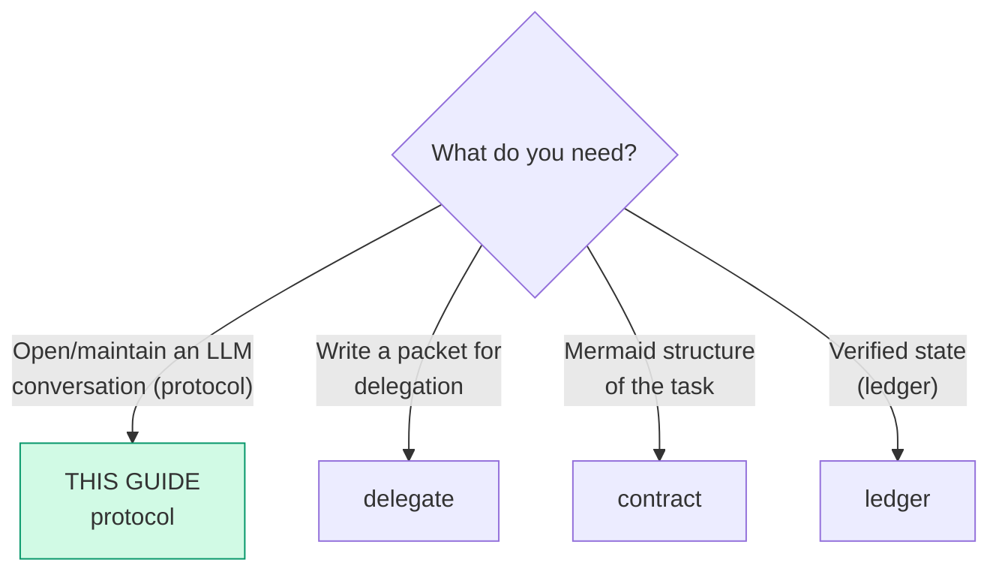

# protocol — Communication protocol (Riel)

This guide steers **the trajectory**: how the agent opens and maintains a
conversation with an LLM.

**Protocol mode:** the user's request reaches the model **raw**. This guide
does NOT rephrase or rewrite requests — it changes how the agent **enters**
the conversation and how it sustains it.

Two halves, in order of durability:

1. **The functional grammar** — model-independent, always reachable, the
   durable core. This is what you lean on.
2. **The opening conditions** — black-box anchoring evidence from a retired
   model; only reachable when the harness does not own the surface. In most
   real harnesses (this one included) they are inert — see "Degraded mode".

## Functional grammar

First-person assignment by function — every statement must **discharge** into
an action, a check, or a closure (that is the "functional echo"):

| Form | Function | Example (EN / ES) |
|---|---|---|
| `We need…` | Shared objective: agent + environment working toward something | "We need the login to validate both providers" / "Necesitamos que el login valide ambos proveedores" |
| `I` | Perception, local judgment, commitment | "I see the test fails on the mock; I will fix it" / "Veo que el test falla en el mock; lo voy a arreglar" |
| `Let's` | Immediate joint operation | "Let's verify the endpoint before continuing" / "Vamos a verificar el endpoint antes de seguir" |

Rules:

1. **Open with `We need…`** — the shared objective.
2. **Mandatory discharge:** a `we need` that does not turn into an
   action/check/closure within the next steps is noise — complete it or drop it.
3. **What is NOT suppressed:** an occasional `Let me` or doubt is not a
   failure. What is avoided are self-dialogue loops: doubt → doubt → doubt
   without action.
4. **Applies in any language:** the function matters more than the literal
   words ("Necesitamos…" / "Veo que…" / "Vamos a…" in Spanish).

**Discharge is not a hope — the ledger enforces it.** The stall rule
(`riel_guide(topic="ledger")`) reads: the same `Next` for 3 seams means
diagnose or change course. A `We need…` that never discharges IS that stall —
the objective sentence sits still while the ledger's `Next` does not move.
So the self-check has a mechanical form:

- A `We need…` discharged ⇒ `riel_note(next=…)` names the action/check and
  the `Next` advances. Verifiable at any seam.
- A `We need…` with no `Next` under it, 3 seams later ⇒ the ledger's stall
  rule fires: diagnose (`I see`) + one small action (`Let's`), or drop the
  sentence.

When a `we need` discharges, the ledger's `Next` moves — that is the one
part of this protocol observable from the outside.

## Entry router

All hand-offs stay inside the Riel framework.

## What this guide CONSUMES / PRODUCES

- Consumes: a request or task to execute with an LLM (direct chat or via subagent)
- Produces: an anchored opening (functional grammar + persona + minimal surface)
  and trajectory maintenance during the conversation (functional echo)

## Opening conditions (the first turn)

What steers the trajectory is the **complete state of the first turn**,
not a magic word. Three conditions — and each has an OWNER. The agent
controls only part of them; the rest is surface somebody else sets:

| Condition | Owner | What the agent itself can do |
|---|---|---|
| 1 · short, stable persona | the **operator** (the profile's persona) | keep your own statements stable; do not stack style layers mid-conversation |
| 2 · minimal surface | the **harness** (prompt + tool catalog) | introduce heavier capabilities only when the task asks; name the current phase in your own words |
| 3 · zero irrelevant injections | **the agent's first turn** | no "you also have…" preamble; no catalog the first action does not need |

**Priority when the conditions clash: 3 > 2 > 1.** And the honest reading:
under a harness that fixes the surface, the agent's own levers are
condition 3 plus the grammar.

### Evidence status — read before trusting the anchoring claims

The anchoring half of this guide (conditions 1–2 above) is **black-box
and model-specific**. It comes from community DeepSeek-Harness probes run on
**V4 Pro, a model retired on 2026-09-14**. The successor (V4.1 Flash)
reports anchoring under every condition in first-round flash probes, and its
own trajectory was not measured. Treat the conditions as a *working
hypothesis about the API-visible surface*, not a portable law:

- Where a harness fixes the surface (see below), the anchoring half is
  **inert** — only the functional-echo discipline survives.
- The conditions are **not** a measured score improvement. Do not claim
  gains from them.

## Degraded mode (the common case — when the harness owns the surface)

Most real harnesses — this one included — inject a skill index, an
environment digest, or a fixed tool schema on every turn. There the
*anchoring* half of this protocol is unreachable, and that is expected.
Drop it; keep the grammar. This is the DEFAULT case, not the exception:

| Lever | Reachable under a fixed surface? | What you keep |
|---|---|---|
| 1–2 · persona + minimal surface | usually not | naming the current phase, in your own words |
| 3 · zero injections | only in your own first turn | no unnecessary preamble in what YOU write |
| functional echo (`We need…` + discharge) | **always** | your statements stay ordered and checkable |

The ledger/contract machinery never depends on the opening conditions. When
the surface is fixed, this guide degenerates to a *writing discipline* — and
a writing discipline costs nothing to keep.

### When delegating (subagents)

In `delegate_task` packets, apply the same conditions in `goal` + `context`:
- `goal` opens with the shared objective ("We need…")
- `context` carries only what the first action needs (repo, files, criteria)
- Do not dump tools or instructions that do not belong to the current phase

## Maintenance (during the conversation)

- Every functional statement discharges: action → check → closure
- If the conversation drifts into infinite planning without action: return to
  `We need…` + the next concrete action
- If doubt loops appear: `I see` (diagnosis of why it is stuck) + `Let's`
  (a small action to get out). A doubt loop IS a stalled `We need…` — same
  ledger rule, same exit.

## Claim limits

These conditions order the opening and discipline the conversation. They are
**not** a measured score improvement — do not claim gains from them. Task
verification lives in the done-check of `riel_guide(topic="ledger")`.

## Pitfalls

- **Rewriting the user's request** — this guide is a protocol, not a
  translator; the message arrives raw.
- **Forcing the grammar into every sentence** — functional echo is not about
  counting words; one well-discharged `we need` per task is enough.
- **Claiming it improves results** — it steers the trajectory; verification
  lives in the ledger.
- **Treating the anchoring levers as a portable law** — they are black-box
  evidence from a retired model; see "Evidence status".
- **Cargo-culting the grammar** — opening every sentence with `we need` and
  discharging none. The check that matters is discharge, not frequency —
  and discharge shows in the ledger's `Next`.
- **Applying it where there is no opening** — a one-shot tool call with no
  first turn earns nothing from this guide; skip it.

## Checklist

- [ ] Opening with a shared objective (`We need…`)
- [ ] Short, stable persona, no stacked layers
- [ ] Minimal surface on the first turn (only what the first action needs)
- [ ] Zero irrelevant injected context in YOUR first turn
- [ ] Every functional statement discharged into action/check/closure
- [ ] Each `We need…` names the action/check/closure that discharged it
      (the ledger's `Next` moved — or the stall rule fired)
- [ ] The user's request was not rewritten
