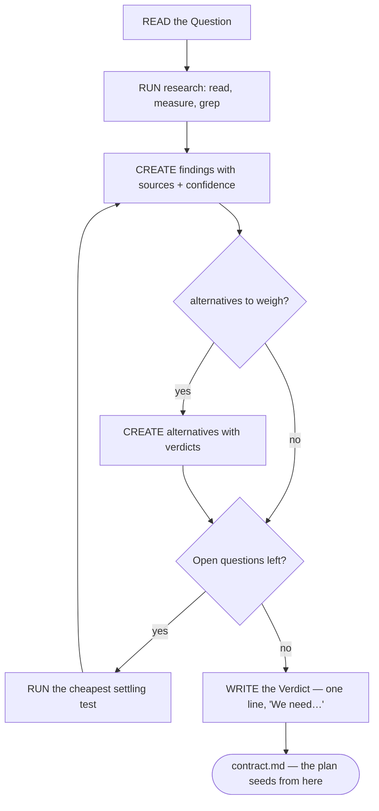

# shaping — The evidence before the plan (Riel)

The **contract** is the plan, the **ledger** is the state, and the **shaping**
is the EVIDENCE the plan rests on. It is written before the contract, at
`.riel/shaping.md`; the contract's claims point back into it
(`— anchor: shaping:F1`), re-read at every seam with `riel_seam(anchors=true)`.

A task whose decision is already settled skips it — the shaping is the
on-ramp, never a second plan. It buys two things the contract cannot:
rejected alternatives keep a home (the contract's `### Why` holds only the
surviving one) and every claim can carry its anchor back to its support.

## Role and location

- `.riel/shaping.md` in the task worktree; `.riel/` is gitignored — local
  state, never a deliverable, never committed.
- Written **before** the contract: the shaping closes the question, then the
  contract restates the decision in its closed form.
- `riel_clean(scope="all")` backs it up (flat, timestamped, inside `.riel/`)
  and removes it; a plain `riel_clean` leaves it in place.
- Overwritten per task: working evidence of the task in flight, not a durable
  record. The engine backs it up before every overwrite.

## Why it is not the contract

A doc that restates another is a drift source. The contract's `## Context` is
CLOSED (snippets verified against the repo, paths decided) and its `### Why`
is the surviving rationale. The shaping is OPEN: findings with sources and a
confidence, alternatives with verdicts, questions still unsettled.

| Artifact | Answers | Register |
|---|---|---|
| `shaping.md` | what do we know, and how do we know it | open, sourced |
| `contract.md` | what will be true, and how it is verified | closed, decided |
| `ledger.md` | where we are | state |

## Sections, in order

1. `# Shaping: <name>` — the name.
2. `## Question` — one question, the decision this research settles. Empty
   or missing is an error: no question, no shaping.
3. `## Findings` — numbered `F#` lines, each with a `— source:` (a file, a
   commit, a URL, a measurement) and a `confidence`. A finding without a
   source is a WARN: an unsourced finding reads exactly like a sourced one,
   and prose that "reads fine" is where hallucination hides.
4. `## Facts` — short `F#` lines the contract can cite directly, with
   sources. Optional.
5. `## Diagrams` — optional, two kinds: the system as it IS vs as it would
   BE. Mermaid, same vocabulary as the contract.
6. `## Alternatives` — numbered `A#`, each with its verdict
   (`discarded: <reason>` or `deferred: <reason>`). The home of the rejected:
   the contract keeps only the winner.
7. `## Open` — questions still unsettled, each with the cheapest test that
   would settle it. The on-ramp's residue: what execution must answer.
8. `## Verdict` — one line that seeds the contract's Objective, opening with
   "We need…".

## The loop

## Tooling

- `riel_shaping(verb="new", params=[…])` writes the skeleton (refuses to
  overwrite without `force`); `riel_shaping(verb="validate")` runs the rules
  — exit 1 on an error, WARNs never fatal.
- Every engine write over an existing shaping backs it up first
  (`shaping-<ts>.bak.md`, flat, beside the original).
- Claims anchored to a finding the shaping does not have are an error at
  `riel_contract(verb="validate")` time — the anchor is checked against the
  file, not trusted.

## Pitfalls

- **A shaping that restates the contract.** If it reads like the plan, it is
  a second plan — the open/closed split is the point.
- **Findings without sources.** A WARN, but treat it as a smell: the next
  reader cannot re-derive your confidence.
- **Skipping the Verdict.** Without it the contract's Objective is authored
  from nothing — the shaping must close with the decision.
- **Shaping after the contract.** The on-ramp behind the plan is a sign the
  research was decoration.

## Cross-references

- Skeleton: `templates/shaping.md`; long form: `specs/spec-shaping-format.md`
  (Spec 7)
- The plan it seeds: `riel_guide(topic="contract")`
- The anchors that point back here: `riel_contract(verb="validate")`,
  re-read with `riel_seam(anchors=true)`
- The delegation flow that starts here: `riel_guide(topic="delegate")`
