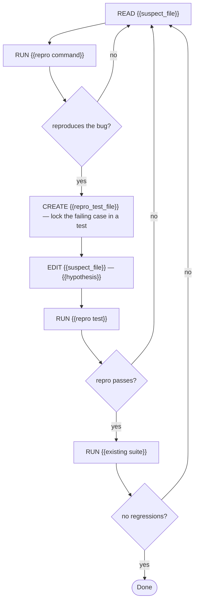

# Task: {{name}}

## Objective
We need {{symptom}} to stop happening: {{correct behavior}}.

## Context

### Project
- **Path:** {{repo_path}}
- **Stack:** {{language, framework, key deps}}
- **Conventions:** {{style, patterns}}

### Existing code to read
{{paths — especially the ones on the failure path}}

### Code to modify
{{exact files + suspect functions}}

### Reference snippets
{{3-5 snippets around the suspected bug}}

## Constraints (hard rules)
1. {{rule from the spec}}

## Pre-registered claims
- P1: The failure is reproducible — verify with: `{{repro command}}` → currently fails with {{observed error}}
- P2: After the fix, the repro passes — verify with: same command, passes
- P3: No regressions — verify with: `{{existing suite}}` → 0 new failures

## Execution graph

## Verification gates

### Gate: Repro currently fails
**Command:** `{{repro command}}`
**Expected:** fails before the fix; **if it passes, you have not found the bug** — go back to S1, do not edit

### Gate: Repro test passes after fix
**Command:** `{{repro command}}`
**Expected:** passes
**On failure:** the fix is incomplete

### Gate: No regressions
**Command:** `{{existing suite}}`
**Expected:** 0 new failures
**On failure:** the fix has too-wide scope

## Deliverable
{{files modified, the repro test that locks the bug, behavior restored}}

## DO NOT
- Fix more than the reported bug in this task
- Refactor the suspect file beyond the minimum edit
