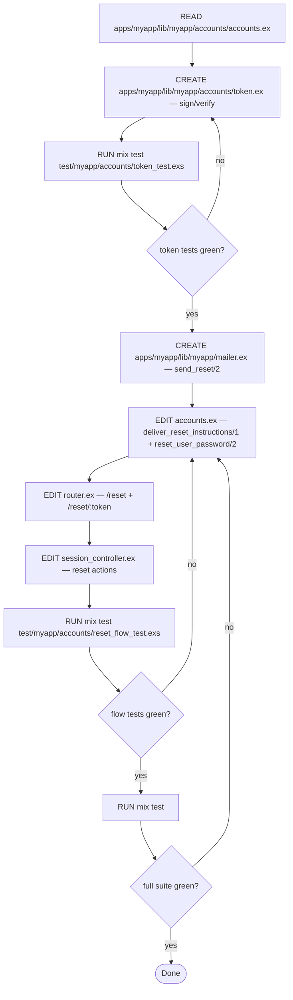

# Task: Password reset via emailed reset link

## Objective
We need a password-reset flow that emails a signed link and accepts the new
password through that link.

## Context

### Project
- **Path:** `~/Workspace/Repos/myapp`
- **Stack:** Elixir 1.20 / OTP 27, Phoenix 1.8, Swoosh for mail
- **Conventions:** umbrella layout `apps/myapp/`, contexts in
  `lib/myapp/accounts/`, `mix format` enforced, warnings as errors

### Existing code to read
- `apps/myapp/lib/myapp/accounts/accounts.ex` — existing context, add the
  reset functions here (pattern at `Accounts.get_user_by_email/1`)
- `apps/myapp_web/lib/myapp_web/controllers/session_controller.ex` — the
  pattern for form-handling controllers

### Code to modify
- `apps/myapp/lib/myapp/accounts/accounts.ex` — add `deliver_reset_instructions/1`
  and `reset_user_password/2`
- `apps/myapp_web/lib/myapp_web/router.ex` — add `/reset` and `/reset/:token`

### Code to create
- `apps/myapp/lib/myapp/accounts/token.ex` — sign/verify wrapper on
  `Phoenix.Token` with 1h TTL
- `apps/myapp/lib/myapp/mailer.ex` — Swoosh mailer with `send_reset/2`
- `apps/myapp/test/myapp/accounts/token_test.exs`
- `apps/myapp/test/myapp/accounts/reset_flow_test.exs`

### Reference snippets
The existing mailer pattern from `apps/myapp/lib/myapp/notify.ex:12-30`
(paste it here, verbatim from `read_file`).

## Constraints (hard rules)
1. No new dependencies.
2. Token TTL is 3_600 seconds, configured in `runtime.exs`, default 1h.
3. All new public functions carry `@spec` and `@doc`.

## Pre-registered claims
- P1: POST `/reset` with a registered email queues one reset email —
  verify with: `mix test test/myapp/accounts/reset_flow_test.exs:delivers`
- P2: The signed token verifies for ≤1h and is rejected after —
  verify with: `mix test test/myapp/accounts/token_test.exs`
- P3: POST `/reset/:token` with the new password updates the hash and
  invalidates the token — verify with: `mix test …/reset_flow_test.exs:consumes`
- P4: Unknown email returns 200 without sending anything (no enumeration) —
  verify with: `mix test …/reset_flow_test.exs:no_enumeration`

## Execution graph

## Verification gates

### Gate: Token unit tests
**Command:** `mix test test/myapp/accounts/token_test.exs`
**Expected:** 4+ tests, 0 failures
**On failure:** fix the token module before continuing

### Gate: Flow tests
**Command:** `mix test test/myapp/accounts/reset_flow_test.exs`
**Expected:** all tests pass, including `no_enumeration`
**On failure:** diagnose A/B/C — if impl, fix; if test is wrong, fix the test

### Gate: Full suite + compile
**Command:** `mix compile --warnings-as-errors && mix test`
**Expected:** 0 warnings, all tests pass
**On failure:** do NOT proceed; fix or report

## Deliverable
- 4 files created, 3 files modified (listed above)
- Reset flow reachable at `POST /reset` and `POST /reset/:token`
- New public functions all carry `@spec` and `@doc`

## DO NOT
- Do NOT add Guardian, Pow, or any auth library.
- Do NOT modify the user schema (no new columns beyond the token field
  on the tokens table — which is owned by a different migration).
- Do NOT change the login flow's behavior.
- Do NOT run `mix ecto.migrate` — the migration belongs to a separate task.
