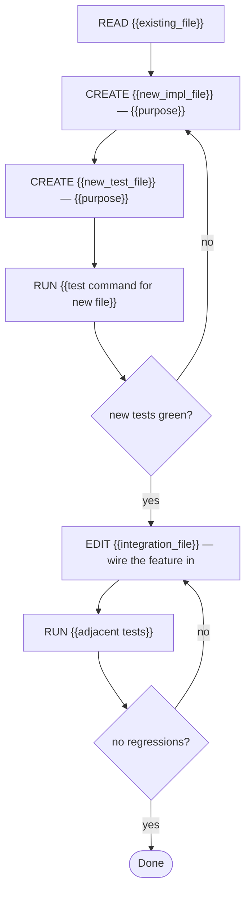

# Task: {{name}}

## Objective
We need {{one_sentence}}.

## Context

### Project
- **Path:** {{repo_path}}
- **Stack:** {{language, framework, key deps}}
- **Conventions:** {{style, patterns, pinned versions}}

### Existing code to read
{{paths with what to look for in each}}

### Code to create
{{new files and what goes in each — module, tests, docs}}

### Code to modify
{{existing files touched, with exact insertion points if known}}

### Reference snippets
{{3-5 snippets, each <30 lines, verified with read_file}}

## Constraints (hard rules)
1. {{rule from the spec}}

## Pre-registered claims
- P1: {{the new behavior exists and is reachable}} — verify with: {{test that calls it}}
- P2: {{no regressions on the adjacent feature}} — verify with: {{existing suite command}}

## Execution graph

## Verification gates

### Gate: New tests pass
**Command:** `{{exact command for the new test file}}`
**Expected:** {{N tests, 0 failures}}
**On failure:** fix implementation, never relax the test

### Gate: No regressions
**Command:** `{{existing suite command}}`
**Expected:** 0 new failures vs baseline
**On failure:** revert the wiring step, diagnose, redo

## Deliverable
{{files created/modified, plus the reachable behavior}}

## DO NOT
- {{explicit anti-pattern}}
