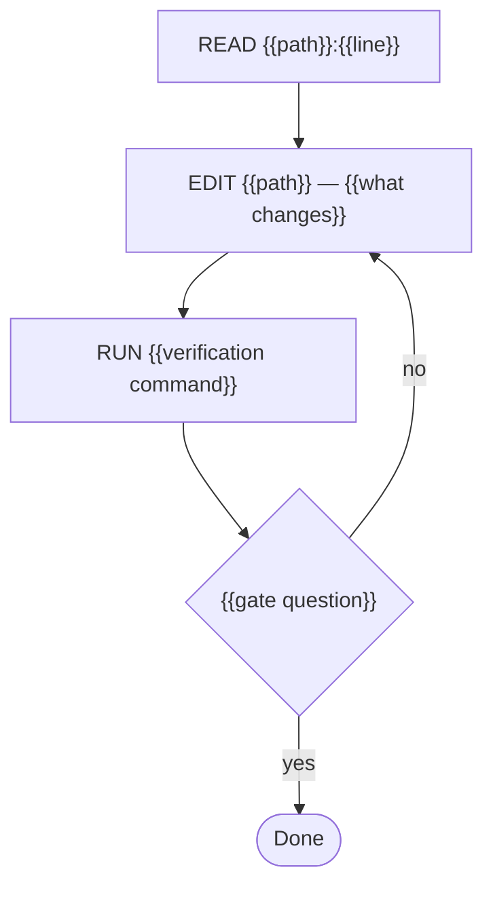

# Task: {{name}}

## Objective
{{one_sentence}}
<!-- Opens with "We need…" (the shared objective). One sentence only: what
     "done" produces, in terms of the deliverable, not the journey. -->

## Context

### Project
- **Path:** {{repo_path}}
- **Stack:** {{language, framework, key deps}}
- **Conventions:** {{style rules, pinned versions, patterns to follow}}

### Existing code to read
{{paths with what to look for in each — adjacent patterns, not the whole repo}}

### Code to modify/create
{{exact files, line ranges if known, what changes in each}}

### Reference snippets
{{3-5 snippets, each <30 lines — the actual code to imitate or edit,
  verified with read_file against the repo at {{commit-or-date}}}}

## Constraints (hard rules)
1. {{rule from the spec}}
<!-- Hard rules only. Style guidance goes in Context, exclusions in DO NOT. -->

## Pre-registered claims
<!-- What will be TRUE when done, declared BEFORE executing. Once created,
     never edited: a failed claim is refuted, never reinterpreted. -->
- P1: {{claim}} — verify with: {{how}}
- P2: {{claim}} — verify with: {{how}}

## Execution graph

## Verification gates

### Gate: {{name}}
**Command:** `{{exact command}}`
**Expected:** {{what success looks like}}
**On failure:** {{what to do — fix, retry, or report}}

## Deliverable
{{exactly what is produced — files created/modified with paths, behavior}}

## DO NOT
- {{explicit anti-pattern}}
<!-- What the agent must avoid even when convenient: out-of-scope refactors,
     related-but-unrequested features, touching files outside the scopes. -->
