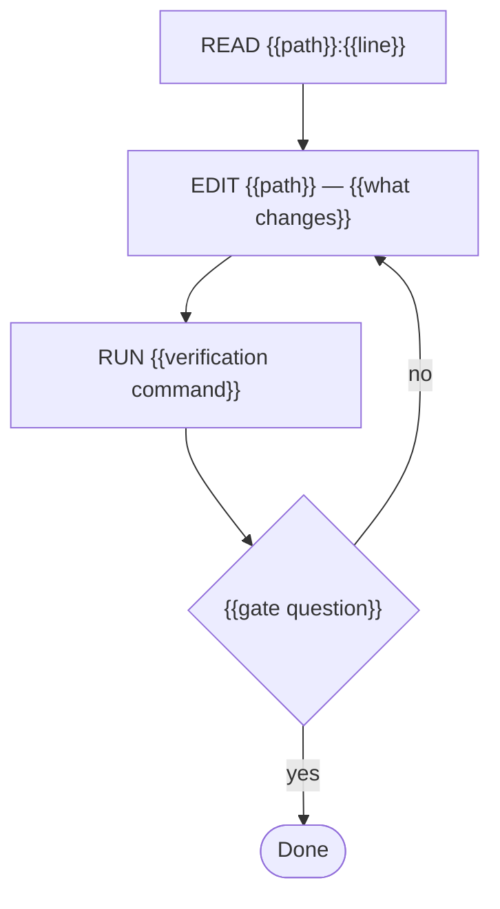

# Task: {{name}}

## Objective
{{one_sentence}}
<!-- Opens with "We need…" (the shared objective). One sentence only: what
     "done" produces, in terms of the deliverable, not the journey. -->

## Context

### Why
{{why}}
<!-- El racional: por qué este objetivo y no otro — qué lo dispara, qué
     alternativa se descartó. Una o dos frases. Viaja al hijo en cada slice
     (rielctl brief slice lo hereda); sin él, el delegado sabe qué hacer
     pero no por qué. Ante un conflicto con la ejecución, el hijo escala
     (ASK[goal-changing]) en vez de reinterpretar. -->

### Project
- **Path:** {{repo_path}}
- **Stack:** {{language, framework, key deps}}
- **Conventions:** {{style rules, pinned versions, patterns to follow}}

### Existing code to read
{{paths with what to look for in each — adjacent patterns, not the whole repo}}

### Code to modify/create
{{exact files, line ranges if known, what changes in each}}

### Reference snippets
{{3-5 snippets, each <30 lines — the actual code to imitate or edit,
  verified with read_file against the repo at {{commit-or-date}}}}

### Context keywords
<!-- El índice del contrato hacia la memoria: una keyword por línea, con hint
     de fuente opcional tras una flecha (dran | memory | code). Se buscan al
     abrir sesión y al avanzar de fase, para completar `## Core` — no son prosa,
     las lee el buscador (agente o tool del plugin). -->
- {{term}} → {{dran}}
- {{term}}

## Constraints (hard rules)
1. {{rule from the spec}}
<!-- Hard rules only. Style guidance goes in Context, exclusions in DO NOT. -->

## Pre-registered claims
<!-- What will be TRUE when done, declared BEFORE executing. Once created,
     never edited: a failed claim is refuted, never reinterpreted.
     A claim may end with its ANCHOR: the region of this contract that
     supports it, re-read at every seam with `rielctl anchor` (distinct from
     the "anchored opening" of riel-protocol). Three forms only:
       '— anchor: §Constraints#2'  the n-th bullet of that section
       '— anchor: G2'              a node of the execution graph
       '— anchor: shaping:F1'      a finding of .riel/shaping.md
     The anchor is the LAST clause of the claim's line and the claim stays on
     ONE line (the ledger seed reads line by line). No anchor is a WARN; an
     anchor that does not resolve is an error; a node missing from a sliced
     graph is the inherited-from-the-parent case. -->
- P1: {{claim}} — verify with: {{how}}
- P2: {{claim}} — verify with: {{how}}

## Execution graph

```mermaid
flowchart TD
  S1["READ {{path}}:{{line}}"] --> S2["EDIT {{path}} — {{what changes}}"]
  S2 --> S3["RUN {{verification command}}"]
  S3 --> G1{"{{gate question}}"}
  G1 -->|no| S2
  G1 -->|yes| END([Done])
```

## Verification gates

### Gate: {{name}}
**Command:** `{{exact command}}`
**Expected:** {{what success looks like}}
**On failure:** {{what to do — fix, retry, or report}}

## Deliverable
{{exactly what is produced — files created/modified with paths, behavior}}

## DO NOT
- {{explicit anti-pattern}}
<!-- What the agent must avoid even when convenient: out-of-scope refactors,
     related-but-unrequested features, touching files outside the scopes. -->
