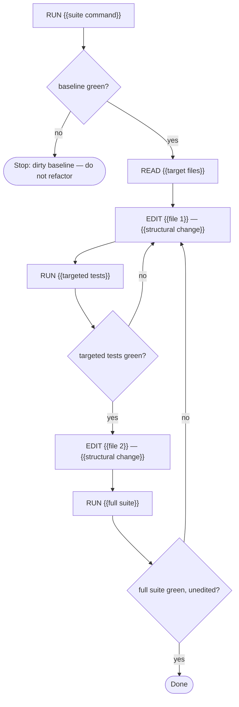

# Task: {{name}}

## Objective
We need the code in {{scope}} restructured so that {{goal}} — with zero observable behavior change.

## Context

### Project
- **Path:** {{repo_path}}
- **Stack:** {{language, framework, key deps}}
- **Conventions:** {{style, patterns}}

### Existing code to read
{{paths to be refactored}}

### Code to modify
{{exact files, and what changes structurally (not behaviorally) in each}}

### Reference snippets
{{3-5 snippets of the before-state}}

## Constraints (hard rules)
1. **Zero behavior change** — no new features, no bug fixes, no API changes.
2. All existing tests pass **unedited**.

## Pre-registered claims
- P1: The full existing suite passes **unedited** after the refactor — verify with: `{{suite command}}`
- P2: {{structural goal holds, e.g. "no module in X imports Y"}} — verify with: `{{grep command}}` returns nothing
- P3: Public API surface is unchanged — verify with: `{{diff command on exports/docs}}`

## Execution graph

## Verification gates

### Gate: Baseline is green
**Command:** `{{suite command}}`
**Expected:** all pass BEFORE any edit
**On failure:** stop — refactor on a dirty baseline mixes signal

### Gate: Full suite after refactor
**Command:** `{{suite command}}`
**Expected:** all pass, with **no test file edited**
**On failure:** the refactor changed behavior; revert the last structural change

## Deliverable
{{files restructured, structural goal achieved, behavior untouched}}

## DO NOT
- Fix any bug discovered mid-refactor (open a separate task)
- Add tests (unless the spec explicitly asks)
- Style-touch files outside the scope
