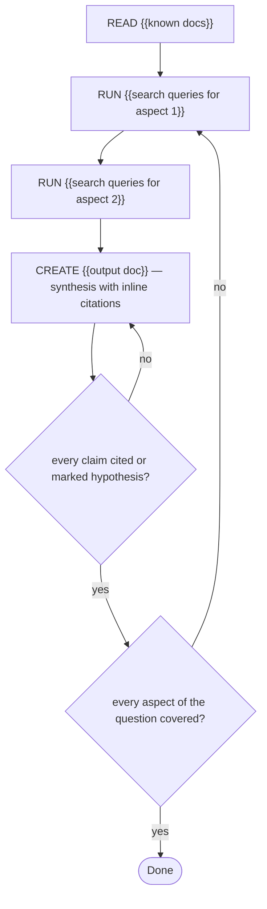

# Task: {{name}}

## Objective
We need an answer to: {{question}}.

## Context

### Project
- **Path:** {{repo_path or "N/A — external research"}}
- **Stack:** {{relevant tech}}
- **Conventions:** cite every claim with URL + date; mark hearsay

### Existing artifacts to read
{{docs / papers / code the answer must account for}}

## Constraints (hard rules)
1. Every factual claim cites a source URL with access date, OR is marked
   as hypothesis.
2. If a number appears, its source and query are reproducible.

## Pre-registered claims
- P1: The answer addresses {{aspect 1}} — verify with: a section exists and cites a source
- P2: The answer addresses {{aspect 2}} — verify with: a section exists and cites a source
- P3: The conclusion fits within the data found (no extrapolation beyond it) — verify with: final review

## Execution graph

## Verification gates

### Gate: Citation completeness
**Command:** `{{grep the output for URLs / check each section}}`
**Expected:** every claim sentence carries a citation or "(hypothesis)"
**On failure:** add the source or mark the claim

### Gate: Coverage of the question
**Command:** `{{reread the question, check each sub-question has its own section}}`
**Expected:** every sub-question answered or explicitly "unknown, needs X"
**On failure:** go back to searching

## Deliverable
{{output document path + format}}

## DO NOT
- Estimate silently (say "no data" explicitly)
- Cite sources you did not actually open
- Extrapolate beyond the data
