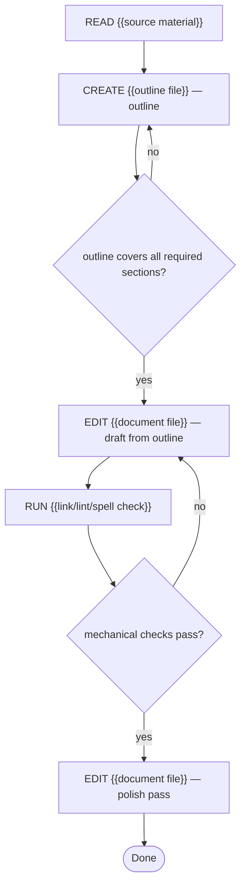

# Task: {{name}}

## Objective
We need a {{kind of document}} that {{effect on the reader}}.

## Context

### Project
- **Path:** {{repo_path or output location}}
- **Stack:** {{format: markdown / rst / docx / …}}
- **Conventions:** {{style guide, tone, register}}

### Existing material to read
{{prior docs, source material, style references}}

### Reference snippets
{{tone examples, terminology lists, formats}}

## Constraints (hard rules)
1. {{length limit / required sections / forbidden topics}}

## Pre-registered claims
- P1: The document covers {{required section}} — verify with: section exists
- P2: The document does not mention {{forbidden topic}} — verify with: `{{grep command}}` returns nothing
- P3: {{tone / readability bar}} — verify with: final read-through against the style guide

## Execution graph

## Verification gates

### Gate: Mechanical checks
**Command:** `{{markdownlint / spellcheck / link checker}}`
**Expected:** 0 errors
**On failure:** fix

### Gate: Forbidden content
**Command:** `{{grep for forbidden topic}}`
**Expected:** no matches
**On failure:** rewrite that section

## Deliverable
{{document path, format, audience}}

## DO NOT
- Do not add sections the reader did not ask for
- Do not break the tone of existing examples
