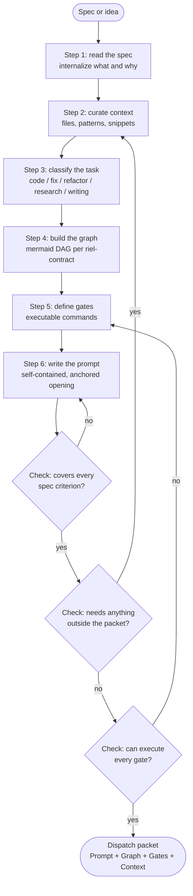
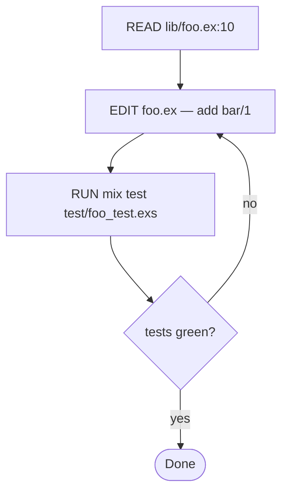

# riel-briefs — Dispatch briefs for agents (Riel)

To **land a process on the fly** as a self-contained instruction for an
agent/subagent: dispatch packets for `delegate_task`, execution specs with
phases, prompts another agent runs without you.

If you need a **durable, reusable skill**, use `riel-contract` — this
skill is for one-shot instructions.

## Core principle

**Agents have no memory of your conversation.** Every packet must be a
standalone document. If the agent needs to ask "what do you mean?" — the
packet is incomplete.

## Anchored opening

Apply the first-turn conditions of `riel-protocol` in `goal` + `context`:
`goal` opens with the shared objective ("We need…"), one-line persona,
`context` carries only what the first action needs, zero irrelevant
injections. Do not restate them here — the canonical rules live in
`riel-protocol`.

## When to use / not use

| Use | Do not use |
|-----|-----------|
| Delegating to subagents (`delegate_task`) | One-line trivial tasks |
| Execution specs with phases (dev todos) | Exploratory research with no known path |
| Processes that repeat and you want frozen | Something you will do yourself right now |

The overhead of writing a good packet pays off only when another agent
executes it.

## Flow overview



## Step 1: Read the spec

Read the full spec before writing anything. Note:

- Every acceptance criterion → becomes a gate or verification step
- Every constraint → appears as a rule in the prompt
- The deliverable → the agent's target output
- Dependencies → what may be referenced vs what must be created

## Step 2: Curate context

The agent needs context it cannot obtain alone. Package it.

| Context type | How to get it | Example |
|--------------|---------------|---------|
| **File structure** | `search_files(path="lib/")` | "Umbrella: `apps/myapp/`, `apps/myapp_web/`" |
| **Existing patterns** | `read_file` in adjacent code | "Follow the pattern in `kanban_live.ex:45-67`" |
| **Code snippets** | `read_file` exact lines | Paste the code to modify or imitate |
| **API signatures** | grep for the definition | "Public API is `Brain.update_page/2`" |
| **Test patterns** | `read_file` in existing tests | "Tests use `DataCase`, pattern in `test/...`" |
| **Config/conventions** | `read_file` in configs | "Elixir 1.20, OTP 27, `--warnings-as-errors`" |

**Context budget:** 3-5 snippets max, each < 30 lines. If you need more,
the task is too big — split it. Exclude full codebase dumps, files it will
not touch, tangential context.

## Step 3: Classify the task

The type changes the **shape of the graph**, not the rules. Every type
uses the same closed verb vocabulary, edge guards, and verification
funnel from riel-contract — what varies is the pipeline topology:

| Type | Graph shape | Typical gates |
|------|-------------|---------------|
| **Code (new feature)** | Linear pipeline with TDD gates | compile, test, format |
| **Code (bug fix)** | Debug → Hypothesis → Fix → Verify | repro, test, no regressions |
| **Code (refactor)** | Read → Plan → Transform → Verify | compile, tests unchanged, diff review |
| **Research** | Search → Extract → Synthesize → Validate | cited sources, complete answer |
| **Writing** | Outline → Draft → Review → Polish | structure, tone, accuracy |

## Step 4: Build the instruction graph

The graph is the **agent's execution plan**. `flowchart TD` following
`riel-contract` conventions — the closed verb vocabulary, predictable IDs,
edge guards, and the verification funnel are all defined there, not here.

- **Always include the graph in the prompt** — it IS the execution plan;
  the agent follows the textual flow even without rendering mermaid
- On complex tasks (3+ phases), the graph prevents skipped steps
- Use predictable IDs by node kind — `W1/W2` for waves, `S1/S2` for steps,
  `G1` for gates (per riel-contract). The agent's parser keys on them.

## Step 5: Define verification gates

Every gate is a **concrete command** the agent can run. Never "verify it
works" — exact command and expected output.

````markdown
### Gate: [Name]
**Command:** `exact command`
**Expected:** [what success looks like]
**On failure:** [what to do — fix, retry, or report]
````

A gate agnostic to any stack (example — adapt the command, keep the shape):

````markdown
### Gate: Service responds
**Command:** `curl -sf http://localhost:8000/health | grep -q '"ok":true'`
**Expected:** exit 0 (silent)
**On failure:** read the server log before retrying; do not re-run blindly
````

Every binary criterion of the spec becomes a gate:

| Spec criterion | Gate |
|----------------|------|
| "No new deps" | `git diff mix.exs` → no deps entries |
| "Backward compatible" | Existing suite runs without failures |
| "Docs updated" | Read the doc, confirm the section exists |

## Step 6: Write the dispatch prompt

Structure:

````markdown
# Task: [Descriptive name]

## Objective
[One sentence: what the agent produces — opens with "We need…"]

## Context

### Project
- **Path:** [exact repo path]
- **Stack:** [language, framework, key deps]
- **Conventions:** [style, patterns to follow]

### Existing code to read
[Paths and what to look for in each]

### Code to modify/create
[Exact files, line ranges, what changes]

### Reference snippets
[Existing code the agent must follow or modify]

## Constraints (hard rules)
1. [Rule 1 — from the spec constraints]

## Execution graph



## Verification gates
[All gates from step 5]

## Deliverable
[Exactly what is produced — files created/modified, behavior]

## DO NOT
[Explicit anti-patterns — what the agent must avoid]
````

### Why "DO NOT" matters

Agents are enthusiastic helpers. Without explicit anti-patterns they
refactor code you did not ask to touch, add out-of-scope features, change
patterns that already work, add dependencies without asking. The "DO NOT"
section is your scope enforcement.

## Real dispatch (delegate_task)

When dispatching, `goal` stays short and `context` carries the packet:

- **goal:** what to achieve, one or two sentences, opening with the shared
  objective ("We need…")
- **context:** the full packet (project, snippets, constraints, graph,
  gates, deliverable, DO NOT) — minimal surface first
- **Language:** if the answer must be in Spanish, say so in the context
- **Parallel subagents:** only if tasks touch disjoint files; if they
  share a file or commit to the same repo, serialize (git index race)

## Pitfalls

- **Context dump instead of curated snippets.** Agents drown on 2000-line
  dumps. 3-5 snippets of 10-30 lines.
- **Vague gates.** "Make sure it works" is not a gate. Exact command and
  expected output.
- **No "DO NOT" section.** Without explicit exclusions, agents refactor
  everything they touch.
- **Graph without edge guards.** A decision without labeled edges leaves
  the agent guessing the path.
- **Prompt without snippets.** An agent that does not see existing
  patterns invents its own — usually wrong.
- **Invented snippets.** Every `path:line` verified with `read_file`
  against the real repo before dispatching. If the repo changed, update
  the packet first.
- **Parallelizing tasks that collide.** Same file or same git index →
  serial.
- **Dumping the full tool/skill catalog in the first turn.** Minimal
  surface first.

## Cross-references

- Verb-graph syntax conventions (canonical): `riel-contract`
- Opening conditions and functional grammar: `riel-protocol`
- Delegation end-to-end (plan + dispatch + parent verification): `riel-delegate`
