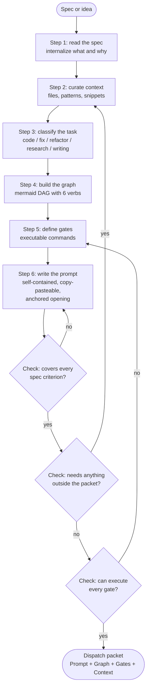
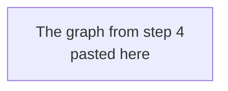

# riel-briefs — Dispatch briefs for agents (Riel)

To **land a process on the fly** as a self-contained instruction for an
agent/subagent: dispatch packets for `delegate_task`, execution specs with
phases, prompts another agent runs without you.

If you need a **durable, reusable skill**, use `riel-contract` — this
skill is for one-shot instructions.

## Core principle

**Agents have no memory of your conversation.** Every packet must be a
standalone document. If the agent needs to ask "what do you mean?" — the
packet is incomplete.

## Anchored opening (DeepSeek first-turn conditions)

What anchors on DeepSeek is the **complete state of the first turn**
(evidence: Minimal schema anchored 5/5; with injections 0/9; Dran pages
`deepseek-v4-interfaz-y-trayectoria-we-need` and
`harness-analysis-papers-en-extension-points`). Apply in `goal` + `context`:

1. **`goal` opens with the shared objective** — "We need…" (functional
   grammar: `We need` shared objective, `I` local judgment, `Let's` joint
   action). See `riel-protocol`.
2. **Short, stable persona** — one-line role in `context`, no stacked layers.
3. **Minimal surface first** — `context` carries only what the first action
   needs (repo, files, criteria). Not the full capability catalog.
4. **Zero irrelevant injections** — no skill catalogs, digests, or
   conventions the first action does not use.
5. On non-DeepSeek models these still work as generic control, without
   anchoring expectations.

## When to use / not use

| Use | Do not use |
|-----|-----------|
| Delegating to subagents (`delegate_task`) | One-line trivial tasks |
| Execution specs with phases (dev todos) | Exploratory research with no known path |
| Processes that repeat and you want frozen | Something you will do yourself right now |

The overhead of writing a good packet pays off only when another agent
executes it.

## Flow overview



## Step 1: Read the spec

Read the full spec before writing anything. Note:

- Every acceptance criterion → becomes a gate or verification step
- Every constraint → appears as a rule in the prompt
- The deliverable → the agent's target output
- Dependencies → what may be referenced vs what must be created

## Step 2: Curate context

The agent needs context it cannot obtain alone. Package it.

### What to include

| Context type | How to get it | Example |
|--------------|---------------|---------|
| **File structure** | `search_files(path="lib/")` | "Umbrella: `apps/myapp/`, `apps/myapp_web/`" |
| **Existing patterns** | `read_file` in adjacent code | "Follow the pattern in `kanban_live.ex:45-67`" |
| **Code snippets** | `read_file` exact lines | Paste the code to modify or imitate |
| **API signatures** | `grep -n "def funcion"` | "Public API is `Brain.update_page/2`" |
| **Test patterns** | `read_file` in existing tests | "Tests use `DataCase`, pattern in `test/...`" |
| **Config/conventions** | `read_file` in configs | "Elixir 1.20, OTP 27, `--warnings-as-errors`" |

### Context budget

Agents have a limited window. Be selective:

- **Include:** files the agent will modify, adjacent patterns to follow,
  exact line ranges
- **Exclude:** full codebase dumps, files it will not touch, tangential
  context
- **Rule of thumb:** 3-5 snippets max, each < 30 lines. If you need more,
  the task is too big — split it.

## Step 3: Classify the task

The type determines the graph shape:

| Type | Graph pattern | Typical gates |
|------|---------------|---------------|
| **Code (new feature)** | Linear pipeline with TDD gates | compile, test, format |
| **Code (bug fix)** | Debug → Hypothesis → Fix → Verify | repro, test, no regressions |
| **Code (refactor)** | Read → Plan → Transform → Verify | compile, tests unchanged, diff review |
| **Research** | Search → Extract → Synthesize → Validate | cited sources, complete answer |
| **Writing** | Outline → Draft → Review → Polish | structure, tone, accuracy |

## Step 4: Build the instruction graph

The graph is the **agent's execution plan** — it makes the workflow visible
and leaves no step to interpretation. `flowchart TD` following
`riel-contract` conventions (`\n` in labels, predictable IDs, labeled edge
guards, verification funnel before End).

### Verb vocabulary (quick reference)

Execution nodes use only these 6 verbs — the canonical table with syntax
conventions lives in `riel-contract`:

| Verb | Tool | Argument in the label |
|------|------|-----------------------|
| `READ` | `read_file` | `path` or `path:line` |
| `EDIT` | `patch` | `path — what changes` |
| `CREATE` | `write_file` | `path — purpose` |
| `RUN` | `terminal` | full literal command |
| `VERIFY` | `terminal` + assert | condition |
| `ASK` | `clarify` | short question |

### Graph rules

1. **Atomic nodes** — one step per node, label ≤ 15-20 tokens
2. **Explicit edge guards** — every decision with labeled edges
   (`|yes|`, `|no|`, `|error|`)
3. **Closed verbs** — execution nodes start with READ / EDIT / CREATE /
   RUN / VERIFY / ASK
4. **Verification funnel** — ALL checks pass before End
5. **Bounded loops** — retries with exit (`|< 3 attempts|` / `|>= 3|`)

### When to include the graph in the prompt

- **Always** — the graph IS the execution plan
- The agent follows the structure even without rendering mermaid — the
  textual flow guides its reasoning
- On complex tasks (3+ phases), the graph prevents skipped steps

## Step 5: Define verification gates

Every gate is a **concrete command** the agent can run. Never "verify it
works" — exact command and expected output.

### Gate template

````markdown
### Gate: [Name]
**Command:** `exact command`
**Expected:** [what success looks like]
**On failure:** [what to do — fix, retry, or report]
````

### Standard gates (apply to almost all code)

````markdown
### Gate: Compile
**Command:** `mix compile --warnings-as-errors`
**Expected:** Compiled successfully, 0 warnings
**On failure:** Fix warnings/errors before continuing

### Gate: Tests
**Command:** `mix test <test_file.exs>`
**Expected:** All tests pass
**On failure:** Read the error, classify, fix

### Gate: Format
**Command:** `mix format --check-formatted`
**Expected:** No output (files formatted)
**On failure:** Run `mix format`
````

### Task-specific gates

Every binary criterion of the spec becomes a gate:

| Spec criterion | Gate |
|----------------|------|
| "No new deps" | `git diff mix.exs` → no deps entries |
| "Backward compatible" | Existing suite runs without failures |
| "Docs updated" | Read the doc, confirm the section exists |

## Step 6: Write the dispatch prompt

The prompt is the final artifact. Structure:

### Prompt template

````markdown
# Task: [Descriptive name]

## Objective
[One sentence: what the agent produces — opens with "We need…"]

## Context

### Project
- **Path:** [exact repo path]
- **Stack:** [language, framework, key deps]
- **Conventions:** [style, patterns to follow]

### Existing code to read
[Paths and what to look for in each]

### Code to modify/create
[Exact files, line ranges, what changes]

### Reference snippets
[Existing code the agent must follow or modify]

## Constraints (hard rules)
1. [Rule 1 — from the spec constraints]
2. [Rule 2]
3. [Rule 3]

## Execution graph



## Verification gates
[All gates from step 5]

## Deliverable
[Exactly what is produced — files created/modified, behavior]

## DO NOT
[Explicit anti-patterns — what the agent must avoid]
````

### Why "DO NOT" matters

Agents are enthusiastic helpers. Without explicit anti-patterns:

- They refactor code you did not ask to touch
- They add out-of-scope features ("while I'm here…")
- They change patterns that already work
- They add dependencies without asking

The "DO NOT" section is your scope enforcement.

## Real dispatch (delegate_task)

When dispatching, `goal` stays short and `context` carries the packet:

- **goal:** what to achieve, one or two sentences, opening with the shared
  objective ("We need…")
- **context:** the full packet (project, snippets, constraints, graph,
  gates, deliverable, DO NOT) — minimal surface first, per the anchored
  opening rules above
- **Language:** if the answer must be in Spanish, say so in the context
- **Parallel subagents:** only if tasks touch disjoint files; if they
  share a file or commit to the same repo, serialize (git index race)

## Pitfalls

- **Context dump instead of curated snippets.** Agents drown on 2000-line
  dumps. 3-5 snippets of 10-30 lines.
- **Vague gates.** "Make sure it works" is not a gate. Exact command and
  expected output.
- **No "DO NOT" section.** Without explicit exclusions, agents refactor
  everything they touch.
- **Graph without edge guards.** A decision without labeled edges leaves
  the agent guessing the path.
- **Prompt without snippets.** An agent that does not see existing
  patterns invents its own — usually wrong.
- **No verification funnel.** Without gates before End, the agent declares
  "done" without verifying.
- **Invented snippets.** Every `path:line` verified with `read_file`
  against the real repo before dispatching. If the repo changed, update
  the packet first.
- **Parallelizing tasks that collide.** Same file or same git index →
  serial.
- **Dumping the full tool/skill catalog in the first turn.** On DeepSeek
  this breaks the anchor (0/9 with skill catalog present). Minimal
  surface first.

## Cross-references

- Verb-graph syntax conventions (canonical): `riel-contract`
- Opening conditions and functional grammar: `riel-protocol`
- Specs this skill consumes: `task-definition-pipeline`
- Multi-phase plans with parallel subagents:
  `delegated-implementation-planning`
- Tests written by a separate agent: `parallel-subagent-test-authoring`
