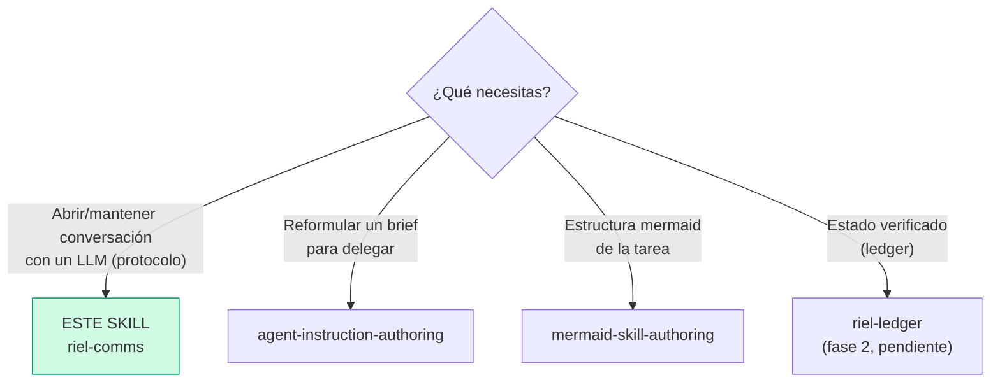

# riel-comms — Protocolo de comunicación (Fase 1 de Riel)

**Riel** es el framework de steering: la capacidad ya existe en el modelo; Riel
evita que se pierda entre tenerla y entregarla. Este componente dirige **la
trayectoria**: cómo el agente abre y mantiene la conversación con el LLM.

**Modo protocolo:** el pedido del usuario llega **crudo** al modelo. riel-comms
NO reformula ni reescribe peticiones — cambia cómo el agente **entra** a la
conversación y cómo la sostiene.

## Entry router

## Parse contract

### Qué CONSUME este skill
- Una petición o tarea para ejecutar con un LLM (chat directo o vía subagente)

### Qué PRODUCE este skill
- Apertura anclada (gramática funcional + persona + superficie mínima)
- Mantenimiento de la trayectoria durante la conversación (eco funcional)

## La gramática funcional

Asignación de primera persona por función — cada enunciado debe **descargarse**
en una acción, un check o un cierre (eso es el "eco funcional"):

| Forma | Función | Ejemplo |
|---|---|---|
| `We need…` | Objetivo compartido: el agente + su entorno trabajando hacia algo | "We need hacer que el login valide ambos proveedores" |
| `I` | Percepción, juicio local, compromiso | "I see el test falla por el mock; I will corregirlo" |
| `Let's` | Operación conjunta inmediata | "Let's verificar el endpoint antes de continuar" |

Reglas:

1. **Abrir con `We need…`** en DeepSeek: la evidencia comunitaria (dsh-anchored-standard)
   muestra que esta forma corresponde a la trayectoria estable del post-training
   de agente (condición Minimal). En otros modelos funciona como control genérico.
2. **Descarga obligatoria:** un `we need` que no se convierte en acción/check/cierre
   en los próximos pasos es ruido — completarlo o descartarlo.
3. **Lo que NO se suprime:** `Let me` o dudas ocasionales no son fallos. Lo que se
   evita son los bucles de auto-diálogo: duda → duda → duda sin acción.
4. **En español también aplica:** "Necesitamos…" / "Veo que…" / "Vamos a…" — la
   función importa más que la palabra literal.

## Condiciones de apertura (el primer turno)

Lo que ancla en DeepSeek es el **estado completo del primer turno**, no una
palabra mágica. Tres condiciones:

1. **Persona corta y estable** — estilo *"You are a helpful software engineer
   assistant"*. No apilar capas de rol encima durante la conversación.
2. **Superficie mínima primero** — presentar el alcance y las herramientas
   necesarias para la primera acción, no el catálogo completo de capacidades.
   Las capacidades pesadas se introducen cuando la tarea las pide.
3. **Cero inyecciones irrelevantes** — no arrastrar skill-catalogs, digests ni
   contexto que la primera acción no necesita. (Evidencia: con catálogo de
   skills presente el anclaje no se reprodujo 0/9.)

### Al delegar (subagentes)

En briefs de `delegate_task`, aplicar las mismas condiciones en `goal` + `context`:
- `goal` abre con el objetivo compartido ("We need…")
- `context` lleva solo lo que la primera acción necesita (repo, archivos, criterios)
- No volcar herramientas ni instrucciones que no corresponden a la fase actual

## Mantenimiento (durante la conversación)

- Cada enunciado funcional se descarga: acción → check → cierre
- Si la conversación deriva a planificación infinita sin acción: volver a
  `We need…` + la siguiente acción concreta
- Si aparecen bucles de duda: `I see` (diagnóstico de por qué se traba) +
  `Let's` (acción pequeña para salir)

## Límites de evidencia (honesto)

- **Medido con fuerza:** que las condiciones de primer turno **anclan la
  trayectoria** (schema Minimal 5/5; con inyecciones 0/9).
- **Hipótesis, no medida:** que la trayectoria anclada mejora *scores* — la
  replicación independiente da IC 95% [−2.6, +9.3]; un A/B independiente
  (issue #10) no encontró ganancia medible. No afirmar mejoras sin medir
  (para eso está `riel-measure`, fase 4).

## Evidencia (páginas Dran)

- `deepseek-v4-interfaz-y-trayectoria-we-need` — las 3 palancas del anclaje
- `harness-analysis-papers-en-extension-points` — confirmado en el preset
  Minimal oficial (persona completa + cero inyecciones + par de tools)
- `j-space-global-workspace-papers` — base científica del workspace

## Pitfalls

- **Reescribir el pedido del usuario** — este skill es protocolo, no traductor;
  el mensaje llega crudo.
- **Forzar la gramática en cada frase** — el eco funcional no es contar palabras;
  un `we need` por tarea basta si se descarga bien.
- **Afirmar que mejora resultados** — ancla la trayectoria; la ganancia se mide.

## Checklist

- [ ] Apertura con objetivo compartido (`We need…` / "Necesitamos…")
- [ ] Persona corta y estable, sin capas apiladas
- [ ] Superficie mínima en el primer turno (solo lo que la primera acción necesita)
- [ ] Cero contexto inyectado irrelevante al inicio
- [ ] Cada enunciado funcional se descargó en acción/check/cierre
- [ ] El pedido del usuario no fue reescrito
