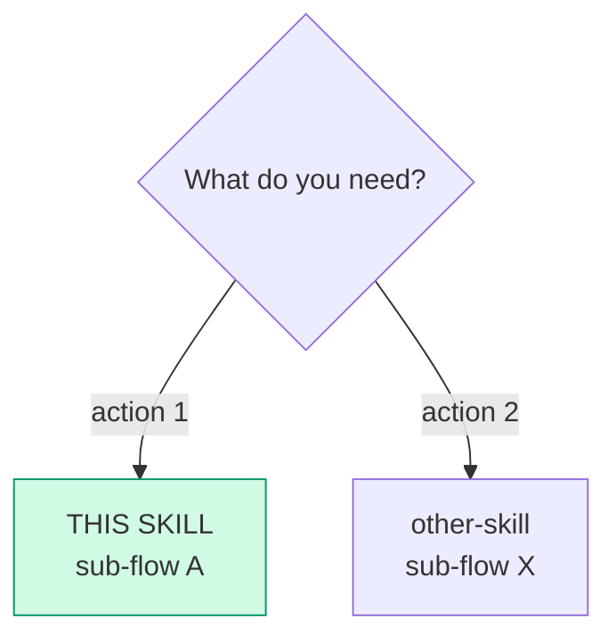
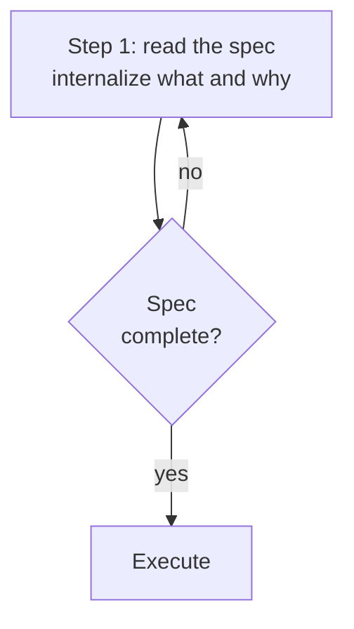
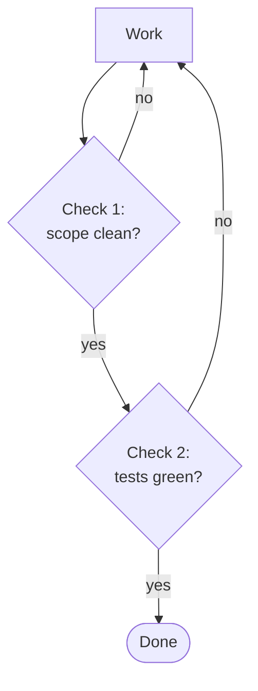

# riel-contract — Mermaid as an executable contract (Riel)

How to structure a **skill or todo** that uses mermaid diagrams: 3-layer
pattern (Entry router → Parse contract → Work), closed vocabulary of 6
verbs, strict syntax conventions so diagrams are parseable by small models
and CI-verifiable.

**When to use:** creating a new skill with decision flows, hand-offs, or
pipelines; adding mermaid to an existing skill; authoring the `## Phases`
graph of a dev todo.

**Do NOT use for:** decorative diagrams without routing/parsing purpose
(use prose); skills without sequential flows.

## Why graphs — the evidence

- **BRAID** (arXiv:2512.15959): replacing free-form CoT with mermaid
  execution graphs gives **+4 to +33.8 accuracy points**; a small model
  with a graph = a model 2 tiers larger without one. Nodes atomic, <15
  tokens ideal.
- **FlowBench** (EMNLP 2024): flowcharts > prose as workflow knowledge for
  agent planning; **text + code + flowchart together > any format alone**.
- **Lost in the Middle** (arXiv:2307.03172): branch logic buried in
  paragraphs gets lost in long context; the graph makes it position-proof.

## The 3-layer pattern (every skill with mermaid)

```
┌─────────────────────────────────────────┐
│ LAYER 0: Entry router                   │  "Am I in the right skill?"
│ mermaid: need → sub-flow                │  "Which section do I run?"
├─────────────────────────────────────────┤
│ LAYER 1: Parse contract                 │  "How do I read my input?"
│ what it CONSUMES + what it PRODUCES     │  "What shape is my output?"
├─────────────────────────────────────────┤
│ LAYER 2: Work                           │  Procedure (steps, tools, gates)
└─────────────────────────────────────────┘
```

Rule: **mermaid complements, never replaces prose.** Prose explains the
why; the diagram summarizes the flow. A section with >3 sequential bullets
is a `flowchart TD` candidate.

## Entry router template

````markdown
## Entry router

Are you in the right skill? Follow this diagram:



Run ONLY the sub-flow you landed on. If the diagram sends you to another
skill, **stop here** and hand off — do not absorb that work.
````

- Destinations that are ANOTHER skill carry the **real name**, never
  "other skill".
- The current skill is highlighted in green (`#d1fae5`/`#059669`).

## Parse contract template

````markdown
## Parse contract

### What this skill CONSUMES
- <input 1> — where it comes from, format
- <input 2>

### What this skill PRODUCES
<produced artifact with its exact structure>

**Without <artifact>, the output is malformed** — the consumer rejects it.
````

The parse contract specifies **verifiable structure**: if the skill produces
an artifact with N mandatory diagrams or fixed sections, that table goes here.

## Verb vocabulary (canonical)

Execution nodes use **only these 6 semantic verbs**. They are NOT tool
names — whoever executes translates them to tools:

| Verb | Typical tool | Argument in the label | Example |
|------|--------------|-----------------------|---------|
| `READ` | `read_file` | `path` or `path:line` | `S1["READ lib/myapp/page.ex:140"]` |
| `EDIT` | `patch` | `path — what changes` | `S2["EDIT page.ex — add update_meta/2"]` |
| `CREATE` | `write_file` | `path — purpose` | `S3["CREATE test/page_test.exs — meta test"]` |
| `RUN` | `terminal` | full literal command | `S4["RUN mix test test/page_test.exs"]` |
| `VERIFY` | `terminal` + assert | condition | `S5["VERIFY git diff --name-only ⊆ scope"]` |
| `ASK` | `clarify` | short question | `S6["ASK confirm the approach?"]` |

**Rules:**

- An execution node not starting with one of these 6 verbs is malformed.
- Never tool names in labels (`read_file`, `patch`) — mermaid is the WHAT,
  not the HOW. The verb → tool translation lives in this table.
- Non-execution nodes (routers, states, narrative decisions) need no verb.

## Syntax conventions (parseable by small models)

### Line breaks: `\n`, NEVER `<br/>`

`<br/>` breaks with `securityLevel: "strict"` (mermaid v11). Use `\n`
inside quoted labels:



### Predictable node IDs

| Kind | IDs | Use |
|------|-----|-----|
| Waves / phases | `W1`, `W2`, `W3` | Execution phases |
| Gates | `G1`, `G2`, `G3` | Criteria between phases |
| Steps | `S1`, `S2`, `S3` | Steps inside a phase |

No variable semantic IDs (`setupDB`, `fixBug`) — small models parse by
regex; fixed IDs are predictable. Routers and narrative flows may use short
stable IDs (`Q`, `SELF`, `START`, `END`).

### Fixed-structure labels

- Phase: `W1["Wave 1: <deliverable>\nFiles: <path1, path2>"]`
- Gate: `G1{"Gate: compile + test\nspecific command"}`
- Read: `S1["READ path:line"]`
- Write: `S2["EDIT path — <what>"]`
- Validate: `S3["RUN <command>"]`

Labels ≤ 15-20 tokens per node — one step per node.

### Explicit edge guards

Every decision carries labeled edges: `-->|yes|`, `-->|no|`, `-->|error|`.
Loops with bounded exit conditions: `-->|"< 3 attempts"|` / `-->|">= 3, escalate"|`.

### One diagram type per purpose

| Purpose | Type | Direction |
|---------|------|-----------|
| Architecture (current vs proposed) | `flowchart` | `LR` |
| Phases / execution DAG | `flowchart` | `TD` |
| Phase detail (steps) | `flowchart` | `LR` |

### Styles: only on illustrative diagrams

Routing/state mermaids (entry routers, lifecycles) DO carry `style` —
colors by meaning: green `#d1fae5`/`#059669` (this skill / terminal ok),
amber `#fef3c7`/`#d97706` (in progress / gate), red `#fee2e2`/`#dc2626`
(cancelled), blue `#dbeafe`/`#2563eb` (dispatch / external action).

Diagrams **parsed as spec** (execution DAGs, phases) carry NO `style` —
it is noise for the parser.

## Verification funnel (BRAID)

Every execution flow **ends in VERIFY/Check node(s) before End**; every
`no`/`fail` edge returns to the step that failed. The topology forces
validation — the agent cannot skip it.



Loops carry counters: retry `< 3` returns to the failing step; `>= 3`
escalates (never infinite loops).

## Syntax validation

### Extracting mermaid blocks: Python regex, not awk

awk extracts line by line, not the whole block. Use:

```python
import re
blocks = re.findall(r'```mermaid\n(.*?)```', content, re.DOTALL)
```

### Local with mmdc

```bash
# ❌ mmdc does NOT accept /dev/null as output
# ✅ temp .svg file, then delete
mmdc -i block.mmd -o /tmp/block.svg --quiet && rm /tmp/block.svg
```

### Generic CI

Workflow running mermaid-cli (`npm install -g @mermaid-js/mermaid-cli`)
over mermaid blocks extracted from skill files when a PR touches them; on
failure show file + block + error.

## Recipe: adding mermaid to an existing skill

1. Read the whole skill first — existing mermaids already use real names;
   new ones must match.
2. Identify sequential-prose sections (inputs in order, decisions,
   hand-offs) → `flowchart TD` candidates.
3. Validate syntax mentally: `\n` for breaks, balanced quotes, no unescaped
   chars in labels.
4. Keep the prose that explains the *why*; the diagram replaces the
   *step by step*.
5. Run local validation with mmdc before presenting.

## Pitfalls

- **Do not invent paths in labels.** Every `path:line` must be verified
  with `read_file` — an invented snippet breaks executor trust.
- **No tool names in labels.** Semantic verbs, never tools.
- **No semantic IDs.** `W1`/`G1`/`S1` predictable.
- **`<br/>` breaks strict.** `\n` always.
- **mmdc does not accept /dev/null.** Temp `.svg` file.
- **awk does not extract mermaid blocks.** Python regex with `re.DOTALL`.
- **Mermaid does not replace prose.** If the diagram adds no flow/decision
   clarity, it does not go.
- **Do not duplicate contracts.** If statuses/tables already live in
   another skill, reference, do not redefine.
- **Syntax pitfalls:** `==`, `!=`, `<=`, `$` break the mermaid parser →
   quote labels containing them.

## Checklist

- [ ] Valid frontmatter: `name`, `description` (trigger in first 57
      chars), `version`, `author`, `license`,
      `metadata.hermes.{tags, related_skills}`
- [ ] Entry router + Parse contract before Work
- [ ] Hand-offs name destination skill + sub-flow and stop (do not absorb)
- [ ] Predictable IDs, fixed-structure labels, one type per purpose
- [ ] Line breaks with `\n`, zero `<br/>`
- [ ] Execution DAGs carry NO `style`; routers/lifecycles do
- [ ] Execution nodes start with a verb from the closed vocabulary
- [ ] Verification funnel before End; loops with counters
- [ ] Mermaid parses: `mmdc -i <file>.mmd -o /tmp/check.svg --quiet`
- [ ] The why-prose intact (mermaid adds, does not replace)

## Cross-references

- One-shot agent instructions with the same vocabulary: `riel-briefs`
- SKILL.md mechanics (frontmatter, validator): `hermes-agent-skill-authoring`
- The ledger that the VERIFY nodes feed: `riel-ledger`
