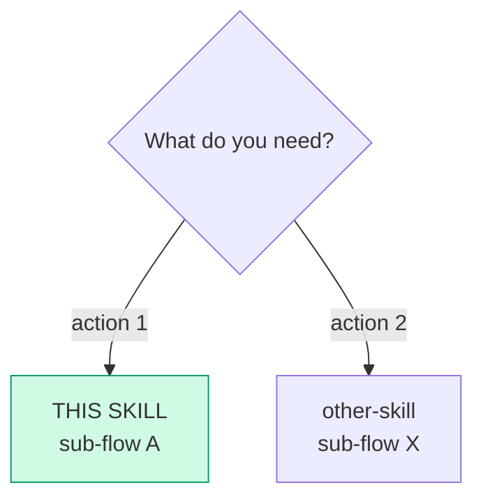
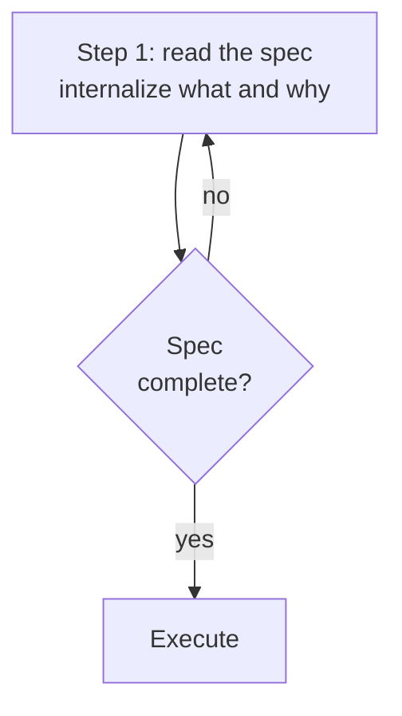

# riel-contract — Mermaid as an executable contract (Riel)

How to structure a **skill or todo** that uses mermaid diagrams: 3-layer
pattern (Entry router → Parse contract → Work), closed vocabulary of 6
verbs, strict syntax conventions so diagrams are parseable by small models
and CI-verifiable. **This skill is the single source of truth** for verb
vocabulary and graph conventions — every other Riel skill references it.

**When to use:** creating a new skill with decision flows, hand-offs, or
pipelines; adding mermaid to an existing skill; authoring the `## Phases`
graph of a dev todo.

**Do NOT use for:** decorative diagrams without routing/parsing purpose
(use prose); skills without sequential flows.

## Why graphs

- **Machine-checkable.** The contract is text a parser accepts or rejects
  (`mmdc`), with a closed verb vocabulary and a funnel topology that ends
  in VERIFY before End. Rules become greps, not hopes — prose has no
  parser.
- **Cheap to prompt.** A dependency is 2–5 tokens in the edge list; prose
  pays per-node boilerplate.
- **Truncation-resistant.** Reading an edge list spends no reasoning on
  re-deriving dependencies from sentences.

What it does not do: make the model smarter. The graph shapes the exchange,
not the capability.

## The 3-layer pattern (every skill with mermaid)

```
┌─────────────────────────────────────────┐
│ LAYER 0: Entry router                   │  "Am I in the right skill?"
│ mermaid: need → sub-flow                │  "Which section do I run?"
├─────────────────────────────────────────┤
│ LAYER 1: Parse contract                 │  "How do I read my input?"
│ what it CONSUMES + what it PRODUCES     │  "What shape is my output?"
├─────────────────────────────────────────┤
│ LAYER 2: Work                           │  Procedure (steps, tools, gates)
└─────────────────────────────────────────┘
```

Rule: **mermaid complements, never replaces prose.** Prose explains the
why; the diagram summarizes the flow. A section with >3 sequential bullets
is a `flowchart TD` candidate.

## Entry router template

````markdown
## Entry router



Run ONLY the sub-flow you landed on. If the diagram sends you to another
skill, **stop here** and hand off — do not absorb that work.
````

- Destinations that are ANOTHER skill carry the **real name**, never
  "other skill".
- The current skill is highlighted in green (`#d1fae5`/`#059669`).

## Parse contract template

````markdown
## Parse contract

### What this skill CONSUMES
- <input 1> — where it comes from, format

### What this skill PRODUCES
<produced artifact with its exact structure>

**Without <artifact>, the output is malformed** — the consumer rejects it.
````

## Verb vocabulary (canonical)

Execution nodes use **only these 6 semantic verbs**. They are NOT tool
names — whoever executes translates them to tools:

| Verb | Typical tool | Argument in the label | Example |
|------|--------------|-----------------------|---------|
| `READ` | `read_file` | `path` or `path:line` | `S1["READ lib/myapp/page.ex:140"]` |
| `EDIT` | `patch` | `path — what changes` | `S2["EDIT page.ex — add update_meta/2"]` |
| `CREATE` | `write_file` | `path — purpose` | `S3["CREATE test/page_test.exs — meta test"]` |
| `RUN` | `terminal` | full literal command | `S4["RUN mix test test/page_test.exs"]` |
| `VERIFY` | `terminal` + assert | condition | `S5["VERIFY git diff --name-only in scope"]` |
| `ASK` | `clarify` | short question | `S6["ASK confirm the approach?"]` |

**Rules:**

- An execution node not starting with one of these 6 verbs is malformed.
- Never tool names in labels (`read_file`, `patch`) — mermaid is the WHAT,
  not the HOW. The verb → tool translation lives in this table.
- Non-execution nodes (routers, states, narrative decisions) need no verb.

### Common operations map

Operations that feel like missing verbs already have a canonical form:

| Operation | Form |
|---|---|
| Execute a script / build / install / git | `RUN` with the literal command |
| Run tests | `S["RUN <test command>"]` then G{"tests green?"} — two nodes: see Verification funnel |
| Search the codebase | `READ` (the executor picks search_files/grep) |
| Delete a file | `RUN rm <path>` |

A new verb enters the vocabulary only if it is **not expressible** as an
existing verb + argument, **needs its own argument schema** to be
verifiable, and **recurs** in real contracts. Every new verb weakens the
closed set that makes contracts grepeable.

## Syntax conventions (parseable by small models)

### Line breaks: `\n`, never `<br/>`

`<br/>` breaks with `securityLevel: "strict"` (mermaid v11). Use `\n`
inside quoted labels:



### Predictable node IDs

| Kind | IDs | Use |
|------|-----|-----|
| Waves / phases | `W1`, `W2`, `W3` | Execution phases |
| Gates | `G1`, `G2`, `G3` | Criteria between phases |
| Steps | `S1`, `S2`, `S3` | Steps inside a phase |

No variable semantic IDs (`setupDB`, `fixBug`) — small models parse by
regex; fixed IDs are predictable. Routers and narrative flows may use short
stable IDs (`Q`, `SELF`, `START`, `END`).

### Fixed-structure labels

- Phase: `W1["Wave 1: <deliverable>\nFiles: <path1, path2>"]`
- Gate: `G1{"Gate: compile + test\nspecific command"}`
- Read: `S1["READ path:line"]`
- Write: `S2["EDIT path — <what>"]`
- Validate: `S3["RUN <command>"]`

Labels ≤ 15-20 tokens per node — one step per node.

### Explicit edge guards

Every decision carries labeled edges: `-->|yes|`, `-->|no|`, `-->|error|`.
Loops with bounded exit conditions: `-->|"< 3 attempts"|` /
`-->|">= 3, escalate"|`.

### One diagram type per purpose

| Purpose | Type | Direction |
|---------|------|-----------|
| Architecture (current vs proposed) | `flowchart` | `LR` |
| Phases / execution DAG | `flowchart` | `TD` |
| Phase detail (steps) | `flowchart` | `LR` |

### Styles: only on illustrative diagrams

Routing/state mermaids (entry routers, lifecycles) DO carry `style` —
colors by meaning: green `#d1fae5`/`#059669` (this skill / terminal ok),
amber `#fef3c7`/`#d97706` (in progress / gate), red `#fee2e2`/`#dc2626`
(cancelled), blue `#dbeafe`/`#2563eb` (dispatch / external action).

Diagrams **parsed as spec** (execution DAGs, phases) carry NO `style` —
it is noise for the parser.

## Verification funnel

Every execution flow **ends in VERIFY/Check node(s) before End**; every
`no`/`fail` edge returns to the step that failed. The topology forces
validation — the agent cannot skip it.

**Running tests and deciding on them are two nodes.** A `RUN mix test`
executes; a `VERIFY{"tests green?"}` decides. The funnel needs the
decision, not the command — a single `RUN` node conflates them and the
agent declares done from exit code alone.


Loops carry counters: retry `< 3` returns to the failing step; `>= 3`
escalates (never infinite loops).

## Syntax validation

Repo tooling: `scripts/validate-mermaid.sh` extracts every mermaid block
(`scripts/extract-mermaid.py`, Python regex with `re.DOTALL`) and pipes
each through `mmdc`. Requires mermaid-cli
(`npm install -g @mermaid-js/mermaid-cli`).

## Pitfalls

- **Do not invent paths in labels.** Every `path:line` must be verified
  with `read_file` — an invented snippet breaks executor trust.
- **No tool names in labels.** Semantic verbs, never tools.
- **No semantic IDs.** `W1`/`G1`/`S1` predictable.
- **mmdc does not accept /dev/null as output.** Temp `.svg` file, delete.
- **Mermaid does not replace prose.** If the diagram adds no flow/decision
  clarity, it does not go.
- **A graph without decisions, branches, or parallel work is a numbered
  list wearing a costume.** Prose carries sequences better than boxes do.
- **Do not duplicate contracts.** If statuses/tables already live in
  another skill, reference, do not redefine.
- **Syntax pitfalls:** `==`, `!=`, `<=`, `$`, `&` break the mermaid parser
  → quote labels containing them.

## Checklist

- [ ] Valid frontmatter: `name`, `description` (trigger in first 57
      chars), `version`, `author`, `license`,
      `metadata.hermes.{tags, related_skills}`
- [ ] Entry router + Parse contract before Work
- [ ] Hand-offs name destination skill + sub-flow and stop (do not absorb)
- [ ] Predictable IDs, fixed-structure labels, one type per purpose
- [ ] Line breaks with `\n`, zero `<br/>`
- [ ] Execution DAGs carry NO `style`; routers/lifecycles do
- [ ] Execution nodes start with a verb from the closed vocabulary
- [ ] Verification funnel before End; loops with counters
- [ ] Mermaid parses: `scripts/validate-mermaid.sh`
- [ ] The why-prose intact (mermaid adds, does not replace)

## Cross-references

- One-shot agent instructions with the same vocabulary: `riel-briefs`
- The ledger that the VERIFY nodes feed: `riel-ledger`
