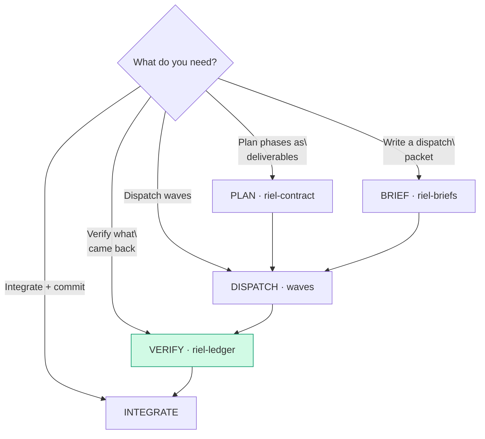

# riel-delegate — The whole Riel framework applied to delegation

One skill to run Riel end-to-end when delegating to subagents. It does not
recreate the framework — it orchestrates it: `riel-protocol` opens every
brief, `riel-briefs` shapes the packet, `riel-contract` structures the
phases, `riel-ledger` verifies what came back. The parent is the one
capability that must not be lost: it plans, dispatches, verifies and
integrates. Children are generators; the parent is the verifier.

## Entry router

Run the sub-flow you landed on. The full cycle is PLAN → BRIEF → DISPATCH →
VERIFY → INTEGRATE, in order — never skip VERIFY.

## Parse contract

### What this skill CONSUMES
- A task to delegate (feature, fix, research, tests)
- The Riel framework skills (`riel-protocol`, `riel-briefs`, `riel-contract`,
  `riel-ledger`)

### What this skill PRODUCES
- A phase plan with per-phase "definición de done" + per-subagent mermaid
- Self-contained dispatch packets (riel-briefs format)
- A parent-side verification verdict per criterion (`confidence X/20`)
- Commits per logical concern

## The delegation cycle

### 1. PLAN — phases are deliverables (riel-contract)

- **Every phase = a complete deliverable** with a literal
  "Entregable (definición de done)" line: what done means end-to-end and how
  to verify it.
- Phase → multiple subagents with **disjoint file scopes**, grouped in waves:
  Wave 1 independent, Wave 2 depends on Wave 1.
- Mermaid at THREE scales: master graph (whole plan), per-phase graph
  (subagents + waves), per-subagent graph (that child's workflow). Follow
  riel-contract conventions (`\n`, never ` `, no `&`, closed verb
  vocabulary, verification funnel before End).
- Draw the association graph across scopes before splitting: any cross-edge
  (a schema references a sibling's not-yet-written module) means the scopes
  are NOT parallel-safe — that child goes in a later wave.

### 2. BRIEF — self-contained packets (riel-briefs)

Every child gets a standalone packet: `goal` opens with the shared objective
("We need…"), `context` carries only what the first action needs, the exact
files it may touch, copy-pasteable code, its verification command, its
commit message, and a DO NOT section. Children have no session context — if
the agent must ask "what do you mean?", the packet is incomplete.

### 3. DISPATCH — waves, bounded and disjoint

- 2-3 children per wave; **max 2 concurrent on a shared provider** (429s).
- State disjoint file scopes literally; shared registry/index files are
  PARENT work, never a child's.
- Pre-warm slow toolchains (deps compile) before dispatching.
- Children never commit and never run the full suite — targeted tests only;
  the full suite is the parent's between-waves gate.

### 4. VERIFY — the parent's job (riel-ledger)

This is the step Riel exists for: the parent generated (dispatched) — now it
must **discriminate which output is correct**. Binary "tests green" hides
uncertainty the same way coarse scoring produces ties.

**Decompose first.** Break the phase's definición de done into its verifiable
criteria (each independent claim about "done").

**Verify each criterion.** Run the gate yourself (compile + targeted tests +
format + diff ⊆ scope). Assign `confidence X/20` to each criterion's verdict.

**Re-sample borderline.** `confidence < 12/20` = borderline → re-sample with
variation (a different angle, order, or question) before accepting. Never
accept the same check repeated (churn); never advance on a borderline.

**Triage failures.** Classify each failure:
- **A — impl not yet present** (`UndefinedFunctionError` on a missing
  module): check `git status`/`git diff` for the child's partial work;
  finish it yourself or re-dispatch.
- **B — impl buggy** (stacktrace points into `lib/`): fix it yourself with
  `patch` — you own the whole repo.
- **C — test/verification wrong**: fix the test yourself.

Children are self-reports, not ground truth: re-run the FULL suite + compile
+ lint yourself after every wave, before the next.

### 5. INTEGRATE & COMMIT

- Run the full gate **unpiped** (check the exit code explicitly — never pipe
  into `tail` and commit; the pipeline masks the exit status).
- One commit per logical concern; children never commit.
- If a child timed out with files on disk (Pattern A: many calls, files
  exist), inventory the diff and complete it yourself — do not re-dispatch.

## Pitfalls (the ones that cost the most)

- **Trusting the child's "all tests pass".** Re-run everything yourself.
- **Overlapping scopes.** File-level disjointness, not task-level. A child
  recovering via `git checkout` destroys sibling work in the same files.
- **Children self-verifying with the full suite.** They die mid-verification
  at the cap with work 100% done. Targeted tests only.
- **Letting children commit.** Git-index races bundle files into one commit.
- **Oversized goals get silently truncated** to literal `"...truncated..."`.
  Anything beyond ~10 lines of instructions goes in a spec file; the goal
  points at it ("Lee <path> y ejecútalo al pie de la letra…").
- **429s on shared providers.** Max 2 concurrent; re-dispatch killed children
  sequentially; check disk before re-dispatching "failed" children (zombies
  may have finished and written their files).
- **Piping the gate into `tail`/`head`.** Masks the exit code and always
  commits a red gate.
- **Empty Next / no ledger after the wave.** If the wave spans phases, the
  parent keeps a local ledger (riel-ledger): Goal, Verified with confidence,
  Next. The parent's state is as loss-prone as a child's.

## Checklist

- [ ] Phases are complete deliverables with definición de done
- [ ] Scopes disjoint at file level; shared files are parent work
- [ ] Every child gets a self-contained riel-briefs packet (goal + context + code + verify + DO NOT)
- [ ] Mermaid at 3 scales, riel-contract conventions
- [ ] Children never commit, never run the full suite
- [ ] Parent verified: decomposed criteria + `confidence X/20` per criterion
- [ ] Borderline (`< 12/20`) re-sampled with variation before advancing
- [ ] Failures triaged A/B/C; B fixed by parent, not re-dispatched
- [ ] Full gate re-run unpiped; commit per logical concern

## Cross-references

- The packet format: `riel-briefs`
- Opening conditions and functional grammar: `riel-protocol`
- Mermaid contract conventions: `riel-contract`
- The ✓NN + confidence + re-sample rules: `riel-ledger`
