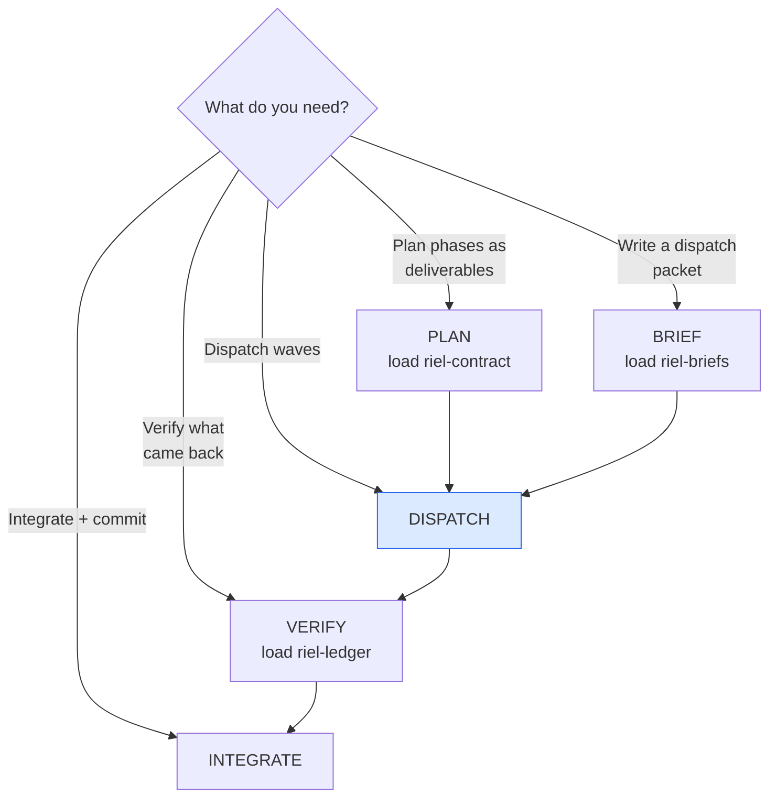

# riel-delegate — Delegation router (Riel)

One skill to route Riel delegation end-to-end. It does not recreate the
framework — it **routes to it** and holds the operational pitfalls that
belong to dispatching alone. The parent is the capability that must not be
lost: it plans, dispatches, verifies and integrates. Children are
generators; the parent is the verifier.

## Entry router

The full cycle is PLAN → BRIEF → DISPATCH → VERIFY → INTEGRATE, in order —
never skip VERIFY. Each step's rules live in its own skill; what follows is
only what dispatching itself adds.

## Parse contract

### What this skill CONSUMES
- A task to delegate (feature, fix, research, tests)

### What this skill PRODUCES
- A routed plan: phases (riel-contract) → packets (riel-briefs) → waves
- A parent-side verification verdict per criterion (riel-ledger)
- Commits per logical concern

## The cycle at a glance

1. **PLAN** — load `riel-contract`. Every phase is a complete deliverable
   with a literal definition of done; subagents get disjoint file scopes,
   grouped in waves (Wave 2 depends on Wave 1). Any cross-edge between
   scopes means they are NOT parallel-safe.
2. **BRIEF** — load `riel-briefs`. Every child gets a standalone packet:
   anchored goal, curated context, exact files, verification command,
   DO NOT section.
3. **DISPATCH** — waves, bounded and disjoint (rules below).
4. **VERIFY** — load `riel-ledger`. Decompose the phase's definition of
   done into criteria; run each gate yourself; `confidence X/20` per
   criterion; borderline (< 12/20) re-sampled with variation before
   accepting. Children are self-reports, not ground truth.
5. **INTEGRATE** — commits per logical concern (rules below).

## DISPATCH — the operational rules this skill owns

- 2-3 children per wave; **max 2 concurrent on a shared provider** (429s).
  "Shared" means same provider account / same API key / same rate pool as
  the parent — not merely the same model family on different keys.
- State disjoint file scopes literally; shared registry/index files are
  PARENT work, never a child's.
- Pre-warm slow toolchains (deps compile) before dispatching.
- Children never commit and never run the full suite — targeted tests
  only; the full suite is the parent's between-waves gate.

## INTEGRATE — the rules this skill owns

- Run the full gate **unpiped** — check the exit code explicitly. Piping
  into `tail`/`head` masks the exit status and commits a red gate.
- One commit per logical concern; children never commit.
- If a child timed out with files on disk, inventory the diff and complete
  it yourself — do not re-dispatch.

## Failure triage (when a child comes back red)

- **A — impl not yet present** (missing module/function): check
  `git status`/`git diff` for partial work; finish it yourself or
  re-dispatch.
- **B — impl buggy** (stacktrace points into lib/): fix it yourself with
  `patch` — you own the whole repo.
- **C — test/verification wrong**: fix the test yourself.

**Fix-it-yourself vs re-dispatch, rule of thumb:** if the child's diff is
>50% correct in structure and scope, finish it yourself — re-dispatching
costs a fresh packet and a fresh reader. If <50%, the brief was wrong or
the model missed the spec; write the correct version into a brief and
re-dispatch, do not patch a half-broken tree.

## Pitfalls (the ones that cost the most)

- **Trusting the child's "all tests pass".** Re-run everything yourself.
- **Overlapping scopes.** File-level disjointness, not task-level. A child
  recovering via `git checkout` destroys sibling work in the same files.
- **Children self-verifying with the full suite.** They die mid-verification
  at the cap with work 100% done. Targeted tests only.
- **Letting children commit.** Git-index races bundle files into one commit.
- **Oversized goals get silently truncated.** Anything beyond ~10 lines of
  instructions goes in a spec file; the goal points at it.
- **429s on shared providers.** Max 2 concurrent; re-dispatch killed
  children sequentially; check disk before re-dispatching "failed"
  children (zombies may have finished and written their files).
- **Piping the gate into `tail`/`head`.** Masks the exit code.
- **No ledger on the parent.** If the wave spans phases, the parent keeps
  a local ledger (riel-ledger) — the parent's state is as loss-prone as a
  child's.

## Checklist

- [ ] Phases are complete deliverables with definition of done (riel-contract)
- [ ] Scopes disjoint at file level; shared files are parent work
- [ ] Every child gets a self-contained packet (riel-briefs)
- [ ] Children never commit, never run the full suite
- [ ] Parent verified: decomposed criteria + `confidence X/20` per criterion (riel-ledger)
- [ ] Failures triaged A/B/C; B fixed by parent, not re-dispatched
- [ ] Full gate re-run unpiped; commit per logical concern

## Cross-references

- The packet format: `riel-briefs`
- Opening conditions and functional grammar: `riel-protocol`
- Mermaid contract conventions: `riel-contract`
- The ✓NN + confidence + re-sample rules: `riel-ledger`
