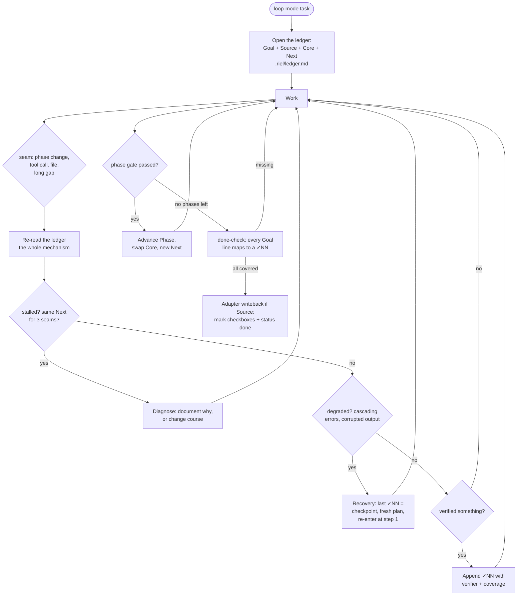

# riel-ledger — Local verified state for long tasks (Riel)

The ledger is **externalized working memory** for tasks long enough to lose
state. It does not solve anything — it lets the agent **restore the same
task state** after every seam: a tool call, a file change, a context
compaction, an hours-long gap. This is the heart of the Riel framework.

**Local-first:** this skill operates entirely inside the task worktree.
It does NOT depend on any remote task system. Remote sync is an adapter's
job — see "Remote systems" at the end.

## When to use

| Mode | Ledger? |
|---|---|
| **fast** — 1 step, checkable at a glance | ❌ nothing |
| **full** — bounded multi-step, clear deliverable | ⚠️ only the done-check |
| **loop** — multi-file, multi-tool, multi-phase, or spanning sessions | ✅ full protocol |

Symptoms that you need a ledger even if you did not plan one: several seams
without knowing the next step; about to re-verify something already
verified; hours passed and you cannot remember where you left off.

## The file: `.riel/ledger.md` in the worktree

- Lives at the worktree root; goes in `.gitignore`.
- **One workstream = one worktree = one ledger** — parallel sessions never
  share a ledger (same lesson as git index races).
- Ephemeral: after the final writeback it may be deleted.

### Git hygiene — the ledger must never be committed

The ledger is local state, not a deliverable. When working inside a repo:

1. **Before committing, ensure `.riel/` is ignored in THAT repo** — add
   `.riel/` to the worktree's `.gitignore` if it is not already there.
2. **Never `git add .riel/` or `git add -A` without checking** — prefer
   explicit adds (`git add <file>`). The ledger must not leak into a
   feature commit.
3. **Before every commit, verify:** `git status` shows no `.riel/` entries.

```markdown
# Riel ledger

## Goal
<one sentence: what "done" means>

## Claims
- P1: <what will be true when done> — verify with: <how>
- P2: <what will be true when done> — verify with: <how>

## Source
<optional: remote system + identifier — e.g. todo:<slug>>

## Phase
<active phase if the task has phases — e.g. "F2: CREATE router_test.exs">

## Core
- <name> — <defining fact>
- <name> — <defining fact>

## Verified
- ✓01 <what holds> — verified by: <what established it>, covering <scope>[, confidence X/20]

## Open
- ?01 <question> — settled by: <the cheapest test that would refute it>

## Next
<the single next action — never empty>
```

## Field rules

| Field | Rule |
|---|---|
| Goal | One sentence; updated only if the goal changes |
| Claims | Pre-registered before first action; P-ids; **never edited after execution begins** — a failed claim is refuted, not reinterpreted |
| Source | Optional; present when the task came from a remote todo |
| Phase | Derived from the phases graph (riel-contract); pointer to the active phase |
| Core | Max 2 live items; change only via explicit swap; each with its defining fact |
| Verified | Numbered ✓NN, append-only; never deleted or renumbered; critical checkpoints may carry `confidence X/20` |
| Open | Numbered ?NN; closed against a checkpoint; the number is never reused |
| Next | Never empty; if blocked, the block IS the Next ("waiting on X from the user") |

A ✓NN without coverage is not a checkpoint — **it is a mood**. Every entry
names the verifier AND what it covered.

**A critical checkpoint with confidence < 12/20 is not a checkpoint.**
Re-verify with variation (different angle, order, or question) until it
clears 12, or open a ?NN for what is keeping it low. Do not advance a
phase on a borderline.

**The verifier is external to the executor's judgment whenever possible.**
"verified by: the tests I ran" is weaker than "verified by: `mix test
test/page_test.exs`, 12 examples 0 failures". A command that returns clean
binary output beats a self-assessment; the executor is the worst judge of
its own work.

## The three registers

You write in three registers — the difference is who reads them.

- **Inner** — dense, compressed, private. For thinking. Never read by
  anyone else, never expanded. "Tests green, ?coverage on edge input ↓"
- **Ledger** — short labelled lines, durable, re-read at seams. For
  state. "✓01 Token signs — `mix test token_test.exs`, 4/4, covering
  sign+verify+expiry"
- **Outer** — clean, complete language. For humans and task-facing tools.
  Deliverables, commits, brief packets, tool inputs.

The switch to outer is **total** and happens at every seam, not once
before delivery. Dense on the inside, decodable on demand, clean on
the outside. If a dense symbol leaks into an outer deliverable, that
is a register bug — fix it before the seam closes.

## The protocol



### Opening (loop mode only)

0. **Restate the Goal in one line, in your own words** — not a summary
   for the user, a re-encoding for yourself. If you can't produce it
   without looking, you don't understand the task yet; go back before
   opening anything.
1. State the Goal — one sentence, what "done" means. If the task came from
   a remote todo, set Source and pull Goal from its title.
2. Set Core — max 2 live items with their defining facts.
3. Set Phase if the task has a phases graph — the first phase without a
   checkbox.
4. Set Next — the first concrete action.
5. Write `.riel/ledger.md`.

### Seam — the mechanism

A seam is any boundary: a phase ending, a tool call, opening a file, a
context compaction, coming back hours later. At each seam: **re-read the
ledger.** That is the whole mechanism — the file is not the mechanism, the
re-read is.

Not everything fades at the same rate, so refresh frequency is not uniform:

| What refreshes | How often | Why |
|---|---|---|
| **The ledger** — Goal/Core/Verified/Open/Next | **Every seam** | It changes constantly and is the only thing carrying state forward |
| **Failure invariants + mode gate** | **Every 3 seams, and after any red-line event** | Short, cheap, and they decay with distance, not with change |
| **The active phase graph** (riel-contract) | **Only on phase change, or when the flow starts feeling mechanical** | Re-reading a graph you're inside of buys nothing |
| **Other skills' rules** | **Never** | They load when the task routes to them |

Refreshing everything every seam is waste; refreshing nothing is how a long
task quietly stops being the task you were given.

Stall detection: same Next for 3 seams → document why or change course.
Goal misaligned with what is being executed → return to the Goal before
acting.

### Recovery (when work degrades)

The ✓NN entries are numbered on purpose — they are addressable checkpoints.
When work degrades (cascading errors, doubt loops, corrupted output):

1. **Do NOT resume where it broke.**
2. Re-read the ledger in full.
3. Identify the last ✓NN — that is the return checkpoint.
4. Write a fresh explicit plan from that checkpoint — **without carrying
   the narrative of the failure into the new plan.** Describe the target
   state, not what went wrong. Models self-condition on their own error
   history: a plan that mentions the prior failure raises the probability
   of repeating it. The ledger keeps the failure context for the human;
   the new plan starts clean.
5. Re-enter at step 1 of the fresh plan — a new plan, not a continuation
   of the broken one.

### Recovery after a long gap (compaction, session boundary)

The ledger survives the gap; the context around it does not. When you come
back and the middle of the task is gone, restore in this exact order before
touching the work:

1. **Re-read the ledger in full** — every ✓NN, not just the last one. You
   are rebuilding what holds, not skimming where you stopped.
2. **Re-read the failure invariants below** — they decay with distance,
   not with change, and the gap is the longest distance you will take.
3. **Re-check the mode gate** — is this still the pass you were on? A gap
   often reveals the task was misclassified.
4. **Restate the pass, and make `Next` the first action back.** The first
   action after a gap is the riskiest seam of the whole task — bound it
   before you act.

Order matters: ledger first (what holds locally), invariants second (what
to watch for), mode third (am I still doing the right size of thing), then
and only then action.

### Mid-task self-checks (signs it has landed)

Ask these during the task, not afterwards. Each failed check maps to
a failure invariant.

- Can you name right now the 1-2 items in Core? If not, the hub is
  overloaded.
- Did the intermediate step arrive before the conclusion, or are you
  decorating an answer that showed up first? If decorating: stop, go
  back to the last ✓NN.
- If someone sampled your last dense line right now, could you expand
  it from the line, not from memory? If not, your compression is
  corrupting state.
- Did your last verification produce a ✓NN, or are you carrying state
  that was never settled?
- Are you about to derive something for the second time that should
  already be in the ledger?
- Is the mode (fast/full/loop) still the right one for what's in front
  of you?

A failed check is a finding, not a mood. Name it in ?NN, fix it,
continue.

### Failure invariants (not working if...)

Checked whenever the ledger is re-read:

1. A ✓NN was declared and never written to the ledger
2. Something was called verified without stated coverage
3. The Next changed without the real work changing (churn)
4. Something with an existing ✓NN got re-verified *without variation* (churn)
5. The Goal does not match what is being executed
6. Open questions keep growing at every seam with nothing being settled
7. Every confidence tag this session has been the same value — if
   confidence never varies, the scale is not discriminating
8. A self-check ran and found nothing — again. A monitor that never
   reports is not a clean system; it is an unplugged monitor
9. You cannot re-state the Goal in one line, in your own words, without
   looking at the ledger — the Goal has gone stale
10. The last ✓NN required 3+ failed attempts before passing. The context
    now carries the history of those failures; self-conditioning makes
    subsequent errors more likely. Consider compacting or restarting
    with a fresh plan from the last clean ✓NN rather than pushing forward
    on a contaminated context

### Recording verification

When something is verified, append immediately — do not batch:

**Cross-check adversarial post-gate (mandatory):** before appending any
✓NN, ask one question from the opposite direction: *"what does this test
NOT cover?"* If the answer matters, it becomes a new ?NN. This is not
re-running the same command (churn) — it is generating evidence *against*
your own result, not just in favor.

`✓NN <what holds> — verified by: <command/test/review>, covering <scope>[, confidence X/20]`

**Mirror:** regenerate the session todo right after (`rielctl todo`) — the
new checkpoint shows as `DONE NN` in the UI without hand-editing the todo.

Re-verifying a **critical** checkpoint is allowed — but only with *variation*
(a different angle, order, or question), never the same check repeated.
Churn re-runs the same question expecting a different answer; re-sampling
reduces the false-positive risk on high-stakes results.

### Phase advancement (when the task has a phases graph)

One phase = one mini-ledger. N phases = N sequential mini-ledgers; only the
active one is live. When a phase gate passes: append its ✓NN, advance
Phase, swap Core to the new phase's items, set the new Next. Open items
belonging to future phases migrate with their numbers. Then regenerate the
session-todo mirror (`rielctl todo`): the new Phase enters as pending, the
new Next is the only `in_progress`.

### Done-check (before declaring done)

**Decompose first, then verify.** A complex Goal is not one line — break it
into its verifiable criteria (each independent claim about "done") before
checking. Then read each criterion **line by line**: every criterion must
map to a ✓NN with coverage, **and every pre-registered Claim must be either
verified or explicitly refuted**. If any criterion is missing → not done.
Open ?NN that cannot be closed go to a Pending list, explicitly — never
silently dropped. A Claim left unverified at the end is a silent drop —
that is an invariant failure, not a shortcut.

## A ledger in the wild (annotated)

```markdown
# Riel ledger

## Goal
The password-reset flow emails a link and accepts the new password.

## Phase
F2: wire the mailer

## Core
- Mailer — sends via `Swoosh`, configured in `config/runtime.exs`
- Token — signed with `Phoenix.Token`, 1h TTL

## Verified
- ✓01 Token signs and verifies — verified by: `mix test test/accounts/token_test.exs`, 4 examples 0 failures, covering sign+verify+expiry
- ✓02 Mailer module compiles — verified by: `mix compile --warnings-as-errors`, covering `lib/app/mailer.ex` only

## Open
- ?01 Does the reset link survive quote chars in email? — settled by: property test on `URI.encode_www_form`

## Next
Wire Mailer.send_reset/2 into the controller action.
```

Notice what is NOT here: no narrative of what was tried, no dead ends, no
plan. Those live in the conversation. The ledger is only what another
session needs to pick up exactly here.

## Remote systems (adapter responsibility, not this skill's)

This skill is local-only: `Goal` / `Core` / `Verified` / `Open` / `Next`
live in `.riel/ledger.md` and are never pushed to a remote task system.
`Source` only records where the task came from (e.g. `todo:<slug>`).

Connecting to a remote system — reading the task in, marking its
checkboxes, setting status done — is the job of a per-system adapter. The
adapter contract lives in `riel/specs/spec-adapters.md`.

## Pitfalls

- **Ledger for a fast task** — pure overhead; the mode gate decides.
- **Batching verification** — append each ✓NN as it happens; batched
  memory is exactly what the ledger prevents.
- **Verified without coverage** — a mood, not a result.
- **Self-assessed verification** — prefer a command with binary output
  over the executor's own judgment.
- **More than 2 live Core items** — park the rest.
- **Empty Next** — the ledger stops being state; if blocked, the block is
  the Next.
- **Sharing a ledger between parallel sessions** — one worktree per
  workstream.
- **Committing the ledger** — `.riel/` is local state; verify with
  `git status` before any commit.
- **Doing done from memory** — the done-check re-reads the Goal line by
  line against the ✓NN list, always.

## Checklist

- [ ] Mode classified: fast/full/loop — ledger only for loop
- [ ] `.riel/ledger.md` opened with Goal + Core + Next (Source if remote)
- [ ] One worktree per workstream
- [ ] `.riel/` ignored in the worktree's `.gitignore`; `git status` clean of it before any commit
- [ ] Ledger re-read at every seam
- [ ] Failure invariants checked (no unwritten ✓NN, no coverage-less verifies, no churn)
- [ ] On degradation: recovery via last ✓NN + fresh plan, never resumed broken
- [ ] Every ✓NN has verifier + coverage, appended as it happens
- [ ] Every ?NN has a settled-by
- [ ] Next never empty
- [ ] Done-check passed: every Goal line maps to a ✓NN
- [ ] Adapter writeback done if Source was set

## Cross-references

- Local format and rules: `riel/specs/spec-ledger-format.md`
- Session-todo mirror (Spec 6, `rielctl todo`): `riel/specs/spec-todo-hermes.md`
- Pull/push protocol: `riel/specs/spec-pull-push.md`
- Phase advancement: `riel/specs/spec-phase-advance.md`
- System adapters: `riel/specs/spec-adapters.md`
- The phases graph the ledger navigates: `riel-contract`
