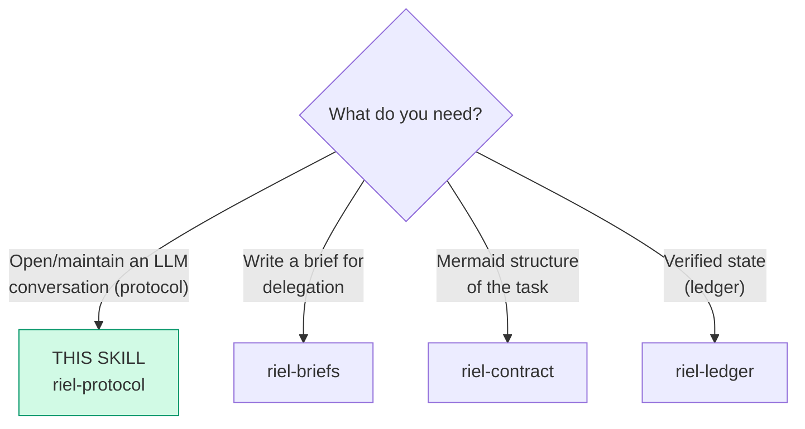

# riel-protocol — Communication protocol (Riel, phase 1)

This component steers **the trajectory**: how the agent opens and maintains
a conversation with an LLM.

**Protocol mode:** the user's request reaches the model **raw**. riel-protocol
does NOT rephrase or rewrite requests — it changes how the agent **enters**
the conversation and how it sustains it.

## Entry router

All hand-offs stay inside the Riel framework.

## Parse contract

### What this skill CONSUMES
- A request or task to execute with an LLM (direct chat or via subagent)

### What this skill PRODUCES
- An anchored opening (functional grammar + persona + minimal surface)
- Trajectory maintenance during the conversation (functional echo)

## Functional grammar

First-person assignment by function — every statement must **discharge** into
an action, a check, or a closure (that is the "functional echo"):

| Form | Function | Example (EN / ES) |
|---|---|---|
| `We need…` | Shared objective: agent + environment working toward something | "We need the login to validate both providers" / "Necesitamos que el login valide ambos proveedores" |
| `I` | Perception, local judgment, commitment | "I see the test fails on the mock; I will fix it" / "Veo que el test falla en el mock; lo voy a arreglar" |
| `Let's` | Immediate joint operation | "Let's verify the endpoint before continuing" / "Vamos a verificar el endpoint antes de seguir" |

Rules:

1. **Open with `We need…`** — the shared objective.
2. **Mandatory discharge:** a `we need` that does not turn into an
   action/check/closure within the next steps is noise — complete it or drop it.
3. **What is NOT suppressed:** an occasional `Let me` or doubt is not a
   failure. What is avoided are self-dialogue loops: doubt → doubt → doubt
   without action.
4. **Applies in any language:** the function matters more than the literal
   words ("Necesitamos…" / "Veo que…" / "Vamos a…" in Spanish).

**Discharge self-check (the verifiable half):** for every `We need…` you
write, point — in the same turn or the next — at the action, check, or
closure that discharged it. If you cannot name one, the sentence is noise:
complete it or drop it. This is the one part of the protocol observable from
the outside — when a `we need` discharges, the ledger's `Next` moves. The
grammar is the durable, model-independent core; the opening conditions below
are not.

## Opening conditions (the first turn)

What steers the trajectory is the **complete state of the first turn**,
not a magic word. Three conditions:

1. **Short, stable persona** — along the lines of *"You are a helpful
   software engineer assistant"*. Do not stack role layers on top during the
   conversation.
2. **Minimal surface first** — present the scope and the tools needed for the
   first action, not the full capability catalog. Heavier capabilities are
   introduced when the task asks for them.
3. **Zero irrelevant injections** — do not drag in skill catalogs, digests, or
   context the first action does not need.

**Priority when the conditions clash: 3 > 2 > 1.**

Each condition has a concrete move — a vague intention does not change a
surface:

| Condition | Concrete move |
|---|---|
| 1 · short persona | one sentence, role only — no stacked style / format / personality layers |
| 2 · minimal surface | list only the tools the FIRST action needs; name heavier capabilities only when the task asks |
| 3 · zero injections | no skill catalog, no environment digest, no "you also have…" preamble on the first turn |

### Evidence status — read before trusting the anchoring claims

The anchoring half of this skill (the three levers above) is **black-box
and model-specific**. It comes from community DeepSeek-Harness probes run on
**V4 Pro, a model retired on 2026-09-14**. The successor (V4.1 Flash)
reports anchoring under every condition in first-round flash probes, and its
own trajectory was not measured. Treat the levers as a *working hypothesis
about the API-visible surface*, not a portable law:

- Where a harness fixes the surface (see below), the anchoring half is
  **inert** — only the functional-echo discipline survives.
- The levers are **not** a measured score improvement. Do not claim gains
  from them.

The durable, model-independent part of this skill is the grammar and the
discharge rule; lean on those.

### When delegating (subagents)

In `delegate_task` briefs, apply the same conditions in `goal` + `context`:
- `goal` opens with the shared objective ("We need…")
- `context` carries only what the first action needs (repo, files, criteria)
- Do not dump tools or instructions that do not belong to the current phase

## Degraded mode (when the harness owns the surface)

Most real harnesses — this one included — inject a skill index, an
environment digest, or a fixed tool schema on every turn. There the
*anchoring* half of this protocol is unreachable, and that is expected. Drop
it; keep the grammar.

| Lever | Reachable under a fixed surface? | What you keep |
|---|---|---|
| 1–2 · persona + minimal surface | usually not | naming the current phase, in your own words |
| 3 · zero injections | no | — |
| functional echo (`We need…` + discharge) | **always** | your statements stay ordered and checkable |

The ledger/contract machinery never depends on the opening conditions. When
the surface is fixed, this skill degenerates to a *writing discipline* — and
a writing discipline costs nothing to keep.

## Maintenance (during the conversation)

- Every functional statement discharges: action → check → closure
- If the conversation drifts into infinite planning without action: return to
  `We need…` + the next concrete action
- If doubt loops appear: `I see` (diagnosis of why it is stuck) + `Let's`
  (a small action to get out)

## Claim limits

These conditions order the opening and discipline the conversation. They are
**not** a measured score improvement — do not claim gains from them. Task
verification lives in the done-check of `riel-ledger`.

## Pitfalls

- **Rewriting the user's request** — this skill is a protocol, not a
  translator; the message arrives raw.
- **Forcing the grammar into every sentence** — functional echo is not about
  counting words; one well-discharged `we need` per task is enough.
- **Claiming it improves results** — it steers the trajectory; verification
  lives in the ledger.
- **Treating the anchoring levers as a portable law** — they are black-box
  evidence from a retired model; see "Evidence status".
- **Cargo-culting the grammar** — opening every sentence with `we need` and
  discharging none. The check that matters is discharge, not frequency.
- **Applying it where there is no opening** — a one-shot tool call with no
  first turn earns nothing from this skill; skip it.

## Checklist

- [ ] Opening with a shared objective (`We need…`)
- [ ] Short, stable persona, no stacked layers
- [ ] Minimal surface on the first turn (only what the first action needs)
- [ ] Zero irrelevant injected context at the start
- [ ] Every functional statement discharged into action/check/closure
- [ ] Each `We need…` names the action/check/closure that discharged it
- [ ] The user's request was not rewritten
