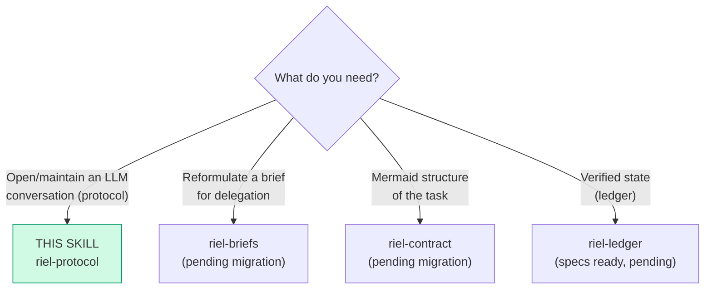

# riel-protocol — Communication protocol (Riel, phase 1)

**Riel** is a steering framework: the capability already exists in the model;
Riel prevents it from being lost between having it and delivering it. This
component steers **the trajectory**: how the agent opens and maintains a
conversation with an LLM.

**Protocol mode:** the user's request reaches the model **raw**. riel-protocol
does NOT rephrase or rewrite requests — it changes how the agent **enters**
the conversation and how it sustains it.

## Entry router

All hand-offs stay inside the Riel framework. `riel-briefs` and
`riel-contract` are the pending migrations of `agent-instruction-authoring`
and `mermaid-skill-authoring` — until they exist, those branches fall back
to the current external skills of the same purpose.

## Parse contract

### What this skill CONSUMES
- A request or task to execute with an LLM (direct chat or via subagent)

### What this skill PRODUCES
- An anchored opening (functional grammar + persona + minimal surface)
- Trajectory maintenance during the conversation (functional echo)

## Functional grammar

First-person assignment by function — every statement must **discharge** into
an action, a check, or a closure (that is the "functional echo"):

| Form | Function | Example |
|---|---|---|
| `We need…` | Shared objective: agent + environment working toward something | "We need the login to validate both providers" |
| `I` | Perception, local judgment, commitment | "I see the test fails on the mock; I will fix it" |
| `Let's` | Immediate joint operation | "Let's verify the endpoint before continuing" |

Rules:

1. **Open with `We need…` on DeepSeek:** community evidence (dsh-anchored-standard)
   shows this form corresponds to the stable trajectory of the agent
   post-training (Minimal condition). On other models it works as generic
   control without anchoring expectations.
2. **Mandatory discharge:** a `we need` that does not turn into an
   action/check/closure within the next steps is noise — complete it or drop it.
3. **What is NOT suppressed:** an occasional `Let me` or doubt is not a
   failure. What is avoided are self-dialogue loops: doubt → doubt → doubt
   without action.
4. **Applies in any language:** the function matters more than the literal
   words ("Necesitamos…" / "Veo que…" / "Vamos a…" in Spanish).

## Opening conditions (the first turn)

What anchors on DeepSeek is the **complete state of the first turn**, not a
magic word. Three conditions:

1. **Short, stable persona** — along the lines of *"You are a helpful
   software engineer assistant"*. Do not stack role layers on top during the
   conversation.
2. **Minimal surface first** — present the scope and the tools needed for the
   first action, not the full capability catalog. Heavier capabilities are
   introduced when the task asks for them.
3. **Zero irrelevant injections** — do not drag in skill catalogs, digests, or
   context the first action does not need. (Evidence: with the skill catalog
   present the anchor did not reproduce, 0/9.)

### When delegating (subagents)

In `delegate_task` briefs, apply the same conditions in `goal` + `context`:
- `goal` opens with the shared objective ("We need…")
- `context` carries only what the first action needs (repo, files, criteria)
- Do not dump tools or instructions that do not belong to the current phase

## Maintenance (during the conversation)

- Every functional statement discharges: action → check → closure
- If the conversation drifts into infinite planning without action: return to
  `We need…` + the next concrete action
- If doubt loops appear: `I see` (diagnosis of why it is stuck) + `Let's`
  (a small action to get out)

## Evidence limits (be honest)

- **Strongly measured:** first-turn conditions **anchor the trajectory**
  (Minimal schema 5/5; with injections 0/9).
- **Hypothesis, not measured:** that the anchored trajectory improves
  *scores* — independent replication gives 95% CI [−2.6, +9.3]; one
  independent A/B (issue #10) found no measurable gain. Do not claim
  improvements without measuring (that is `riel-measure`, phase 4).

## Evidence (Dran pages)

- `deepseek-v4-interfaz-y-trayectoria-we-need` — the 3 anchoring levers
- `harness-analysis-papers-en-extension-points` — confirmed in the official
  Minimal preset (complete persona + zero injections + two-tool pair)
- `j-space-global-workspace-papers` — workspace scientific base

## Pitfalls

- **Rewriting the user's request** — this skill is a protocol, not a
  translator; the message arrives raw.
- **Forcing the grammar into every sentence** — functional echo is not about
  counting words; one well-discharged `we need` per task is enough.
- **Claiming it improves results** — it anchors the trajectory; gains are
  measured.

## Checklist

- [ ] Opening with a shared objective (`We need…`)
- [ ] Short, stable persona, no stacked layers
- [ ] Minimal surface on the first turn (only what the first action needs)
- [ ] Zero irrelevant injected context at the start
- [ ] Every functional statement discharged into action/check/closure
- [ ] The user's request was not rewritten
