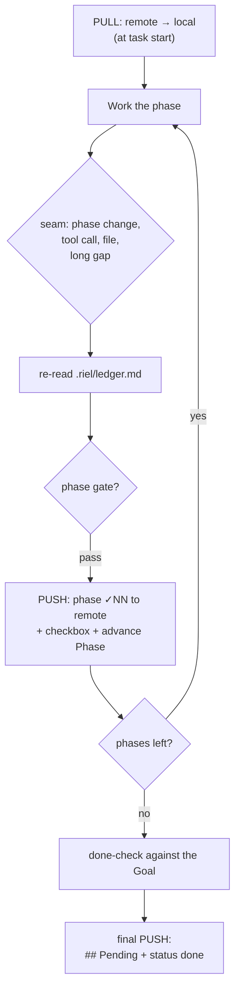

# Spec 3 — Pull/push protocol (local ↔ remote)

Status: draft v1 · Riel phase 2
How the local ledger syncs with the remote (any task system via spec-adapters).
**Derived patch: `coder-flow`** (compatibility layer).

## Full cycle

## PULL (at start)

1. Read the remote task COMPLETELY (adapter: spec-adapters) — never from search excerpts.
2. `Goal` ← todo title/objective.
3. `Source` ← remote system + task identifier (e.g. `todo:<slug>`).
4. `Phase` ← first DAG phase without a checkbox (spec-phase-advance).
5. `Verified` ← seed from the existing `## Verification` (when resuming a half-done task).
6. `Open` ← from existing `## Pending`, if they apply to the active phase.
7. `Next` ← first action of the active phase.
8. Write `.riel/ledger.md`.

## Seam

- Re-read the local file — microseconds, no remote round-trip.
- Detect stalls: same Next for 3 seams → document why or change course.

## PUSH at every gate (not just at the end)

1. Rebuild the full remote body (read-before-write).
2. Append the phase's `✓NN` to `## Verification`.
3. Mark the phase checkbox.
4. Write in ONE single call.
5. Advance Phase (spec-phase-advance).

**Why at every gate:** a mid-task crash must not lose what was verified.

## Final PUSH

1. **done-check:** every line of the Goal must map to a ✓NN with coverage; if any is missing → not done.
2. Unclosed `?NN` → to the body's `## Pending`.
3. Status → done via the adapter's safe route (meta-merge, never content replacement).
4. Delete `.riel/ledger.md` if desired — it is now disposable.

## Safe update rules

- Read-before-write on EVERY push.
- Never split an update across multiple calls (the second wipes the first).
- Status only through the system's meta-merge operation (spec-adapters).
- Never blank-retry: if a push fails, retry with the diagnosis attached; counter <3 / ≥3 escalate to Álvaro.
- **Git hygiene:** the local ledger is never committed — see spec-ledger-format.
