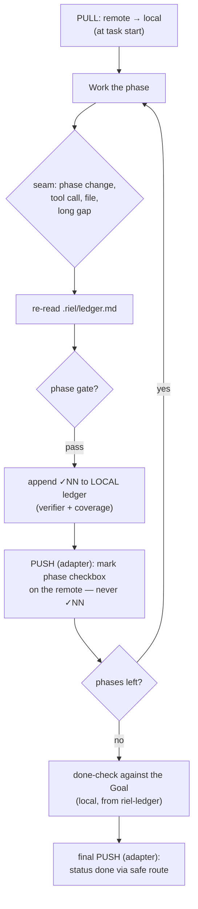

# Spec 3 — Pull/push protocol (local ↔ remote)

Status: draft v2 · Riel phase 2
How the local ledger relates to a remote task system (via spec-adapters).
**The ✓NN stays local.** The remote only ever receives checkboxes and status.
Existing adapter deployments continue to work unchanged — they satisfy
this contract (the *how* lives in the private adapter notes, not here).

## The split of responsibilities

- **Local (riel-ledger):** `Goal` / `Core` / `Verified` (✓NN) / `Open` / `Next`
  live in `.riel/ledger.md` and are **never pushed to the remote**. They are
  working memory for the execution in flight.
- **Remote (adapter, any task system):** the task's durable plan (objective +
  phases + verification checklist) and its status. The adapter only reads the
  task and writes two things: **checkbox marks** and **status done**.

## Full cycle

## PULL (at start)

1. Read the remote task COMPLETELY (adapter: spec-adapters) — never from search excerpts.
2. `Goal` ← task objective.
3. `Source` ← remote system + task identifier (e.g. `todo:<slug>`).
4. `Phase` ← first phase without a checked box (spec-phase-advance).
5. `Verified` ← seed from the phases already checked (their gates already passed); re-verify only if in doubt.
6. `Next` ← first action of the active phase.
7. Write `.riel/ledger.md`.

## Seam

- Re-read the local file — microseconds, no remote round-trip.
- Detect stalls: same Next for 3 seams → document why or change course.

## PUSH at every gate (checkboxes only, never ✓NN)

1. Append the phase's `✓NN` to the **local** ledger (riel-ledger) — verifier + coverage.
2. Rebuild the full remote body (read-before-write).
3. Mark the phase's checkbox in the remote `## Verificación` checklist.
4. Write in ONE single call.
5. Advance Phase (spec-phase-advance).

**Why at every gate:** a mid-task crash must not lose *which phases are done*.
The checkbox is the only durable trace on the remote; the ✓NN detail is local.

## Final PUSH

1. **done-check (local):** every line of the Goal must map to a ✓NN with coverage; if any is missing → not done.
2. Unclosed `?NN` → report to Álvaro (not written to the remote).
3. Status → done via the adapter's safe route (meta-merge, never content replacement).
4. Delete `.riel/ledger.md` if desired — it is now disposable.

## Safe update rules

- Read-before-write on EVERY push.
- Never split an update across multiple calls (the second wipes the first).
- Status only through the system's meta-merge operation (spec-adapters).
- Never blank-retry: if a push fails, retry with the diagnosis attached; counter <3 / ≥3 escalate to Álvaro.
- **Git hygiene:** the local ledger is never committed — see spec-ledger-format.
