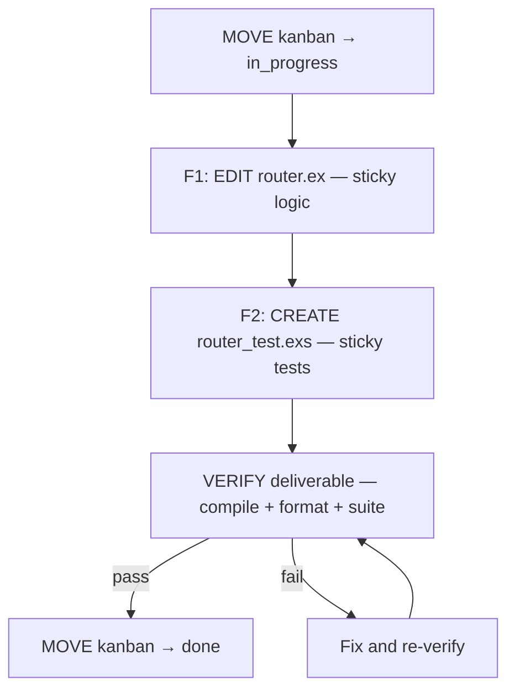

# Spec 2 — Todo contract (the durable body in the remote)

Status: draft v1 · Riel phase 2
The remote todo IS the durable ledger. This spec defines what its body must carry to be one.
**Derived patch: `todo-flow`** (Dran repo).

## Required structure (variant 3 — development feature)

````markdown
## What to do

<verb + object>. Done means: <one-sentence criterion>.

## Deliverable

<concrete, verifiable artifact>

## Phases



### F1: EDIT router.ex — sticky logic

**Scope:** <files this phase may touch>

**How to verify (of this phase):**
- [ ] <criterion> — method: <how it is checked>, coverage: <what it covers>

### F2: ...

## How to verify (global)

- [ ] <criterion> — method: ..., coverage: ...

## Verification

<!-- filled DURING execution: each gate appends a ✓NN (spec-pull-push) -->

## Pending

<!-- filled AT THE END: ?NN that were not closed (spec-pull-push) -->
````

## Rules

1. **Each phase = one mini-ledger:** own scope (files it may touch) + own criteria.
2. Every criterion names **method + expected coverage** — not just "observable criterion".
3. A `done` without a populated `## Verification` **is malformed**.
4. The phase graph ends in VERIFY node(s) before End — verification funnel (riel-contract): topology forces validation.
5. `## Verification` and `## Pending` are created empty when the todo is written (reserved sections).

## Derived patch to `todo-flow`

- **New golden rule:** the closure contract (rule 3 above).
- **Base skeleton:** `## How to verify` = criteria with method + coverage.
- **Variant 3 template:** scope + per-phase verification + reserved sections.
- **Cross-reference:** the Riel specs (`riel/specs/`).
